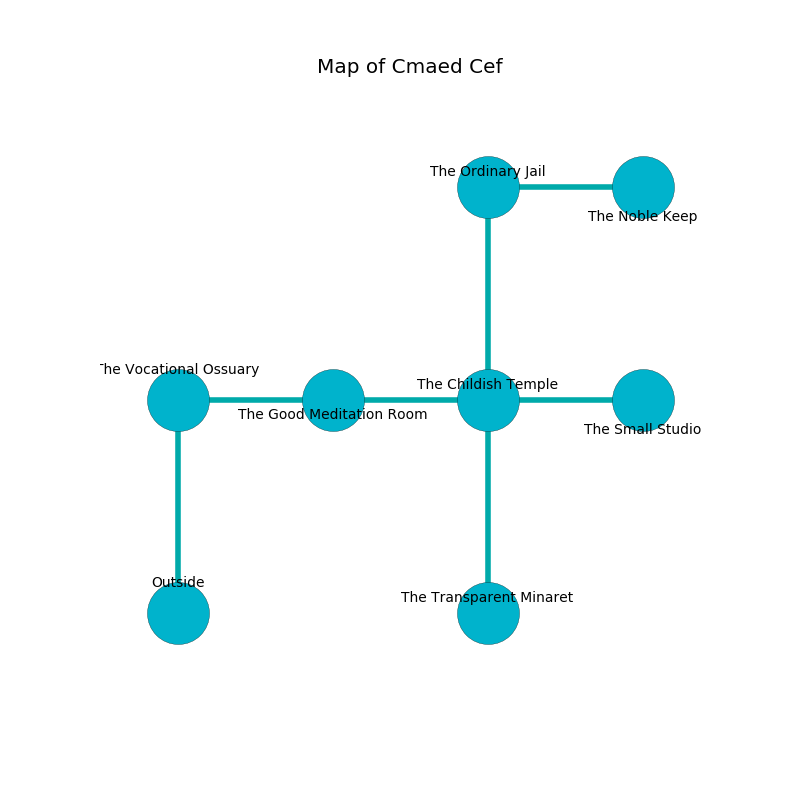

%Ruin Dogs

##Cmaed Cef
###Overview
Cmaed Cef is located in a poisoned plain. Some areas of Cmaed Cef are flooded. The ruin is flooding. It is occupied by Humans. Dexter Jacques The Indiscreet, a Vampire Spawn is here. The Humans are the soldiers of Dexter Jacques The Indiscreet. He  is trying to understand [The Unfair Book](#The-Unfair-Book). 

###Artifact
####The Unfair Book

The Unfair Book has the form of an opaque crystal. Air glows from it. It smells like styrene. It is a shifting blue color. When smelled it frightens children. 

###Locations

####the vocational ossuary
Gray razorgrass is growing in a patch on the floor. The floor is bloodstained. 

* [Dexter Jacques The Indiscreet](#Dexter-Jacques-The-Indiscreet) is here.
* To the east a windy cave connects to [the good meditation room](#the-good-meditation-room).
* To the south is the entrance.

####the good meditation room
The floor is cluttered with broken glass. There are a Cult Fanatic, a Veteran, a Berserker, a Cultist, two Acolytes, and  here. The air tastes like dates here. The Humans are willing to negotiate. 

* To the west a windy cave leads to [the vocational ossuary](#the-vocational-ossuary).
* To the east a long threshold connects to [the childish temple](#the-childish-temple).

####the childish temple
Blue ferns are growing from the ceiling. The air smells like sausage here. There are a Barbed Devil and a Giant Spider here. 

* There is a dress here.
* [The Unfair Book](#The-Unfair-Book) is here.
* To the west a long threshold leads to [the good meditation room](#the-good-meditation-room).
* To the east a torchlit pathway leads to [the small studio](#the-small-studio).
* To the north a torchlit opening connects to [the ordinary jail](#the-ordinary-jail).
* To the south a twisted corridor leads to [the transparent minaret](#the-transparent-minaret).

####the small studio
The mirrored walls are ruined. The floor is sticky. 

There is an engraving on the wall written in Humans Script. 

> I tried digging.
>

* To the west a torchlit pathway leads to [the childish temple](#the-childish-temple).

####the ordinary jail
The air tastes like ripe banana here. The floor is glossy. There are an Invisible Stalker, a Spider, and an Owl here. Gray mushrooms are growing from the ceiling. 

* There is a finger here.
* To the east a windy artery connects to [the noble keep](#the-noble-keep).
* To the south a torchlit opening opens to [the childish temple](#the-childish-temple).

####the noble keep
The brick walls are covered in mold. The floor is flooded with two inch deep hot water. There are a Stirge, a Lion, a Wereboar, a Hyena, a Scarecrow, and a Commoner here. White ferns are swaying from the walls. 

* There is a face here.
* To the west a windy artery connects to [the ordinary jail](#the-ordinary-jail).

####the transparent minaret
The obsidion walls are pristine. The floor is bloodstained. 

* To the north a twisted corridor leads to [the childish temple](#the-childish-temple).

