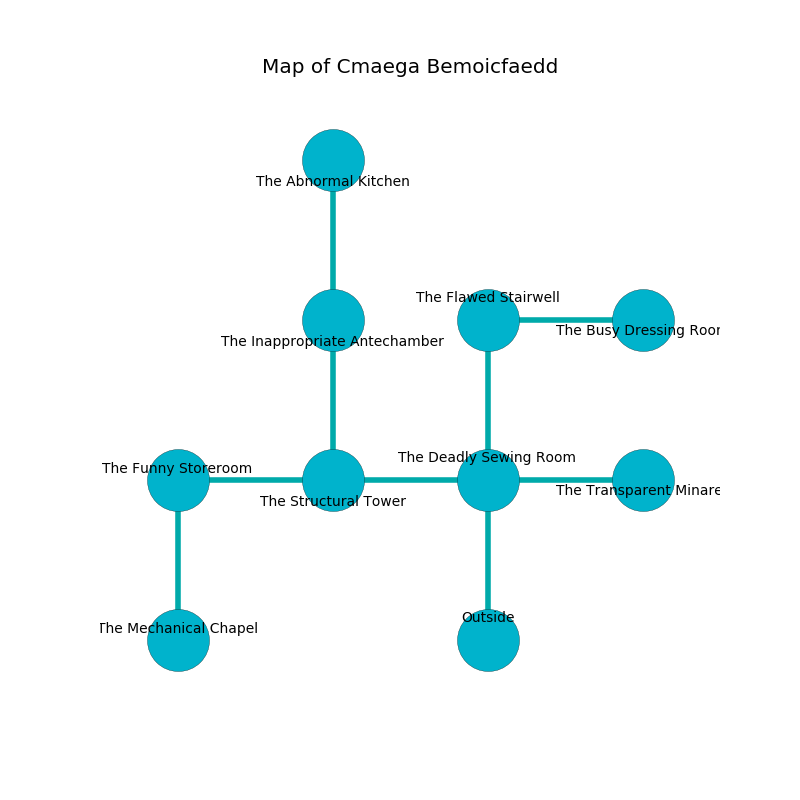

%Ruin Dogs

##Cmaega Bemoicfaedd
###Overview
Cmaega Bemoicfaedd is located in a spikey mountain. Parts of it are inaccessible. The ruin is sinking into the earth. It is occupied by Deep Gnomes. Elvis Grimes The Ruthless, a Cloud Giant is here. The Deep Gnomes have been charmed by Elvis Grimes The Ruthless. He  is founding a new religion. 

###Artifact
####Iaedcm Deda

Iaedcm Deda is a powerful artifact in the shape of an opaque prism. It smells like davana. Psychic energy glows around it. When smelled it makes its owner invisible. 

###Locations

####the deadly sewing room
The crystal walls are unsettled. The floor is bloodstained. The air tastes like nut skin here. 

* To the west a dark cave opens to [the structural tower](#the-structural-tower).
* To the east a dark walkway leads to [the transparent minaret](#the-transparent-minaret).
* To the north a torchlit opening opens to [the flawed stairwell](#the-flawed-stairwell).
* To the south is the entrance.

####the structural tower
There are twenty Deep Gnomes here. The floor is smooth. The air tastes like lavender here. The Deep Gnomes are fighting amongst themselves. 

* To the west a long gap opens to [the funny storeroom](#the-funny-storeroom).
* To the east a dark cave leads to [the deadly sewing room](#the-deadly-sewing-room).
* To the north a twisted hallway leads to [the inappropriate antechamber](#the-inappropriate-antechamber).

####the flawed stairwell
The air tastes like graham cracker here. 

* There is a chain here.
* To the east a flooded pathway leads to [the busy dressing room](#the-busy-dressing-room).
* To the south a torchlit opening connects to [the deadly sewing room](#the-deadly-sewing-room).

####the busy dressing room

* To the west a flooded pathway leads to [the flawed stairwell](#the-flawed-stairwell).

####the transparent minaret
The air tastes like leek here. 

There is an engraving on a monolith written in Deep Gnomes Script. 

> [Iaedcm Deda](#Iaedcm-Deda)
>
> excited, white, ample
>

* To the west a dark walkway opens to [the deadly sewing room](#the-deadly-sewing-room).

####the inappropriate antechamber
White ferns are growing in a patch on the floor. 

* [Elvis Grimes The Ruthless](#Elvis-Grimes-The-Ruthless) is here.
* To the north a dark gap opens to [the abnormal kitchen](#the-abnormal-kitchen).
* To the south a twisted hallway opens to [the structural tower](#the-structural-tower).

####the funny storeroom
The air smells like lemon peel here. There are twenty Deep Gnomes here. Blue ferns are sprouting in broken urns. One of the Deep Gnomes is working a mechanism that can pour bees from the ceiling. 

* [Iaedcm Deda](#Iaedcm-Deda) is here.
* To the east a long gap leads to [the structural tower](#the-structural-tower).
* To the south a torchlit passageway opens to [the mechanical chapel](#the-mechanical-chapel).

####the abnormal kitchen
The floor is sticky. There are a Monodrone, a Duergar, a Stone Giant, a Yuan-Ti Pureblood, an Intellect Devourer, an Ettin, and a Quadrone here. 

* To the south a dark gap leads to [the inappropriate antechamber](#the-inappropriate-antechamber).

####the mechanical chapel
There are twenty Deep Gnomes here. The air smells like taco here. Green mushrooms are swaying in cracks in the floor. The stone walls are bloodstained. The floor is cluttered with ashes. If the Deep Gnomes notice the Ruin Dogs, one of them will retreat and alert the others. 

* To the north a torchlit passageway connects to [the funny storeroom](#the-funny-storeroom).

