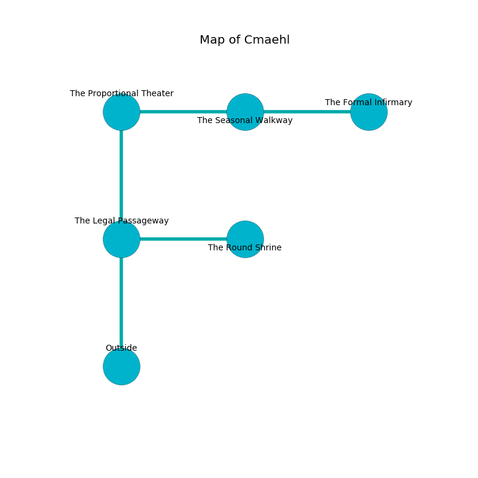

%Ruin Dogs

##Cmaehl
###Overview
Cmaehl is constructed on an obsidion tree. Parts of it are frozen. The ruin is larger on the inside than the outside. It is occupied by Kenku. Javier Medlin The Impulsive, an Incubus is here. The Kenku are the minions of Javier Medlin The Impulsive. He  is trying to use [The Common Pumpkin](#The-Common-Pumpkin). 

###Artifact
####The Common Pumpkin

The Common Pumpkin looks like a transparent cube. It smells like incense. Cacophony glows around it. It is a dark purple color. When cradled it changes the past. 

###Locations

####the legal passageway
The floor is glossy. The mirrored walls are unsettled. 

There is an engraving on the floor written in common. 

> Leave at once.
>

* To the east a dark cave connects to [the round shrine](#the-round-shrine).
* To the north a hazy walkway connects to [the proportional theater](#the-proportional-theater).
* To the south is the entrance.

####the round shrine
The floor is glossy. Yellow razorgrass is decaying in a patch on the floor. The mirrored walls are scratched. 

* There is a parcel here.
* To the west a dark cave opens to [the legal passageway](#the-legal-passageway).

####the proportional theater
The floor is flooded with five inch deep cool water. Yellow moss is swaying in a patch on the floor. 

There is an engraving on a stone written in Kenku Script. 

> A nose is a bike
>
> but never inevitable
>
> [The Common Pumpkin](#The-Common-Pumpkin)
>
> married and pleasant
>
> oral, common, opposed
>
> you are destroyed
>

* [Javier Medlin The Impulsive](#Javier-Medlin-The-Impulsive) is here.
* To the east a twisted pathway leads to [the seasonal walkway](#the-seasonal-walkway).
* To the south a hazy walkway opens to [the legal passageway](#the-legal-passageway).

####the seasonal walkway
Green lichens are sprouting in a patch on the floor. The obsidion walls are ruined. The floor is bloodstained. 

* [The Common Pumpkin](#The-Common-Pumpkin) is here.
* To the west a twisted pathway connects to [the proportional theater](#the-proportional-theater).
* To the east a dripping pathway opens to [the formal infirmary](#the-formal-infirmary).

####the formal infirmary
The air tastes like popcorn here. 

* To the west a dripping pathway connects to [the seasonal walkway](#the-seasonal-walkway).

