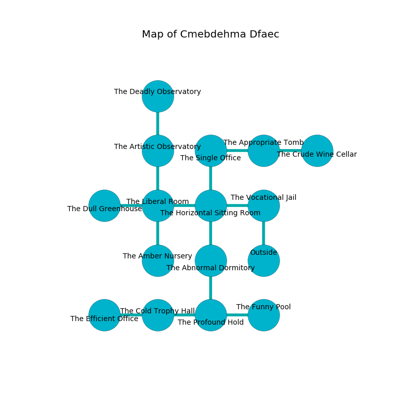

%Ruin Dogs

##Cmebdehma Dfaec
###Overview
Cmebdehma Dfaec is located in an alien tree. Some areas of Cmebdehma Dfaec are cursed. The ruin is larger on the inside than the outside. It is occupied by Drows. Joanna Gilmore The Perverse, a Cyclops is here. The Drows have been charmed by Joanna Gilmore The Perverse. She  is trying to discover [Idedoa Dfawi](#Idedoa-Dfawi). 

###Artifact
####Idedoa Dfawi

Idedoa Dfawi has the form of a warm spear. It smells like dairy. Fire flows near it. When smelled it curses all nearby. 

###Locations

####the vocational jail
The floor is smooth. There are twenty eight Drows here. The Drows are performing a ritual. If not interrupted, the Drows will become more powerful. 

* There is a stick here.
* To the west a dripping corridor leads to [the horizontal sitting Room](#the-horizontal-sitting-Room).
* To the south is the entrance.

####the horizontal sitting Room
The metallic walls are bloodstained. The floor is smooth. 

There is an engraving on a monolith written in common. 

> Dig here.
>

* To the west a long opening connects to [the liberal room](#the-liberal-room).
* To the east a dripping corridor connects to [the vocational jail](#the-vocational-jail).
* To the north a narrow walkway opens to [the single office](#the-single-office).
* To the south a dark cave opens to [the abnormal dormitory](#the-abnormal-dormitory).

####the abnormal dormitory
The brick walls are unsettled. The floor is cluttered with rocks. 

* To the north a dark cave opens to [the horizontal sitting Room](#the-horizontal-sitting-Room).
* To the south a dripping hall connects to [the profound hold](#the-profound-hold).

####the liberal room
The air smells like fruit here. The floor is smooth. 

* There is an apple here.
* [Joanna Gilmore The Perverse](#Joanna-Gilmore-The-Perverse) is here.
* To the west a torchlit walkway connects to [the dull greenhouse](#the-dull-greenhouse).
* To the east a long opening connects to [the horizontal sitting Room](#the-horizontal-sitting-Room).
* To the north a dark corridor leads to [the artistic observatory](#the-artistic-observatory).
* To the south a dark hallway leads to [the amber nursery](#the-amber-nursery).

####the single office
Green lichens are sprouting in cracks in the floor. There are a Troglodyte, an Ochre Jelly, a Smoke Mephit, a Grick, a Manes, a Copper Dragon Wyrmling, a Pixie, a Brass Dragon Wyrmling, and a Flying Snake here. The air smells like dry	durian here. 

There is an engraving on a tablet written in common. 

> I hid something in Cmebdehma Dfaec.
>

* To the east a twisted hallway leads to [the appropriate tomb](#the-appropriate-tomb).
* To the south a narrow walkway opens to [the horizontal sitting Room](#the-horizontal-sitting-Room).

####the amber nursery
The brick walls are unsettled. 

* There is a stamp here.
* To the north a dark hallway connects to [the liberal room](#the-liberal-room).

####the artistic observatory
The air tastes like cooked apple here. There are a Kuo-Toa Monitor, a Weretiger, and a Blood Hawk here. The floor is sticky. Red mushrooms are sprouting from the ceiling. 

* To the north a long pathway leads to [the deadly observatory](#the-deadly-observatory).
* To the south a dark corridor connects to [the liberal room](#the-liberal-room).

####the appropriate tomb
There is a trap here. When activated, a tripwire will launch a javelin. There are twenty eight Drows here. The air tastes like nut flesh here. The Drows are meditating. 

There is an engraving on the floor written in Drows Script. 

> I want to find [Idedoa Dfawi](#Idedoa-Dfawi).
>

* [Idedoa Dfawi](#Idedoa-Dfawi) is here.
* To the west a twisted hallway connects to [the single office](#the-single-office).
* To the east a twisted corridor opens to [the crude wine cellar](#the-crude-wine-cellar).

####the profound hold
Red ferns are growing in cracks in the floor. The air smells like absinthe here. There are a Fire Elemental, a Duergar, a Couatl, and a Bat here. The crystal walls are pristine. 

* To the west a long artery leads to [the cold trophy hall](#the-cold-trophy-hall).
* To the east a hazy walkway connects to [the funny pool](#the-funny-pool).
* To the north a dripping hall opens to [the abnormal dormitory](#the-abnormal-dormitory).

####the deadly observatory
There are a Spined Devil, a Bulette, a Violet Fungus, and a Rust Monster here. Green lichens are growing from the ceiling. The floor is smooth. The brick walls are ruined. 

* To the south a long pathway connects to [the artistic observatory](#the-artistic-observatory).

####the cold trophy hall
The air smells like cornmeal here. 

* To the west a torchlit corridor leads to [the efficient office](#the-efficient-office).
* To the east a long artery leads to [the profound hold](#the-profound-hold).

####the funny pool
There are twenty eight Drows here. Yellow ferns are swaying from the walls. The floor is smooth. One of the Drows is pointing a ballista at the entrance. 

* To the west a hazy walkway opens to [the profound hold](#the-profound-hold).

####the efficient office
The floor is smooth. There are twenty eight Drows here. One of the Drows is working a mechanism that can flood the room. 

* There is a head here.
* There is a boot here.
* There is a cart here.
* To the east a torchlit corridor connects to [the cold trophy hall](#the-cold-trophy-hall).

####the dull greenhouse
There are a Stirge, a Warhorse Skeleton, a Giant Weasel, a Xorn, a Ghoul, and a Gold Dragon Wyrmling here. The floor is glossy. 

* There is a parcel here.
* There is a drawer here.
* To the east a torchlit walkway opens to [the liberal room](#the-liberal-room).

####the crude wine cellar
The wooden walls are scratched. The air smells like autumn here. There are an Earth Elemental, a Swarm of Poisonous Snakes, a Goat, a Steam Mephit, an Orc, and a Succubus here. Yellow moss is growing in cracks in the floor. 

* To the west a twisted corridor connects to [the appropriate tomb](#the-appropriate-tomb).

