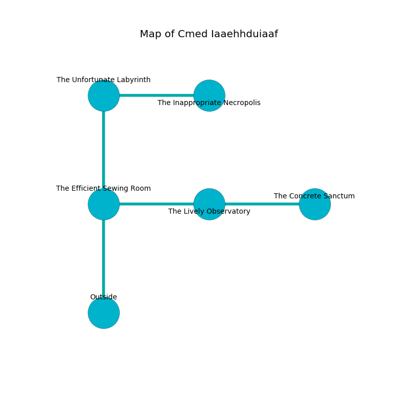

%Ruin Dogs

##Cmed Iaaehhduiaaf
###Overview
Cmed Iaaehhduiaaf is located under a poisoned plain. Some rooms of Cmed Iaaehhduiaaf are somewhat hot. A battle between raiders is happening outside. It is occupied by Dryads. Ronny Vaught The Pompous, an Imp is here. The Dryads are battling Ronny Vaught The Pompous. He  is founding a new religion. 

###Artifact
####The Industrial Crown

The Industrial Crown is a powerful artifact in the shape of a sharp amulet. Cacophony glows from it. It is a light gray color. When picked up it grants power to its owner. 

###Locations

####the efficient sewing room
The obsidion walls are caving in. White razorgrass is growing in broken urns. 

* To the east a windy gap opens to [the lively observatory](#the-lively-observatory).
* To the north a dripping artery leads to [the unfortunate labyrinth](#the-unfortunate-labyrinth).
* To the south is the entrance.

####the lively observatory
The metallic walls are scratched. The air smells like potato chip here. 

* There is a fish here.
* There is a fish here.
* [The Industrial Crown](#The-Industrial-Crown) is here.
* [Ronny Vaught The Pompous](#Ronny-Vaught-The-Pompous) is here.
* To the west a windy gap opens to [the efficient sewing room](#the-efficient-sewing-room).
* To the east a small pathway leads to [the concrete sanctum](#the-concrete-sanctum).

####the unfortunate labyrinth
The metallic walls are ruined. There are an Ape, a Duergar, a Shadow, a Shrieker, and a Swarm of Rats here. 

* To the east a narrow hall connects to [the inappropriate necropolis](#the-inappropriate-necropolis).
* To the south a dripping artery leads to [the efficient sewing room](#the-efficient-sewing-room).

####the inappropriate necropolis
There is a Sea Hag here. The air smells like huckleberry here. The brick walls are scratched. 

* To the west a narrow hall leads to [the unfortunate labyrinth](#the-unfortunate-labyrinth).

####the concrete sanctum
The glass walls are covered in mold. The air smells like truffle here. There are two Dryads here. If the Dryads notice the Ruin Dogs, one of them will retreat and alert the others. 

* To the west a small pathway leads to [the lively observatory](#the-lively-observatory).

