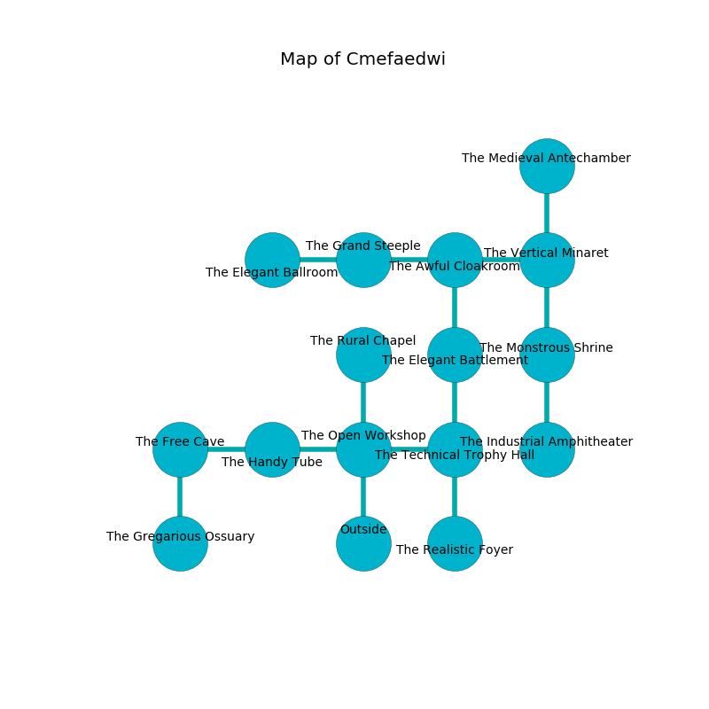

%Ruin Dogs

##Cmefaedwi
###Overview
Cmefaedwi is constructed on a haunted tree. Parts of Cmefaedwi are inaccessible. A blizzard is happening outside. It is occupied by Troglodytes. Walter Oliveira The Impolite, an Orc War Chief is here. The Troglodytes are battling Walter Oliveira The Impolite. She  is founding a new religion. 

###Artifact
####Cuuaf Iiaaedaf

Cuuaf Iiaaedaf has the form of a hard sphere. When worshipped it grants a wish. 

###Locations

####the open workshop
The glass walls are scratched. The floor is cluttered with ashes. There are twenty Troglodytes here. The air smells like popcorn here. The Troglodytes are performing a ritual. If not interrupted, a powerful monster will be summoned. 

* To the west a small passageway connects to [the handy tube](#the-handy-tube).
* To the east a long opening leads to [the technical trophy hall](#the-technical-trophy-hall).
* To the north a dripping cave connects to [the rural chapel](#the-rural-chapel).
* To the south is the entrance.

####the technical trophy hall
The floor is flooded with eight inch deep cold water. There are a Goblin, a Helmed Horror, and a Bronze Dragon Wyrmling here. 

There is an engraving on the wall written in common. 

> I could not try dying.
>

* To the west a long opening opens to [the open workshop](#the-open-workshop).
* To the north a dark walkway opens to [the elegant battlement](#the-elegant-battlement).
* To the south a small pathway opens to [the realistic foyer](#the-realistic-foyer).

####the rural chapel
The air smells like davana here. There are twenty Troglodytes here. The floor is smooth. The Troglodytes are willing to negotiate. 

* To the south a dripping cave leads to [the open workshop](#the-open-workshop).

####the elegant battlement
There are twenty Troglodytes here. The floor is smooth. White moss is swaying in cracks in the floor. If the Troglodytes notice the Ruin Dogs, one of them will retreat and alert [Walter Oliveira](#Walter-Oliveira). 

* To the north a hazy walkway opens to [the awful cloakroom](#the-awful-cloakroom).
* To the south a dark walkway opens to [the technical trophy hall](#the-technical-trophy-hall).

####the awful cloakroom
Yellow moss is decaying in cracks in the floor. 

There is an engraving on the wall written in Troglodytes Script. 

> I hid something in Cmefaedwi.
>

* To the west a torchlit cavern connects to [the grand steeple](#the-grand-steeple).
* To the east a flooded path connects to [the vertical minaret](#the-vertical-minaret).
* To the south a hazy walkway connects to [the elegant battlement](#the-elegant-battlement).

####the vertical minaret
The glass walls are unsettled. There is a Cambion here. Green mushrooms are growing from the ceiling. 

There is an engraving on a monolith written in common. 

> Oh cruel god
>
> essential, primary, odd
>
> functional and live
>
> the world is alive
>

* To the west a flooded path opens to [the awful cloakroom](#the-awful-cloakroom).
* To the north a windy path opens to [the medieval antechamber](#the-medieval-antechamber).
* To the south a dripping hall connects to [the monstrous shrine](#the-monstrous-shrine).

####the grand steeple
There is a trap here. When activated, a magical proximity detector will fire a net. There are twenty Troglodytes here. The Troglodytes are willing to negotiate. 

* [Cuuaf Iiaaedaf](#Cuuaf-Iiaaedaf) is here.
* To the west a dripping pathway connects to [the elegant ballroom](#the-elegant-ballroom).
* To the east a torchlit cavern opens to [the awful cloakroom](#the-awful-cloakroom).

####the realistic foyer
There are a Thri-Kreen, a Quaggoth, a Crab, and a Ghost here. Red ferns are growing in broken urns. 

* To the north a small pathway leads to [the technical trophy hall](#the-technical-trophy-hall).

####the monstrous shrine
The floor is flooded with seven inch deep lukewarm water. There is a trap here. When activated, a magical rune will launch a blade. 

* There is a nail here.
* To the north a dripping hall connects to [the vertical minaret](#the-vertical-minaret).
* To the south a dark passageway opens to [the industrial amphitheater](#the-industrial-amphitheater).

####the medieval antechamber
There are twenty Troglodytes here. The floor is glossy. Red lichens are sprouting in cracks in the floor. One of the Troglodytes is pointing a ballista at the entrance. 

* To the south a windy path connects to [the vertical minaret](#the-vertical-minaret).

####the industrial amphitheater
The floor is sticky. 

* There is a brain here.
* To the north a dark passageway leads to [the monstrous shrine](#the-monstrous-shrine).

####the handy tube
There are a Swarm of Rats, a Tridrone, and a Mezzoloth here. 

* There is a baby here.
* [Walter Oliveira The Impolite](#Walter-Oliveira-The-Impolite) is here.
* To the west a hazy passageway connects to [the free cave](#the-free-cave).
* To the east a small passageway opens to [the open workshop](#the-open-workshop).

####the free cave
Gray razorgrass is growing from the ceiling. The metallic walls are covered in mold. 

* To the east a hazy passageway opens to [the handy tube](#the-handy-tube).
* To the south a flooded cavern opens to [the gregarious ossuary](#the-gregarious-ossuary).

####the gregarious ossuary
The brick walls are ruined. The air smells like shellfish here. There are twenty Troglodytes here. If the Troglodytes notice the Ruin Dogs, one of them will retreat and alert [Walter Oliveira](#Walter-Oliveira). 

There is an engraving on a stone written in common. 

> I am lost in Cmefaedwi.
>
> Hide here.
>

* There is a brake here.
* There is a cake here.
* To the north a flooded cavern leads to [the free cave](#the-free-cave).

####the elegant ballroom
There is a trap here. When activated, a magical rune will launch a swinging block. 

There is an engraving on a stone written in Troglodytes Script. 

> I am fleeing Cmefaedwi.
>

* To the east a dripping pathway leads to [the grand steeple](#the-grand-steeple).

