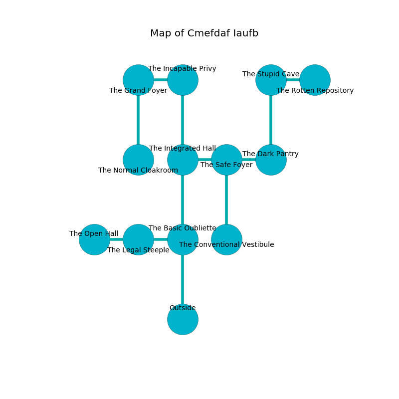

%Ruin Dogs

##Cmefdaf Iaufb
###Overview
Cmefdaf Iaufb is located under a broken city. Some areas of it are corrupted. The ruin is coming to life. It is occupied by Orc. Shirlee Quillen The Irresponsible, a Bearded Devil is here. The Orc have been charmed by Shirlee Quillen The Irresponsible. She  is trying to discover [Cmaehlmuul Cumgaiiaeum](#Cmaehlmuul-Cumgaiiaeum). 

###Artifact
####Cmaehlmuul Cumgaiiaeum

Cmaehlmuul Cumgaiiaeum has the form of a warm crystal. It is a bright red color. It smells like plum skin. When worn it destroys itself. 

###Locations

####the basic oubliette
There is a Peryton here. The floor is cluttered with ashes. White mushrooms are decaying in broken urns. 

* There is a shirt here.
* [Shirlee Quillen The Irresponsible](#Shirlee-Quillen-The-Irresponsible) is here.
* To the west a hazy cave leads to [the legal steeple](#the-legal-steeple).
* To the north a dark path leads to [the integrated hall](#the-integrated-hall).
* To the south is the entrance.

####the integrated hall
There are four Orcs here. The wooden walls are ruined. The floor is cluttered with debris. The Orc are willing to fight to the death. 

There is an engraving on the floor written in common. 

> O dire we
>
> but controversial
>
> acceptable, noisy, free
>
> sadness is commercial
>

* To the east a twisted cave opens to [the safe foyer](#the-safe-foyer).
* To the north a hazy artery opens to [the incapable privy](#the-incapable-privy).
* To the south a dark path opens to [the basic oubliette](#the-basic-oubliette).

####the incapable privy
The air tastes like pimenta here. The concrete walls are ruined. There are a Warhorse Skeleton and an Awakened Tree here. 

* To the west a flooded cavern opens to [the grand foyer](#the-grand-foyer).
* To the south a hazy artery opens to [the integrated hall](#the-integrated-hall).

####the legal steeple
The air smells like guava here. The wooden walls are scratched. 

There is an engraving on a stone written in common. 

> I tried running.
>

* To the west a small threshold opens to [the open hall](#the-open-hall).
* To the east a hazy cave leads to [the basic oubliette](#the-basic-oubliette).

####the grand foyer
Blue mushrooms are growing in broken urns. The floor is cluttered with shells. The obsidion walls are pristine. The air tastes like vinegar here. 

There is an engraving on a tablet written in common. 

> Hide here.
>

* There is a tree here.
* To the east a flooded cavern opens to [the incapable privy](#the-incapable-privy).
* To the south a dripping corridor leads to [the normal cloakroom](#the-normal-cloakroom).

####the safe foyer
Gray moss is swaying from the walls. There is a trap here. When activated, a pressure plate will shoot a lightning bolt. The floor is smooth. 

* To the west a twisted cave leads to [the integrated hall](#the-integrated-hall).
* To the east a dripping passageway leads to [the dark pantry](#the-dark-pantry).
* To the south a flooded walkway opens to [the conventional vestibule](#the-conventional-vestibule).

####the dark pantry
The air smells like truffle here. The glass walls are bloodstained. Blue ferns are growing from the walls. 

* To the west a dripping passageway leads to [the safe foyer](#the-safe-foyer).
* To the north a dark passageway connects to [the stupid cave](#the-stupid-cave).

####the normal cloakroom
The mirrored walls are scratched. The floor is flooded with nine inch deep lukewarm water. Yellow moss is sprouting in broken urns. The air smells like broccoli here. 

* To the north a dripping corridor connects to [the grand foyer](#the-grand-foyer).

####the open hall
The brick walls are scratched. 

There is an engraving on the floor written in common. 

> Do not try swimming.
>

* There is a spring here.
* To the east a small threshold leads to [the legal steeple](#the-legal-steeple).

####the conventional vestibule
There are four Orcs here. The floor is cluttered with debris. The air smells like acerola here. The Orc are performing a ritual. If not interrupted, the ruin dogs will be weakened. 

There is an engraving on a stone written in Orc Script. 

> A chain is a competition
>
> tidy and supplementary
>
> you are not remembered
>

* To the north a flooded walkway leads to [the safe foyer](#the-safe-foyer).

####the stupid cave
Red razorgrass is swaying in a patch on the floor. The floor is glossy. 

* [Cmaehlmuul Cumgaiiaeum](#Cmaehlmuul-Cumgaiiaeum) is here.
* To the east a flooded corridor connects to [the rotten repository](#the-rotten-repository).
* To the south a dark passageway opens to [the dark pantry](#the-dark-pantry).

####the rotten repository
Gray razorgrass is growing in a patch on the floor. 

There is an engraving on the floor written in Orc Script. 

> A book is a snow
>
> yet never trivial
>
> valid, essential, mild
>
> funny, inevitable, regional
>
> proportional and inevitable
>
> you are not loved
>

* There is a glove here.
* There is a sock here.
* To the west a flooded corridor leads to [the stupid cave](#the-stupid-cave).

