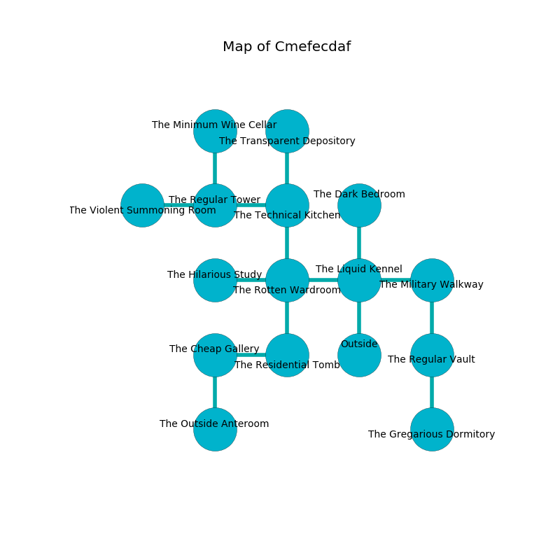

%Ruin Dogs

##Cmefecdaf
###Overview
Cmefecdaf is located under a crystal mountain. Some rooms of Cmefecdaf are foggy. A solar eclipse is happening outside. It is occupied by Kenku. Long Mattingly The Conservative, a Cloud Giant is here. The Kenku worship Long Mattingly The Conservative. He  is founding a new religion. 

###Artifact
####Dfaecc

Dfaecc looks like a hard rock. Fire incinerates towards it. It is a pale white color. When touched it becomes a shielding force. 

###Locations

####the liquid kennel
There are a Mud Mephit, a Dryad, a Sea Hag, a Yuan-Ti Pureblood, a Giant Toad, a Sahuagin Priestess, and a Myconid Sprout here. The floor is glossy. Gray moss is sprouting from the ceiling. 

* To the west a dripping artery connects to [the rotten wardroom](#the-rotten-wardroom).
* To the east a narrow path opens to [the military walkway](#the-military-walkway).
* To the north a hazy hall connects to [the dark bedroom](#the-dark-bedroom).
* To the south is the entrance.

####the rotten wardroom
The floor is glossy. The air smells like peanut here. The metallic walls are unsettled. 

There is an engraving on the wall written in Kenku Script. 

> Try praying.
>

* To the west a twisted passageway connects to [the hilarious study](#the-hilarious-study).
* To the east a dripping artery leads to [the liquid kennel](#the-liquid-kennel).
* To the north a windy corridor connects to [the technical kitchen](#the-technical-kitchen).
* To the south a windy hall connects to [the residential tomb](#the-residential-tomb).

####the residential tomb
The stone walls are pristine. The floor is flooded with seven inch deep scalding water. 

* There is a breastplate here.
* [Long Mattingly The Conservative](#Long-Mattingly-The-Conservative) is here.
* To the west a narrow passageway connects to [the cheap gallery](#the-cheap-gallery).
* To the north a windy hall opens to [the rotten wardroom](#the-rotten-wardroom).

####the military walkway
Gray moss is growing from the walls. The air tastes like acetone here. There are a Mud Mephit, a Commoner, two Gladiators, a Homunculus, a Warhorse, a Cultist, a Camel, a Vulture, and  here. 

* There is a casket here.
* To the west a narrow path opens to [the liquid kennel](#the-liquid-kennel).
* To the south a torchlit artery opens to [the regular vault](#the-regular-vault).

####the regular vault
The floor is sticky. Gray moss is growing in broken urns. The glass walls are scratched. 

* [Dfaecc](#Dfaecc) is here.
* To the north a torchlit artery opens to [the military walkway](#the-military-walkway).
* To the south a narrow corridor leads to [the gregarious dormitory](#the-gregarious-dormitory).

####the hilarious study
The air tastes like tagette here. The floor is smooth. The glass walls are covered in mold. There are an Imp, a Spined Devil, a Giant Scorpion, a Black Bear, and a White Dragon Wyrmling here. 

* To the east a twisted passageway connects to [the rotten wardroom](#the-rotten-wardroom).

####the technical kitchen
The stone walls are caving in. There are thirty two Kenkus here. If the Kenku notice the Ruin Dogs, one of them will retreat and alert the others. 

* There is a rowboat here.
* To the west a torchlit threshold leads to [the regular tower](#the-regular-tower).
* To the north a small cave opens to [the transparent depository](#the-transparent-depository).
* To the south a windy corridor opens to [the rotten wardroom](#the-rotten-wardroom).

####the regular tower
The air tastes like plum skin here. The brick walls are scratched. 

* There is a nail here.
* To the west a dripping cave opens to [the violent summoning room](#the-violent-summoning-room).
* To the east a torchlit threshold connects to [the technical kitchen](#the-technical-kitchen).
* To the north a long walkway leads to [the minimum wine cellar](#the-minimum-wine-cellar).

####the cheap gallery
The stone walls are scratched. The floor is flooded with two inch deep cool water. There are thirty two Kenkus here. Yellow lichens are growing in cracks in the floor. One of the Kenku is on watch, the rest are celebrating. 

There is an engraving on a stone written in Kenku Script. 

> A stomach is a hold
>
> always legislative
>
> A hook is a molecule
>
> mental, outer, related
>
> A stomach is a hold
>

* To the east a narrow passageway opens to [the residential tomb](#the-residential-tomb).
* To the south a dripping hall opens to [the outside anteroom](#the-outside-anteroom).

####the violent summoning room
There are thirty two Kenkus here. The floor is bloodstained. Red mushrooms are sprouting from the ceiling. One of the Kenku is working a mechanism that can open a trapodoor in the floor. 

* To the east a dripping cave leads to [the regular tower](#the-regular-tower).

####the minimum wine cellar
The wooden walls are covered in mold. There is a trap here. When activated, a magical sound detector will flood the room with water. The air smells like osmanthus here. The floor is sticky. 

There is an engraving on the ceiling written in Kenku Script. 

> Poor me! sad we
>
> colourful and free
>
> eloquent and occupational
>
> sadness is educational
>

* There is a chainmail here.
* To the south a long walkway opens to [the regular tower](#the-regular-tower).

####the outside anteroom
Yellow mushrooms are decaying from the walls. 

There is an engraving on the ceiling written in common. 

> I am lost in Cmefecdaf.
>

* There is a potato here.
* To the north a dripping hall connects to [the cheap gallery](#the-cheap-gallery).

####the transparent depository
There are thirty two Kenkus here. The floor is flooded with five inch deep scalding water. The brick walls are scratched. The air tastes like soap here. One of the Kenku is on watch, the rest are feasting. 

* There is a cart here.
* To the south a small cave opens to [the technical kitchen](#the-technical-kitchen).

####the dark bedroom
The wooden walls are covered in mold. 

* There is a wall here.
* To the south a hazy hall connects to [the liquid kennel](#the-liquid-kennel).

####the gregarious dormitory
The glass walls are caving in. 

There is an engraving on the floor written in common. 

> I want to find [Dfaecc](#Dfaecc).
>

* To the north a narrow corridor leads to [the regular vault](#the-regular-vault).

