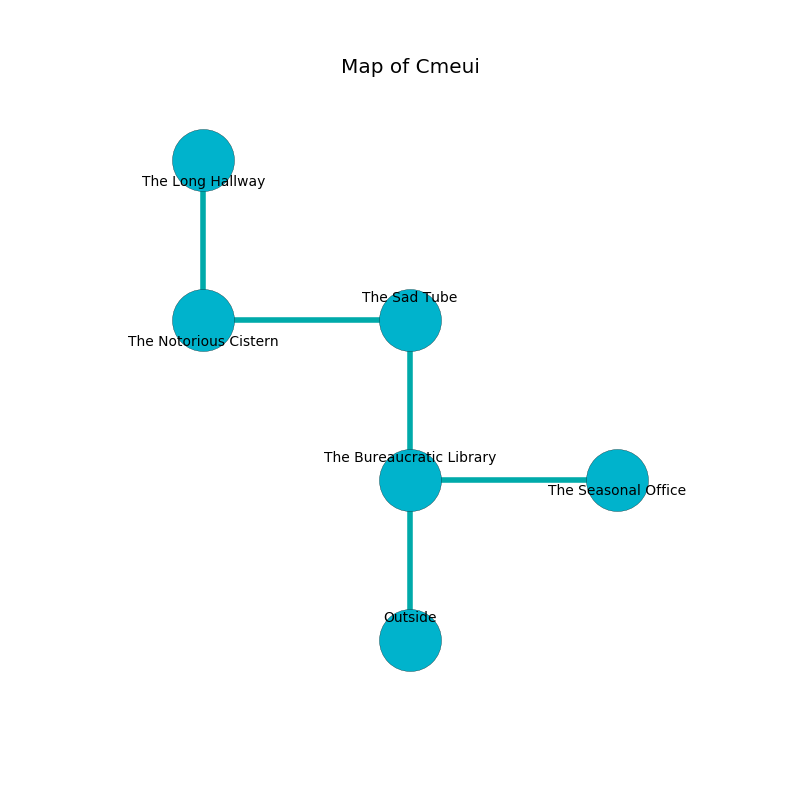

%Ruin Dogs

##Cmeui
###Overview
Cmeui is located on a cursed mountain. Some rooms of Cmeui are cursed. The ruin is burning. It is occupied by Vampires. Ricky Ness The Bossy, a Fire Giant is here. The Vampires are battling Ricky Ness The Bossy. He  is founding a new religion. 

###Artifact
####Dfuug

Dfuug has the form of a glassy rock. It smells like toast. It is a sickly green color. When picked up it frightens children. 

###Locations

####the bureaucratic library
There are a Lion, a Flumph, a Noble, a Blood Hawk, a Manes, a Hook Horror, a Minotaur, a Half-Red Dragon Veteran, and an Elk here. 

There is an engraving on the floor written in Vampires Script. 

> Maybe try cowering.
>

* [Dfuug](#Dfuug) is here.
* [Ricky Ness The Bossy](#Ricky-Ness-The-Bossy) is here.
* To the east a long cave leads to [the seasonal office](#the-seasonal-office).
* To the north a dark corridor leads to [the sad tube](#the-sad-tube).
* To the south is the entrance.

####the sad tube
Red razorgrass is swaying in cracks in the floor. There are a Basilisk and a Spirit Naga here. The floor is glossy. The air smells like juice here. 

* To the west a dark gap opens to [the notorious cistern](#the-notorious-cistern).
* To the south a dark corridor opens to [the bureaucratic library](#the-bureaucratic-library).

####the notorious cistern
There are two Vampire Spawns here. The glass walls are scratched. The Vampires are willing to negotiate. 

* To the east a dark gap leads to [the sad tube](#the-sad-tube).
* To the north a twisted passageway connects to [the long hallway](#the-long-hallway).

####the long hallway
Blue razorgrass is sprouting in a patch on the floor. 

There is an engraving on the wall written in common. 

> Dear me! dire you
>
> yet low
>
> yet never new
>
> the world is slow
>

* There is a seed here.
* To the south a twisted passageway leads to [the notorious cistern](#the-notorious-cistern).

####the seasonal office
The air tastes like rose tea here. The floor is glossy. 

There is an engraving on the wall written in Vampires Script. 

> We are frozen
>
> always mobile
>
> yet never eloquent
>
> constitutional and frequent
>
> ever short
>
> essential, intermediate, handy
>

* To the west a long cave connects to [the bureaucratic library](#the-bureaucratic-library).

