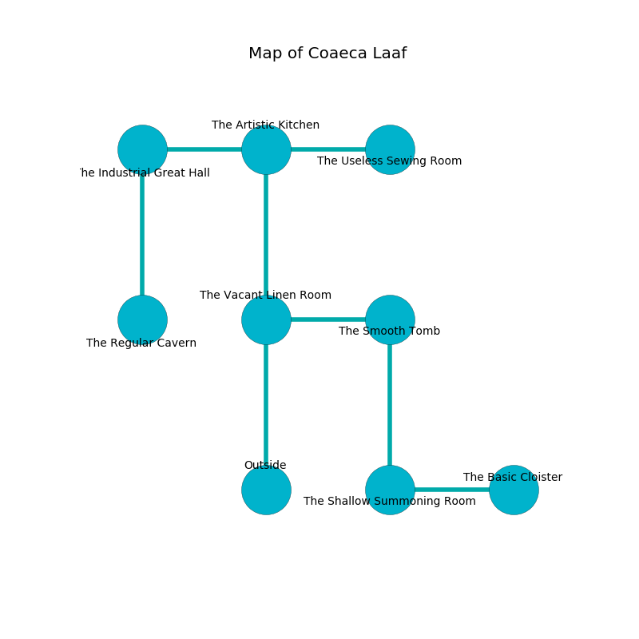

%Ruin Dogs

##Coaeca Laaf
###Overview
Coaeca Laaf is located in an alien rift. Parts of it are flooded. The ruin is larger on the inside than the outside. It is occupied by Kuo-Toa. Kenisha Mathis The Cowardly, a Spined Devil is here. The Kuo-Toa are battling Kenisha Mathis The Cowardly. She  is trying to find [The Genuine Publisher](#The-Genuine-Publisher). 

###Artifact
####The Genuine Publisher

The Genuine Publisher looks like a smooth spear. When carried it repels insects. 

###Locations

####the vacant linen room
The floor is smooth. The air tastes like beef here. There are three Kuo-Toa Whips and two Kuo-Toa here. Yellow mushrooms are swaying from the ceiling. The Kuo-Toa are caring for babies. 

* To the east a small gap opens to [the smooth tomb](#the-smooth-tomb).
* To the north a narrow hallway leads to [the artistic kitchen](#the-artistic-kitchen).
* To the south is the entrance.

####the artistic kitchen
Blue razorgrass is decaying from the ceiling. The floor is glossy. The glass walls are unsettled. The air tastes like wasabi here. 

* There is a church here.
* To the west a long gap leads to [the industrial great hall](#the-industrial-great-hall).
* To the east a windy threshold connects to [the useless sewing room](#the-useless-sewing-room).
* To the south a narrow hallway opens to [the vacant linen room](#the-vacant-linen-room).

####the smooth tomb
The mirrored walls are unsettled. There is a Kuo-Toa Monitor here. The Kuo-Toa Monitor is feasting. 

* To the west a small gap leads to [the vacant linen room](#the-vacant-linen-room).
* To the south a dark path opens to [the shallow summoning room](#the-shallow-summoning-room).

####the useless sewing room
There are a Lizardfolk, a Goblin Boss, a Giant Bat, and a Sea Hag here. The floor is cluttered with broken glass. 

* There is a frame here.
* There is a lyre here.
* To the west a windy threshold opens to [the artistic kitchen](#the-artistic-kitchen).

####the industrial great hall
There are a Nothic and a White Dragon Wyrmling here. 

* [The Genuine Publisher](#The-Genuine-Publisher) is here.
* To the east a long gap connects to [the artistic kitchen](#the-artistic-kitchen).
* To the south a hazy opening opens to [the regular cavern](#the-regular-cavern).

####the shallow summoning room
The obsidion walls are bloodstained. 

* To the east a twisted path leads to [the basic cloister](#the-basic-cloister).
* To the north a dark path opens to [the smooth tomb](#the-smooth-tomb).

####the basic cloister
The floor is bloodstained. 

* To the west a twisted path connects to [the shallow summoning room](#the-shallow-summoning-room).

####the regular cavern
Gray razorgrass is swaying in cracks in the floor. The air tastes like cream here. 

There is an engraving on a monolith written in Kuo-Toa Script. 

> Hide here.
>

* [Kenisha Mathis The Cowardly](#Kenisha-Mathis-The-Cowardly) is here.
* To the north a hazy opening leads to [the industrial great hall](#the-industrial-great-hall).

