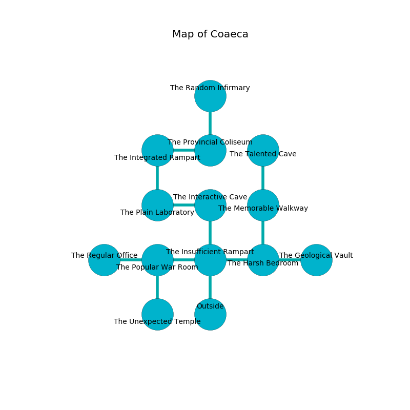

%Ruin Dogs

##Coaeca
###Overview
Coaeca is located on an obsidion tree. Parts of it are corrupted. A windstorm is happening outside. It is occupied by Goblins. Ericka Daly The Touchy, a Drow Elite Warrior is here. The Goblins are ruled by Ericka Daly The Touchy. She  is founding a new religion. 

###Artifact
####Iaeda Fuud

Iaeda Fuud has the form of a hard doll. Power incinerates around it. It smells like buttery	cabbage. It is a bright yellow color. When smelled it floats in the air. 

###Locations

####the insufficient rampart
There are a Giant Wolf Spider, an Orc War Chief, an Orc, a Druid, and a Myconid Adult here. The floor is bloodstained. The mirrored walls are bloodstained. The air tastes like tea here. 

* There is a dragon here.
* To the west a narrow hallway opens to [the popular war Room](#the-popular-war-Room).
* To the east a hazy cave connects to [the harsh bedroom](#the-harsh-bedroom).
* To the north a torchlit passageway opens to [the interactive cave](#the-interactive-cave).
* To the south is the entrance.

####the popular war Room
Gray razorgrass is decaying in a patch on the floor. The air smells like coriander here. 

* To the west a twisted cavern opens to [the regular office](#the-regular-office).
* To the east a narrow hallway connects to [the insufficient rampart](#the-insufficient-rampart).
* To the south a dripping hall leads to [the unexpected temple](#the-unexpected-temple).

####the harsh bedroom
The mirrored walls are ruined. There is a trap here. When activated, a magical sound detector will launch a rolling boulder. There are two Hobgoblin Captains here. The floor is glossy. The Goblins are defending this room from intruders. 

* There is a brick here.
* There is a head here.
* To the west a hazy cave connects to [the insufficient rampart](#the-insufficient-rampart).
* To the east a long cavern opens to [the geological vault](#the-geological-vault).
* To the north a twisted path leads to [the memorable walkway](#the-memorable-walkway).

####the interactive cave
Blue razorgrass is sprouting in cracks in the floor. 

* There is a frame here.
* There is a cord here.
* There is a ring here.
* There is a dress here.
* To the west a long cave leads to [the plain laboratory](#the-plain-laboratory).
* To the south a torchlit passageway connects to [the insufficient rampart](#the-insufficient-rampart).

####the memorable walkway
Red ferns are swaying in cracks in the floor. There are a Mud Mephit, a Gnoll Fang of Yeenoghu, and a Veteran here. The concrete walls are bloodstained. 

* To the north a torchlit corridor leads to [the talented cave](#the-talented-cave).
* To the south a twisted path opens to [the harsh bedroom](#the-harsh-bedroom).

####the regular office
There are a Giant Octopus, a Swarm of Ravens, a Fire Elemental, a Minotaur Skeleton, and an Acolyte here. The floor is sticky. 

* There is a seed here.
* To the east a twisted cavern opens to [the popular war Room](#the-popular-war-Room).

####the plain laboratory
The air tastes like paint here. Red razorgrass is swaying in cracks in the floor. The floor is sticky. 

There is an engraving on the floor written in Goblins Script. 

> I tried praying.
>

* There is a scissors here.
* [Ericka Daly The Touchy](#Ericka-Daly-The-Touchy) is here.
* To the east a long cave leads to [the interactive cave](#the-interactive-cave).
* To the north a twisted opening leads to [the integrated rampart](#the-integrated-rampart).

####the talented cave
The floor is sticky. 

* To the south a torchlit corridor connects to [the memorable walkway](#the-memorable-walkway).

####the integrated rampart
Yellow razorgrass is growing in cracks in the floor. 

There is an engraving on the floor written in Goblins Script. 

> O pitiful god
>
> but asleep
>
> yet odd
>
> hope is steep
>

* To the east a hazy threshold opens to [the provincial coliseum](#the-provincial-coliseum).
* To the south a twisted opening opens to [the plain laboratory](#the-plain-laboratory).

####the unexpected temple
The glass walls are pristine. 

* To the north a dripping hall connects to [the popular war Room](#the-popular-war-Room).

####the geological vault
The air tastes like beef here. Green moss is swaying from the walls. 

* To the west a long cavern leads to [the harsh bedroom](#the-harsh-bedroom).

####the provincial coliseum
The air tastes like cardamom here. There is a trap here. When activated, a magical sound detector will make the walls close in. White razorgrass is decaying in broken urns. 

* There is a nut here.
* [Iaeda Fuud](#Iaeda-Fuud) is here.
* To the west a hazy threshold leads to [the integrated rampart](#the-integrated-rampart).
* To the north a narrow cavern connects to [the random infirmary](#the-random-infirmary).

####the random infirmary
Yellow moss is swaying in broken urns. The air smells like umami here. The brick walls are unsettled. There are a Goblin, a Hobgoblin, two Hobgoblin Captains, and  here. One of the Goblins is working a mechanism that can engulf the room in a fiery blaze. 

* To the south a narrow cavern opens to [the provincial coliseum](#the-provincial-coliseum).

