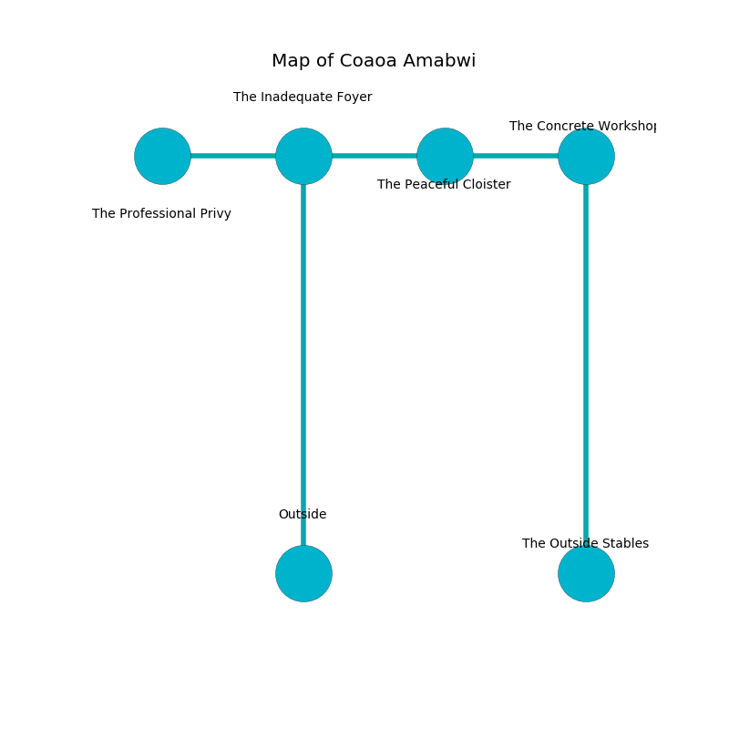

%Ruin Dogs

##Coaoa Amabwi
###Overview
Coaoa Amabwi is constructed on a broken mountain. Regions of it are foggy. A battle between raiders is happening outside. It is occupied by Pixies. Lawrence Clement The Cantankerous, a Gnoll Fang of Yeenoghu is here. The Pixies have been charmed by Lawrence Clement The Cantankerous. He  is founding a new religion. 

###Artifact
####Cfaedaeum

Cfaedaeum looks like an opaque doll. It smells like styrene. It is a sickly white color. When eaten it ignites its surrroundings. 

###Locations

####the inadequate foyer
There are sixteen Pixies here. The floor is sticky. Yellow razorgrass is decaying in a patch on the floor. The obsidion walls are scratched. One of the Pixies is on watch, the rest are drunk. 

* To the west a narrow gap connects to [the professional privy](#the-professional-privy).
* To the east a long corridor leads to [the peaceful cloister](#the-peaceful-cloister).
* To the south is the entrance.

####the peaceful cloister
The air smells like prune here. Green mushrooms are decaying in a patch on the floor. The floor is cluttered with bones. 

* There is a cart here.
* To the west a long corridor opens to [the inadequate foyer](#the-inadequate-foyer).
* To the east a hazy walkway opens to [the concrete workshop](#the-concrete-workshop).

####the concrete workshop
The floor is flooded with four inch deep hot water. White ferns are sprouting from the walls. There are a Goblin, a Gargoyle, a Minotaur Skeleton, and an Owl here. The mirrored walls are bloodstained. 

There is an engraving on a tablet written in common. 

> Try swimming.
>

* [Cfaedaeum](#Cfaedaeum) is here.
* To the west a hazy walkway leads to [the peaceful cloister](#the-peaceful-cloister).
* To the south a long gap connects to [the outside stables](#the-outside-stables).

####the professional privy
The floor is sticky. There are a Wererat and a Quaggoth here. Gray moss is sprouting in cracks in the floor. There is a trap here. When activated, a magical rune will blast flames. The concrete walls are caving in. 

* There is a boat here.
* There is a fork here.
* [Lawrence Clement The Cantankerous](#Lawrence-Clement-The-Cantankerous) is here.
* To the east a narrow gap leads to [the inadequate foyer](#the-inadequate-foyer).

####the outside stables
There is a trap here. When activated, a magical rune will launch a blade. The floor is smooth. The air smells like yuzu here. 

* There is a dog here.
* To the north a long gap opens to [the concrete workshop](#the-concrete-workshop).

