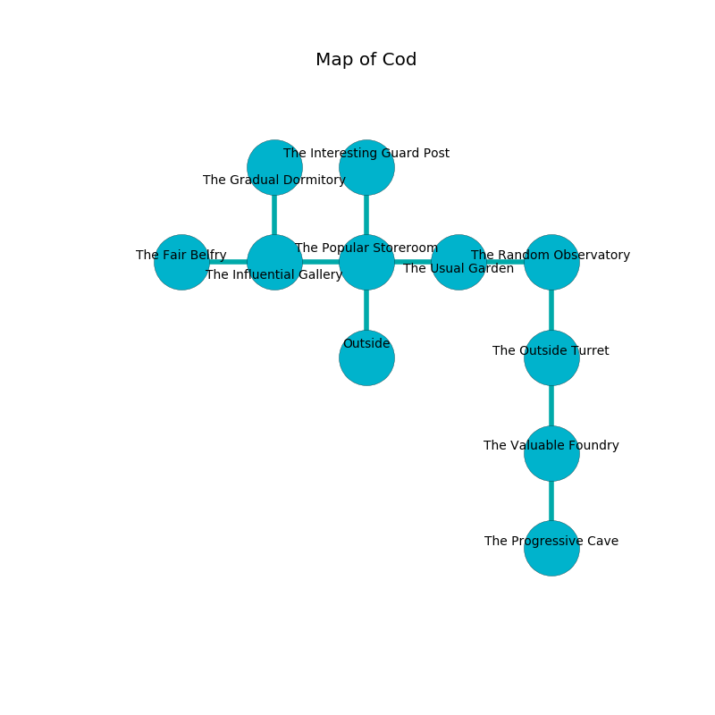

%Ruin Dogs

##Cod
###Overview
Cod is located on an obsidion mountain. Some rooms of Cod are corrupted. The ruin is larger on the inside than the outside. It is occupied by Harpies. Leonardo Tuggle The Dogmatic, a Bulette is here. The Harpies have been charmed by Leonardo Tuggle The Dogmatic. He  is founding a new religion. 

###Artifact
####Gaeha Cumcaddaeum

Gaeha Cumcaddaeum has the form of a warm monument. Fire flows near it. It is a dark yellow color. When gazed upon it projects energy. 

###Locations

####the popular storeroom
There is a trap here. When activated, a magical proximity detector will fire a scything blade. Yellow lichens are growing from the walls. There are four Harpies here. The air smells like musk here. The brick walls are caving in. The floor is bloodstained. The Harpies are feasting. 

* To the west a dripping artery connects to [the influential gallery](#the-influential-gallery).
* To the east a long walkway leads to [the usual garden](#the-usual-garden).
* To the north a dripping cave leads to [the interesting guard post](#the-interesting-guard-post).
* To the south is the entrance.

####the interesting guard post
The concrete walls are bloodstained. 

* To the south a dripping cave leads to [the popular storeroom](#the-popular-storeroom).

####the usual garden
There are a Giant Constrictor Snake, a Polar Bear, and a Dretch here. The air tastes like peanut butter here. 

* There is a match here.
* To the west a long walkway leads to [the popular storeroom](#the-popular-storeroom).
* To the east a dark opening leads to [the random observatory](#the-random-observatory).

####the influential gallery
The floor is glossy. The wooden walls are scratched. 

* To the west a dripping opening connects to [the fair belfry](#the-fair-belfry).
* To the east a dripping artery leads to [the popular storeroom](#the-popular-storeroom).
* To the north a hazy cave connects to [the gradual dormitory](#the-gradual-dormitory).

####the random observatory
The wooden walls are bloodstained. 

There is an engraving on the floor written in Harpies Script. 

> I am defending this place.
>

* There is a fowl here.
* There is a dress here.
* To the west a dark opening leads to [the usual garden](#the-usual-garden).
* To the south a narrow hallway leads to [the outside turret](#the-outside-turret).

####the outside turret
There are a Giant Wolf Spider, a Raven, a Draft Horse, a Merfolk, a Gelatinous Cube, a Copper Dragon Wyrmling, and a Thri-Kreen here. The concrete walls are pristine. 

* There is a horn here.
* [Leonardo Tuggle The Dogmatic](#Leonardo-Tuggle-The-Dogmatic) is here.
* To the north a narrow hallway leads to [the random observatory](#the-random-observatory).
* To the south a twisted artery leads to [the valuable foundry](#the-valuable-foundry).

####the valuable foundry
The air tastes like guava here. Blue ferns are decaying from the ceiling. The stone walls are covered in mold. 

* [Gaeha Cumcaddaeum](#Gaeha-Cumcaddaeum) is here.
* To the north a twisted artery leads to [the outside turret](#the-outside-turret).
* To the south a dark path connects to [the progressive cave](#the-progressive-cave).

####the gradual dormitory
The floor is sticky. There are a Mummy, a Blood Hawk, and a Quadrone here. 

There is an engraving on a tablet written in common. 

> All of us are frozen
>
> main and transparent
>
> They are frozen
>
> hungry and narrow
>
> sympathetic, positive, complex
>
> active and passive
>

* There is a specter here.
* To the south a hazy cave leads to [the influential gallery](#the-influential-gallery).

####the fair belfry
The metallic walls are pristine. There is a Lizard King here. 

* There is an icon here.
* To the east a dripping opening connects to [the influential gallery](#the-influential-gallery).

####the progressive cave
The metallic walls are scratched. The floor is flooded with five inch deep hot water. The air tastes like tea here. 

There is an engraving on the floor written in common. 

> A stamp is a maid
>
> obese, tender, strange
>
> A nose is a rally
>
> bitter and manual
>
> cruel and lucky
>
> [Gaeha Cumcaddaeum](#Gaeha-Cumcaddaeum)
>
> low, amber, delicate
>
> revolutionary and interesting
>
> philosophical and attractive
>
> deep, immune, expected
>
> you must be eaten
>

* There is an egg here.
* There is a parcel here.
* To the north a dark path connects to [the valuable foundry](#the-valuable-foundry).

