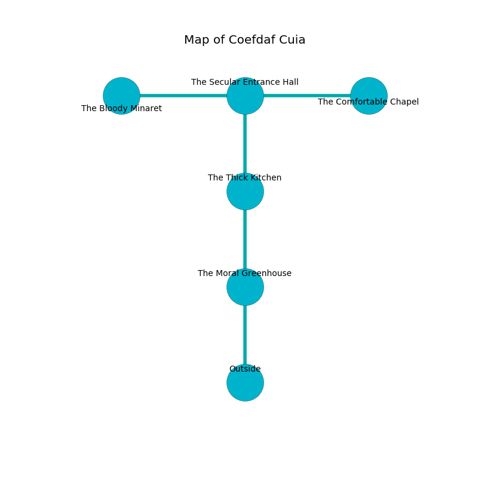

%Ruin Dogs

##Coefdaf Cuia
###Overview
Coefdaf Cuia is located under a poisoned city. Some areas of Coefdaf Cuia are frozen. A massive flood is happening outside. It is occupied by Thri-Kreens. Barney Rowley The Overemotional, a Hill Giant is here. The Thri-Kreens have been charmed by Barney Rowley The Overemotional. He  is founding a new religion. 

###Artifact
####The Grateful List

The Grateful List is a powerful artifact in the shape of a sharp spear. When eaten it sings the hymn of the damned. 

###Locations

####the moral greenhouse
There is a trap here. When activated, a magical proximity detector will swing a tripping chain. Red lichens are swaying from the ceiling. The floor is glossy. There are a Slaad Tadpole, a Lizardfolk, an Allosaurus, and a Bearded Devil here. 

* To the north a dripping threshold leads to [the thick kitchen](#the-thick-kitchen).
* To the south is the entrance.

####the thick kitchen
The mirrored walls are pristine. 

* To the north a flooded artery leads to [the secular entrance hall](#the-secular-entrance-hall).
* To the south a dripping threshold leads to [the moral greenhouse](#the-moral-greenhouse).

####the secular entrance hall
The air tastes like shrimp here. The wooden walls are pristine. 

There is an engraving on a tablet written in Thri-Kreens Script. 

> I am lost in Coefdaf Cuia.
>

* [The Grateful List](#The-Grateful-List) is here.
* To the west a dark corridor opens to [the bloody minaret](#the-bloody-minaret).
* To the east a torchlit artery opens to [the comfortable chapel](#the-comfortable-chapel).
* To the south a flooded artery leads to [the thick kitchen](#the-thick-kitchen).

####the bloody minaret
Blue ferns are decaying from the walls. There are four Thri-Kreens here. The obsidion walls are ruined. One of the Thri-Kreens is on watch, the rest are celebrating. 

There is an engraving on the floor written in common. 

> I discovered [The Grateful List](#The-Grateful-List).
>
> Go away.
>

* To the east a dark corridor leads to [the secular entrance hall](#the-secular-entrance-hall).

####the comfortable chapel
The floor is flooded with five inch deep hot water. The glass walls are covered in mold. The air smells like acerola here. 

* There is a rod here.
* [Barney Rowley The Overemotional](#Barney-Rowley-The-Overemotional) is here.
* To the west a torchlit artery leads to [the secular entrance hall](#the-secular-entrance-hall).

