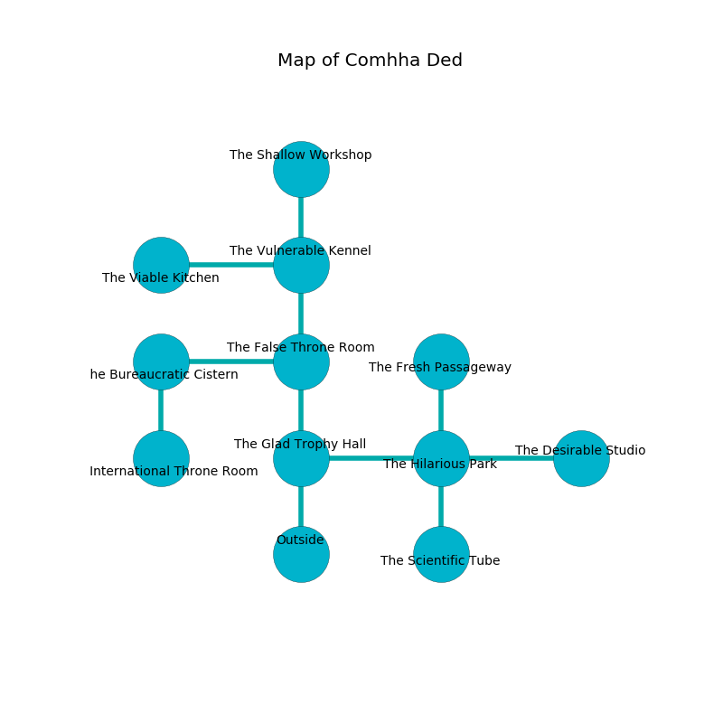

%Ruin Dogs

##Comhha Ded
###Overview
Comhha Ded is located under a spikey rift. Regions of Comhha Ded are corrupted. A massive flood is happening outside. It is occupied by Cyclopses. Vashti Mccain The Unpredictable, a Drow Mage is here. The Cyclopses are ruled by Vashti Mccain The Unpredictable. She  is founding a new religion. 

###Artifact
####The Lonely Elite

The Lonely Elite is a powerful artifact in the shape of an opaque meteorite. Water glows from it. It smells like dairy. When picked up it becomes a deadly projectile. 

###Locations

####the glad trophy hall
There are two Cyclopses here. The crystal walls are scratched. Yellow lichens are decaying in broken urns. The Cyclopses are willing to negotiate. 

* There is a sword here.
* [Vashti Mccain The Unpredictable](#Vashti-Mccain-The-Unpredictable) is here.
* To the east a dark walkway connects to [the hilarious park](#the-hilarious-park).
* To the north a windy corridor connects to [the false throne room](#the-false-throne-room).
* To the south is the entrance.

####the hilarious park
There is a trap here. When activated, a pressure plate will open a large pit in the floor. There are a Mud Mephit, a Yeti, a Hell Hound, and an Orc Eye of Gruumsh here. Gray lichens are swaying in cracks in the floor. 

* [The Lonely Elite](#The-Lonely-Elite) is here.
* To the west a dark walkway leads to [the glad trophy hall](#the-glad-trophy-hall).
* To the east a torchlit hall leads to [the desirable studio](#the-desirable-studio).
* To the north a small opening connects to [the fresh passageway](#the-fresh-passageway).
* To the south a dark gap leads to [the scientific tube](#the-scientific-tube).

####the false throne room
The concrete walls are caving in. The air tastes like macadamia here. 

* To the west a twisted cavern connects to [the bureaucratic cistern](#the-bureaucratic-cistern).
* To the north a hazy cavern connects to [the vulnerable kennel](#the-vulnerable-kennel).
* To the south a windy corridor leads to [the glad trophy hall](#the-glad-trophy-hall).

####the vulnerable kennel
There are two Cyclopses here. One of the Cyclopses is on watch, the rest are sleeping. 

There is an engraving on a stone written in common. 

> O everything is sadistic
>
> but never characteristic
>
> internal and voluntary
>
> the world is optimistic
>

* There is a head here.
* To the west a twisted passageway leads to [the viable kitchen](#the-viable-kitchen).
* To the north a twisted hall opens to [the shallow workshop](#the-shallow-workshop).
* To the south a hazy cavern connects to [the false throne room](#the-false-throne-room).

####the bureaucratic cistern
There is a trap here. When activated, a magical sound detector will shoot a lightning bolt. Gray lichens are swaying in cracks in the floor. The air smells like pear here. The mirrored walls are ruined. 

There is an engraving on a stone written in Cyclopses Script. 

> I am free.
>

* To the east a twisted cavern opens to [the false throne room](#the-false-throne-room).
* To the south a small cave leads to [the international throne room](#the-international-throne-room).

####the viable kitchen
The stone walls are ruined. Green moss is growing in a patch on the floor. 

There is an engraving on the wall written in common. 

> I discovered Comhha Ded.
>
> A trap ahead.
>

* To the east a twisted passageway leads to [the vulnerable kennel](#the-vulnerable-kennel).

####the shallow workshop
The air tastes like wasabi here. The glass walls are caving in. There are a Young Black Dragon, a Copper Dragon Wyrmling, a Blue Dragon Wyrmling, an Orog, and a Tridrone here. 

* To the south a twisted hall connects to [the vulnerable kennel](#the-vulnerable-kennel).

####the fresh passageway
The air tastes like maple here. 

* To the south a small opening opens to [the hilarious park](#the-hilarious-park).

####the international throne room
The floor is glossy. There are a Bone Naga and a Green Hag here. The air smells like onion here. 

There is an engraving on the ceiling written in Cyclopses Script. 

> A trap ahead.
>

* To the north a small cave connects to [the bureaucratic cistern](#the-bureaucratic-cistern).

####the scientific tube
The crystal walls are scratched. White mushrooms are decaying from the ceiling. The air smells like carnation here. The floor is smooth. 

There is an engraving on a stone written in Cyclopses Script. 

> Dear me! weak soul
>
> it is always whole
>
> always conventional
>
> cruelty is whole
>

* There is a cup here.
* To the north a dark gap opens to [the hilarious park](#the-hilarious-park).

####the desirable studio
The glass walls are ruined. 

* To the west a torchlit hall leads to [the hilarious park](#the-hilarious-park).

