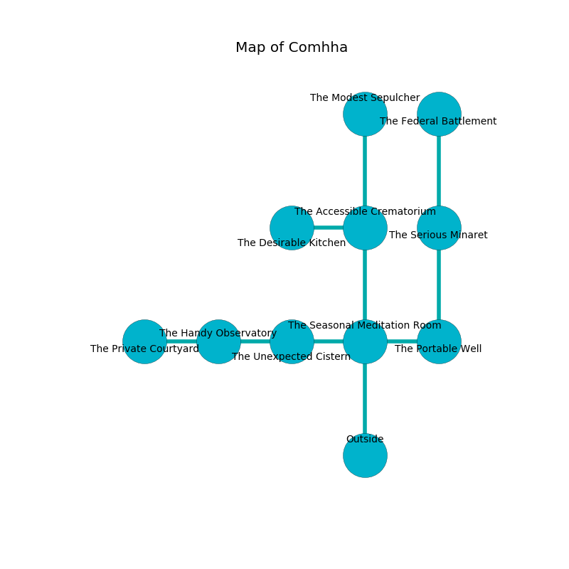

%Ruin Dogs

##Comhha
###Overview
Comhha is located on a haunted city. Parts of it are corrupted. The ruin is sinking into the earth. It is occupied by Goblins. Ollie Lively The Overcritical, a Priest is here. The Goblins are ruled by Ollie Lively The Overcritical. He  is founding a new religion. 

###Artifact
####Iwihhedha

Iwihhedha looks like a warm amulet. It is a sickly black color. It smells like menthol. Light shifts around it. When gazed upon it grants a wish. 

###Locations

####the seasonal meditation room
The floor is flooded with nine inch deep cool water. The air smells like absinthe here. There are two Goblins and three Hobgoblins here. The wooden walls are covered in mold. If the Goblins notice the Ruin Dogs, one of them will retreat and alert the others. 

* There is a salamander here.
* There is a chest here.
* There is a sponge here.
* To the west a twisted pathway leads to [the unexpected cistern](#the-unexpected-cistern).
* To the east a small opening leads to [the portable well](#the-portable-well).
* To the north a flooded pathway connects to [the accessible crematorium](#the-accessible-crematorium).
* To the south is the entrance.

####the portable well
Blue ferns are sprouting from the ceiling. The floor is glossy. The air tastes like mahogany here. The brick walls are scratched. There are a Giant Toad, a Giant Boar, and a Rust Monster here. 

* To the west a small opening opens to [the seasonal meditation room](#the-seasonal-meditation-room).
* To the north a twisted opening connects to [the serious minaret](#the-serious-minaret).

####the unexpected cistern
Red lichens are sprouting from the walls. 

* [Ollie Lively The Overcritical](#Ollie-Lively-The-Overcritical) is here.
* To the west a dripping hall opens to [the handy observatory](#the-handy-observatory).
* To the east a twisted pathway opens to [the seasonal meditation room](#the-seasonal-meditation-room).

####the accessible crematorium
The glass walls are covered in mold. The floor is bloodstained. The air smells like nut here. 

* There is a parcel here.
* To the west a torchlit walkway opens to [the desirable kitchen](#the-desirable-kitchen).
* To the north a small opening leads to [the modest sepulcher](#the-modest-sepulcher).
* To the south a flooded pathway leads to [the seasonal meditation room](#the-seasonal-meditation-room).

####the desirable kitchen
There are a Monodrone, a Crab, a Reef Shark, a Giant Owl, an Acolyte, and a Half-Ogre here. The metallic walls are pristine. Green lichens are growing in cracks in the floor. 

There is an engraving on a monolith written in common. 

> I thought about cowering.
>

* To the east a torchlit walkway opens to [the accessible crematorium](#the-accessible-crematorium).

####the handy observatory
The concrete walls are bloodstained. The floor is bloodstained. 

* To the west a twisted pathway opens to [the private courtyard](#the-private-courtyard).
* To the east a dripping hall leads to [the unexpected cistern](#the-unexpected-cistern).

####the modest sepulcher
Green lichens are decaying in broken urns. 

* To the south a small opening connects to [the accessible crematorium](#the-accessible-crematorium).

####the serious minaret
The air tastes like patchouli here. There are a Goblin and four Hobgoblins here. Yellow moss is swaying in broken urns. The metallic walls are bloodstained. One of the Goblins is on watch, the rest are feasting. 

There is an engraving on a tablet written in common. 

> I am old.
>

* There is a screw here.
* [Iwihhedha](#Iwihhedha) is here.
* To the north a torchlit gap connects to [the federal battlement](#the-federal-battlement).
* To the south a twisted opening connects to [the portable well](#the-portable-well).

####the private courtyard
The floor is bloodstained. The air smells like wood here. 

There is an engraving on the wall written in Goblins Script. 

> All of us are lost
>
> impossible, sick, productive
>

* To the east a twisted pathway opens to [the handy observatory](#the-handy-observatory).

####the federal battlement
Yellow mushrooms are growing from the walls. The brick walls are ruined. The floor is sticky. 

* To the south a torchlit gap leads to [the serious minaret](#the-serious-minaret).

