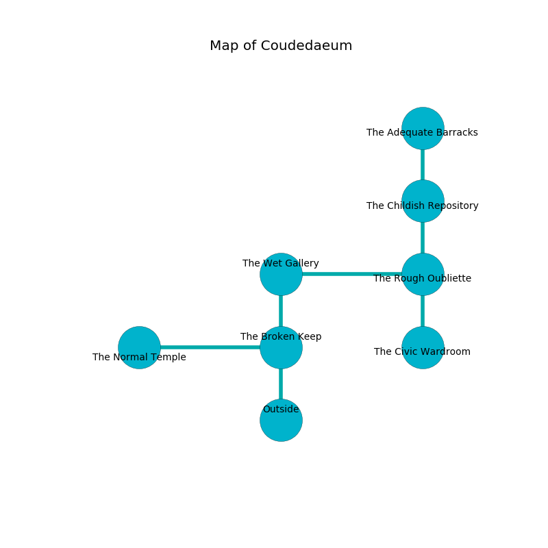

%Ruin Dogs

##Coudedaeum
###Overview
Coudedaeum is located under a giant rift. Parts of Coudedaeum are incredibly cold. A battle between raiders is happening outside. It is occupied by Harpies. Tara Vail The Ruthless, a Bandit Captain is here. The Harpies have been charmed by Tara Vail The Ruthless. She  is trying to discover [The Even Fountain](#The-Even-Fountain). 

###Artifact
####The Even Fountain

The Even Fountain is a powerful artifact in the shape of a warm crystal. When thrown it destroys itself. 

###Locations

####the broken keep
The floor is flooded with three inch deep hot water. There are three Harpies here. The Harpies are willing to fight to the death. 

* To the west a twisted cave connects to [the normal temple](#the-normal-temple).
* To the north a dark opening connects to [the wet gallery](#the-wet-gallery).
* To the south is the entrance.

####the wet gallery
Yellow mushrooms are swaying from the ceiling. The floor is sticky. 

* To the east a windy threshold opens to [the rough oubliette](#the-rough-oubliette).
* To the south a dark opening connects to [the broken keep](#the-broken-keep).

####the rough oubliette
Green ferns are swaying in cracks in the floor. The stone walls are ruined. 

* To the west a windy threshold opens to [the wet gallery](#the-wet-gallery).
* To the north a long gap leads to [the childish repository](#the-childish-repository).
* To the south a dripping corridor connects to [the civic wardroom](#the-civic-wardroom).

####the civic wardroom
There is a trap here. When activated, a magical proximity detector will launch a poison dart. The obsidion walls are ruined. 

There is an engraving on the wall written in Harpies Script. 

> I found [The Even Fountain](#The-Even-Fountain).
>
> I tried swimming.
>

* To the north a dripping corridor leads to [the rough oubliette](#the-rough-oubliette).

####the childish repository
There are three Harpies here. The air smells like bacon here. Green lichens are sprouting in a patch on the floor. One of the Harpies is on watch, the rest are meditating. 

* [The Even Fountain](#The-Even-Fountain) is here.
* To the north a twisted artery connects to [the adequate barracks](#the-adequate-barracks).
* To the south a long gap opens to [the rough oubliette](#the-rough-oubliette).

####the normal temple
There are three Harpies here. One of the Harpies is on watch, the rest are caring for babies. 

* [Tara Vail The Ruthless](#Tara-Vail-The-Ruthless) is here.
* To the east a twisted cave opens to [the broken keep](#the-broken-keep).

####the adequate barracks
The air tastes like chive here. There are three Harpies here. The stone walls are covered in mold. The Harpies are willing to negotiate. 

* To the south a twisted artery connects to [the childish repository](#the-childish-repository).

