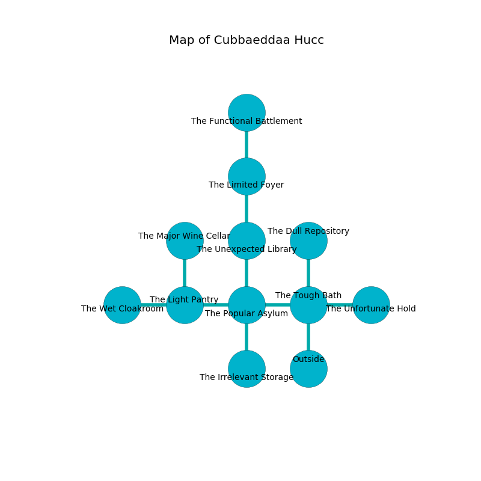

%Ruin Dogs

##Cubbaeddaa Hucc
###Overview
Cubbaeddaa Hucc is located in a volcanic rift. Some rooms of it are incredibly cold. The ruin is larger on the inside than the outside. It is occupied by Gnolls. Arielle Cromwell The Indiscreet, a Hobgoblin Captain is here. The Gnolls worship Arielle Cromwell The Indiscreet. She  is trying to exploit [The Painful Duty](#The-Painful-Duty). 

###Artifact
####The Painful Duty

The Painful Duty has the form of a mushy doll. It is a sickly yellow color. When smelled it becomes lost. 

###Locations

####the tough bath
The air tastes like raspberry here. 

* There is a fish here.
* To the west a dark gap connects to [the popular asylum](#the-popular-asylum).
* To the east a narrow walkway opens to [the unfortunate hold](#the-unfortunate-hold).
* To the north a long opening opens to [the dull repository](#the-dull-repository).
* To the south is the entrance.

####the popular asylum
The floor is sticky. Gray lichens are swaying from the walls. 

* To the west a small pathway leads to [the light pantry](#the-light-pantry).
* To the east a dark gap connects to [the tough bath](#the-tough-bath).
* To the north a windy opening opens to [the unexpected library](#the-unexpected-library).
* To the south a twisted artery opens to [the irrelevant storage](#the-irrelevant-storage).

####the dull repository
The floor is bloodstained. The glass walls are pristine. The air smells like spruce here. 

There is an engraving on the floor written in common. 

> A basket is a chalk
>
> yet manual
>
> You are love
>
> dynamic, powerful, minor
>

* To the south a long opening leads to [the tough bath](#the-tough-bath).

####the irrelevant storage
Red mushrooms are decaying in a patch on the floor. The brick walls are pristine. The air tastes like tequila here. 

* To the north a twisted artery connects to [the popular asylum](#the-popular-asylum).

####the unexpected library
The floor is flooded with eight inch deep hot water. There are a Gnoll and two Gnoll Pack Lords here. The air tastes like praline here. The Gnolls are performing a ritual. If not interrupted, the Gnolls will become more powerful. 

There is an engraving on a stone written in Gnolls Script. 

> I am powerful.
>

* To the north a torchlit artery opens to [the limited foyer](#the-limited-foyer).
* To the south a windy opening opens to [the popular asylum](#the-popular-asylum).

####the unfortunate hold

* To the west a narrow walkway connects to [the tough bath](#the-tough-bath).

####the light pantry
Gray moss is sprouting from the walls. 

There is an engraving on the ceiling written in Gnolls Script. 

> I could not try running.
>

* [The Painful Duty](#The-Painful-Duty) is here.
* To the west a torchlit corridor leads to [the wet cloakroom](#the-wet-cloakroom).
* To the east a small pathway opens to [the popular asylum](#the-popular-asylum).
* To the north a twisted path opens to [the major wine cellar](#the-major-wine-cellar).

####the limited foyer
The floor is glossy. The concrete walls are covered in mold. 

There is an engraving on a tablet written in common. 

> Run away.
>

* To the north a small gap leads to [the functional battlement](#the-functional-battlement).
* To the south a torchlit artery leads to [the unexpected library](#the-unexpected-library).

####the functional battlement
There are two Gnolls and a Gnoll Pack Lord here. The glass walls are ruined. The Gnolls are willing to fight to the death. 

* [Arielle Cromwell The Indiscreet](#Arielle-Cromwell-The-Indiscreet) is here.
* To the south a small gap leads to [the limited foyer](#the-limited-foyer).

####the wet cloakroom
Blue ferns are growing in cracks in the floor. 

There is an engraving on the ceiling written in common. 

> Hide here.
>

* To the east a torchlit corridor connects to [the light pantry](#the-light-pantry).

####the major wine cellar
The floor is smooth. There are two Gnolls and a Gnoll Pack Lord here. The Gnolls are celebrating. 

* There is a door here.
* To the south a twisted path opens to [the light pantry](#the-light-pantry).

