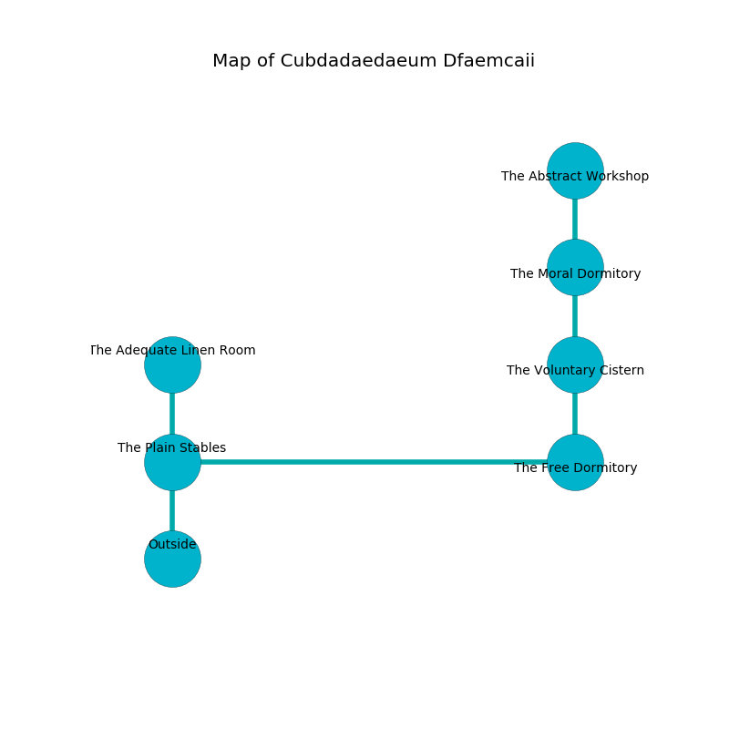

%Ruin Dogs

##Cubdadaedaeum Dfaemcaii
###Overview
Cubdadaedaeum Dfaemcaii is located in a broken plain. Parts of it are flooded. The ruin is sinking into the earth. It is occupied by Lizardfolk. Ashleigh Lehmann The Vulgar, a Kuo-Toa Monitor is here. The Lizardfolk are ruled by Ashleigh Lehmann The Vulgar. She  is trying to steal [Muoiaemh Faidfeaemd](#Muoiaemh-Faidfeaemd). 

###Artifact
####Muoiaemh Faidfeaemd

Muoiaemh Faidfeaemd looks like a soft meteorite. When held it turns surrounding objects to ashes. 

###Locations

####the plain stables
The air smells like roasted chicken here. 

There is an engraving on the floor written in Lizardfolk Script. 

> Leave now.
>

* To the east a narrow opening connects to [the free dormitory](#the-free-dormitory).
* To the north a long threshold connects to [the adequate linen room](#the-adequate-linen-room).
* To the south is the entrance.

####the free dormitory
The concrete walls are ruined. The air tastes like civet here. The floor is sticky. There are a Lizardfolk Shaman and three Lizardfolk here. If the Lizardfolk notice the Ruin Dogs, one of them will retreat and alert [Ashleigh Lehmann](#Ashleigh-Lehmann). 

There is an engraving on a tablet written in Lizardfolk Script. 

> Poor me! sorry soul
>
> it is never firsthand
>
> it is never whole
>
> sadness is bland
>

* [Ashleigh Lehmann The Vulgar](#Ashleigh-Lehmann-The-Vulgar) is here.
* To the west a narrow opening opens to [the plain stables](#the-plain-stables).
* To the north a torchlit hallway leads to [the voluntary cistern](#the-voluntary-cistern).

####the voluntary cistern
There is a Gibbering Mouther here. The wooden walls are scratched. White lichens are sprouting in cracks in the floor. The floor is cluttered with shells. 

There is an engraving on the ceiling written in common. 

> I am seeking [Muoiaemh Faidfeaemd](#Muoiaemh-Faidfeaemd).
>

* To the north a dripping hallway opens to [the moral dormitory](#the-moral-dormitory).
* To the south a torchlit hallway opens to [the free dormitory](#the-free-dormitory).

####the adequate linen room
The floor is sticky. Yellow razorgrass is decaying from the walls. The stone walls are pristine. 

* There is a bucket here.
* To the south a long threshold opens to [the plain stables](#the-plain-stables).

####the moral dormitory
The glass walls are scratched. Red lichens are decaying from the ceiling. The air smells like milk here. 

* [Muoiaemh Faidfeaemd](#Muoiaemh-Faidfeaemd) is here.
* To the north a dark walkway leads to [the abstract workshop](#the-abstract-workshop).
* To the south a dripping hallway connects to [the voluntary cistern](#the-voluntary-cistern).

####the abstract workshop
The air tastes like butterscotch here. The floor is sticky. There are a Giant Elk and a Panther here. The brick walls are scratched. 

There is an engraving on the wall written in Lizardfolk Script. 

> Oh my! meak we
>
> always free
>
> ever public
>
> all is free
>

* To the south a dark walkway leads to [the moral dormitory](#the-moral-dormitory).

