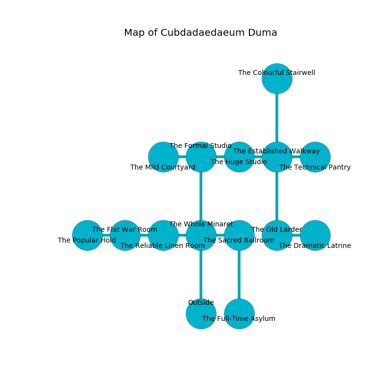

%Ruin Dogs

##Cubdadaedaeum Duma
###Overview
Cubdadaedaeum Duma is located in a poisoned city. Some rooms of it are frozen. The ruin is flooding. It is occupied by Dryads. Gus Marin The Greedy, a Fire Giant is here. The Dryads have been charmed by Gus Marin The Greedy. He  is trying to hide [Homh](#Homh). 

###Artifact
####Homh

Homh looks like a cold doll. It smells like oats. It is a medium brown color. When gazed upon it grants psychic powers. 

###Locations

####the whole minaret
The floor is bloodstained. The air smells like chemicals here. The metallic walls are unsettled. 

* To the west a hazy walkway leads to [the reliable linen room](#the-reliable-linen-room).
* To the east a twisted hallway connects to [the sacred ballroom](#the-sacred-ballroom).
* To the north a hazy gap connects to [the formal studio](#the-formal-studio).
* To the south is the entrance.

####the sacred ballroom
The floor is cluttered with shells. 

* To the west a twisted hallway leads to [the whole minaret](#the-whole-minaret).
* To the south a dripping passageway connects to [the full-time asylum](#the-full-time-asylum).

####the full-time asylum
There are eight Dryads here. The Dryads are celebrating. 

* There is a plate here.
* There is a kettle here.
* There is a spear here.
* To the north a dripping passageway connects to [the sacred ballroom](#the-sacred-ballroom).

####the formal studio
There are an Allosaurus, a Revenant, an Octopus, and a Werebear here. The crystal walls are scratched. The floor is glossy. 

* There is a brooch here.
* To the west a small pathway connects to [the mild courtyard](#the-mild-courtyard).
* To the east a windy cave connects to [the huge studio](#the-huge-studio).
* To the south a hazy gap leads to [the whole minaret](#the-whole-minaret).

####the huge studio
The floor is smooth. There is a trap here. When activated, a tripwire will extend a spring loaded spear. The air smells like roasted chicken here. Gray razorgrass is growing from the ceiling. 

* There is a rail here.
* To the west a windy cave leads to [the formal studio](#the-formal-studio).
* To the east a dark passageway leads to [the established walkway](#the-established-walkway).

####the established walkway
The air tastes like dairy here. There are a Zombie, a Raven, a Sahuagin Baron, an Awakened Shrub, a Giant Shark, and a Griffon here. Red mushrooms are sprouting from the ceiling. 

* To the west a dark passageway connects to [the huge studio](#the-huge-studio).
* To the east a windy pathway opens to [the technical pantry](#the-technical-pantry).
* To the north a twisted cave connects to [the colourful stairwell](#the-colourful-stairwell).
* To the south a small hall connects to [the old larder](#the-old-larder).

####the reliable linen room
The brick walls are bloodstained. There are eight Dryads here. The Dryads are willing to fight to the death. 

There is an engraving on a stone written in common. 

> Poor me! life is poor
>
> heavy, abundant, light
>
> it is always mature
>
> the world is white
>

* There is a seed here.
* To the west a torchlit artery connects to [the flat war Room](#the-flat-war-Room).
* To the east a hazy walkway opens to [the whole minaret](#the-whole-minaret).

####the old larder
White moss is decaying in cracks in the floor. The concrete walls are scratched. The floor is glossy. 

* [Gus Marin The Greedy](#Gus-Marin-The-Greedy) is here.
* To the east a long hall opens to [the dramatic latrine](#the-dramatic-latrine).
* To the north a small hall opens to [the established walkway](#the-established-walkway).

####the technical pantry
The floor is cluttered with shells. Blue moss is swaying in a patch on the floor. The crystal walls are ruined. 

There is an engraving on a stone written in common. 

> Oh my! the memory of you is woe
>
> musical, well, slow
>
> yet whole
>
> all is low
>

* To the west a windy pathway leads to [the established walkway](#the-established-walkway).

####the mild courtyard
The stone walls are pristine. The floor is bloodstained. Yellow ferns are decaying from the ceiling. 

* To the east a small pathway connects to [the formal studio](#the-formal-studio).

####the flat war Room
The floor is cluttered with debris. The concrete walls are bloodstained. There is a trap here. When activated, a magical proximity detector will make the ceiling slowly lower. There are eight Dryads here. The Dryads are willing to fight to the death. 

* [Homh](#Homh) is here.
* To the west a windy walkway leads to [the popular hold](#the-popular-hold).
* To the east a torchlit artery opens to [the reliable linen room](#the-reliable-linen-room).

####the dramatic latrine
The air tastes like green bean here. There are eight Dryads here. The concrete walls are unsettled. One of the Dryads is working a mechanism that can pour a torrent of water from the ceiling. 

* To the west a long hall leads to [the old larder](#the-old-larder).

####the colourful stairwell
There are eight Dryads here. Yellow moss is decaying from the ceiling. The air tastes like broccoli here. The floor is cluttered with shells. The Dryads are performing a ritual. If not interrupted, the Dryads will become more powerful. 

* There is a dog here.
* There is a tome here.
* To the south a twisted cave connects to [the established walkway](#the-established-walkway).

####the popular hold

* To the east a windy walkway leads to [the flat war Room](#the-flat-war-Room).

