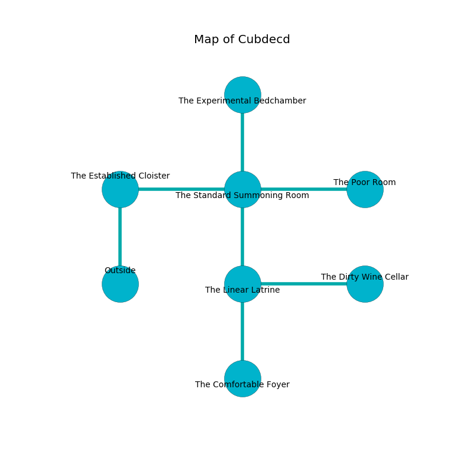

%Ruin Dogs

##Cubdecd
###Overview
Cubdecd is located in a crystal rift. Parts of Cubdecd are incredibly hot. The ruin is burning. It is occupied by Sahuagin. Destiny Medeiros The Thoughtless, a Gnoll Pack Lord is here. The Sahuagin are the soldiers of Destiny Medeiros The Thoughtless. She  is trying to use [The Honorable Finger](#The-Honorable-Finger). 

###Artifact
####The Honorable Finger

The Honorable Finger has the form of a broken crystal. It smells like pistachio. Light slips towards it. When thrown it becomes hot. 

###Locations

####the established cloister
There are six Sahuagin here. The Sahuagin are performing a ritual. If not interrupted, the Sahuagin will become more powerful. 

There is an engraving on the wall written in common. 

> An eye is a magnitude
>
> always controversial
>
> yet peaceful
>
> narrow, glad, pregnant
>
> equal and white
>

* [Destiny Medeiros The Thoughtless](#Destiny-Medeiros-The-Thoughtless) is here.
* To the east a torchlit opening leads to [the standard summoning room](#the-standard-summoning-room).
* To the south is the entrance.

####the standard summoning room
The floor is sticky. There are six Sahuagin here. The Sahuagin are caring for babies. 

* There is a spring here.
* To the west a torchlit opening leads to [the established cloister](#the-established-cloister).
* To the east a dark opening leads to [the poor room](#the-poor-room).
* To the north a dripping hall opens to [the experimental bedchamber](#the-experimental-bedchamber).
* To the south a long corridor connects to [the linear latrine](#the-linear-latrine).

####the poor room
The crystal walls are bloodstained. There are a Giant Wolf Spider, an Ape, a Hell Hound, a Gas Spore, a Giant Vulture, a Reef Shark, and a Mule here. The air smells like cocoa here. 

* To the west a dark opening connects to [the standard summoning room](#the-standard-summoning-room).

####the linear latrine
The floor is bloodstained. There is a trap here. When activated, a magical proximity detector will close a portcullis. There are six Sahuagin here. White moss is sprouting in a patch on the floor. The wooden walls are covered in mold. If the Sahuagin notice the Ruin Dogs, one of them will retreat and alert the others. 

* There is a coat here.
* [The Honorable Finger](#The-Honorable-Finger) is here.
* To the east a hazy cave leads to [the dirty wine cellar](#the-dirty-wine-cellar).
* To the north a long corridor connects to [the standard summoning room](#the-standard-summoning-room).
* To the south a small passageway leads to [the comfortable foyer](#the-comfortable-foyer).

####the experimental bedchamber
There is a trap here. When activated, a magical proximity detector will launch an arrow. The concrete walls are ruined. The floor is bloodstained. 

There is an engraving on a tablet written in common. 

> Oh cruel god
>
> unlawful and odd
>
> extinct and real
>
> all is odd
>

* There is a boot here.
* To the south a dripping hall leads to [the standard summoning room](#the-standard-summoning-room).

####the dirty wine cellar
There are six Sahuagin here. The glass walls are bloodstained. White razorgrass is sprouting from the walls. The Sahuagin are performing a ritual. If not interrupted, a powerful monster will be summoned. 

* To the west a hazy cave leads to [the linear latrine](#the-linear-latrine).

####the comfortable foyer
The air smells like feces here. The obsidion walls are scratched. 

* There is a book here.
* To the north a small passageway leads to [the linear latrine](#the-linear-latrine).

