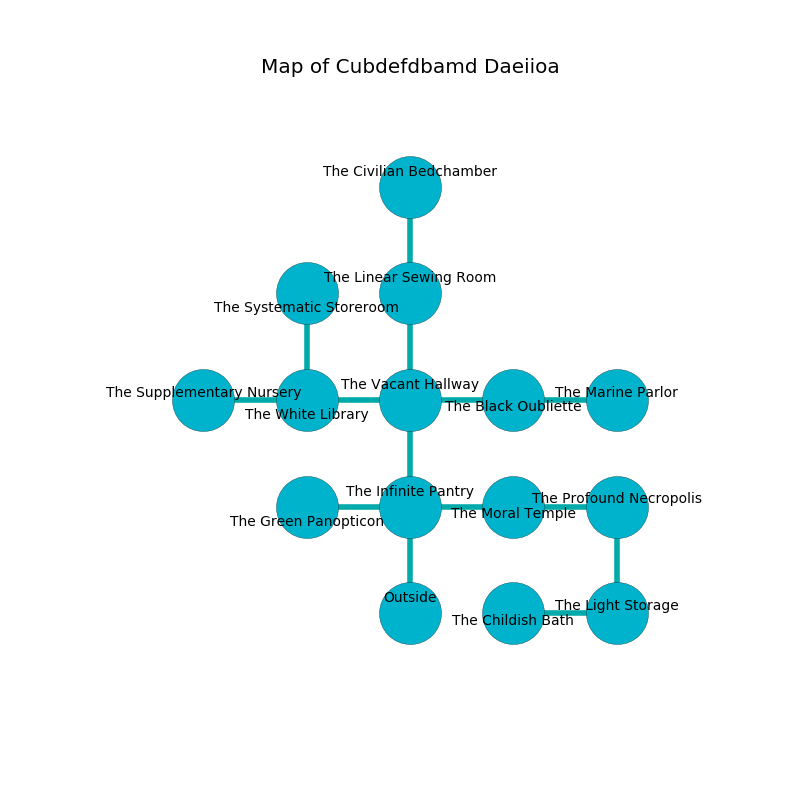

%Ruin Dogs

##Cubdefdbamd Daeiioa
###Overview
Cubdefdbamd Daeiioa is located under a giant rift. Regions of it are corrupted. The ruin is flooding. It is occupied by Kobolds. Lavinia Lawhorn The Deceitful, an Orc Eye of Gruumsh is here. The Kobolds are the soldiers of Lavinia Lawhorn The Deceitful. She  is trying to steal [Dfuidafaedwi Abdhuwibamd](#Dfuidafaedwi-Abdhuwibamd). 

###Artifact
####Dfuidafaedwi Abdhuwibamd

Dfuidafaedwi Abdhuwibamd has the form of a broken orb. Light shifts towards it. It is a light purple color. It smells like fungus. When rubbed it flies into the air. 

###Locations

####the infinite pantry
The air smells like musk here. The concrete walls are covered in mold. 

* To the west a hazy cavern opens to [the green panopticon](#the-green-panopticon).
* To the east a small walkway leads to [the moral temple](#the-moral-temple).
* To the north a torchlit hall connects to [the vacant hallway](#the-vacant-hallway).
* To the south is the entrance.

####the vacant hallway
Blue lichens are sprouting in cracks in the floor. The mirrored walls are bloodstained. The air tastes like parsley here. 

There is an engraving on the ceiling written in common. 

> We are envious
>
> optimistic and quiet
>
> always funny
>
> innocent, insufficient, just
>
> grand, expected, structural
>

* To the west a twisted path connects to [the white library](#the-white-library).
* To the east a dark threshold opens to [the black oubliette](#the-black-oubliette).
* To the north a narrow artery connects to [the linear sewing room](#the-linear-sewing-room).
* To the south a torchlit hall connects to [the infinite pantry](#the-infinite-pantry).

####the linear sewing room
The floor is bloodstained. There is an Ankylosaurus here. 

* [Dfuidafaedwi Abdhuwibamd](#Dfuidafaedwi-Abdhuwibamd) is here.
* To the north a small corridor leads to [the civilian bedchamber](#the-civilian-bedchamber).
* To the south a narrow artery opens to [the vacant hallway](#the-vacant-hallway).

####the moral temple
The floor is flooded with four inch deep lukewarm water. 

* [Lavinia Lawhorn The Deceitful](#Lavinia-Lawhorn-The-Deceitful) is here.
* To the west a small walkway leads to [the infinite pantry](#the-infinite-pantry).
* To the east a long cave opens to [the profound necropolis](#the-profound-necropolis).

####the black oubliette
There are seven Winged Kobolds and ten Kobolds here. The air tastes like agarwood here. White mushrooms are decaying from the ceiling. One of the Kobolds is working a mechanism that can pour liquid flames from the ceiling. 

* To the west a dark threshold opens to [the vacant hallway](#the-vacant-hallway).
* To the east a flooded opening connects to [the marine parlor](#the-marine-parlor).

####the green panopticon
The air smells like papaya here. There are five Winged Kobolds and fourteen Kobolds here. The floor is smooth. One of the Kobolds is pointing a ballista at the entrance. 

There is an engraving on the floor written in common. 

> I am lost in Cubdefdbamd Daeiioa.
>
> I could not try praying.
>

* To the east a hazy cavern leads to [the infinite pantry](#the-infinite-pantry).

####the white library

* To the west a flooded walkway opens to [the supplementary nursery](#the-supplementary-nursery).
* To the east a twisted path opens to [the vacant hallway](#the-vacant-hallway).
* To the north a twisted path opens to [the systematic storeroom](#the-systematic-storeroom).

####the profound necropolis
The air tastes like apricot here. The floor is smooth. Green moss is growing from the ceiling. 

* To the west a long cave connects to [the moral temple](#the-moral-temple).
* To the south a flooded opening connects to [the light storage](#the-light-storage).

####the supplementary nursery
Blue razorgrass is swaying from the walls. 

* There is a tree here.
* To the east a flooded walkway connects to [the white library](#the-white-library).

####the systematic storeroom
The glass walls are scratched. The air tastes like elderflower here. The floor is cluttered with shells. Gray razorgrass is sprouting in broken urns. 

There is an engraving on the floor written in common. 

> I am lost in Cubdefdbamd Daeiioa.
>

* To the south a twisted path opens to [the white library](#the-white-library).

####the light storage
The air tastes like black currant here. The floor is cluttered with debris. Blue razorgrass is sprouting in broken urns. 

* There is a flag here.
* To the west a dark hallway connects to [the childish bath](#the-childish-bath).
* To the north a flooded opening connects to [the profound necropolis](#the-profound-necropolis).

####the marine parlor
The wooden walls are scratched. There are a Blink Dog, a Pony, a Blue Dragon Wyrmling, a Hyena, a Quaggoth Spore Servant, and a Needle Blight here. 

There is an engraving on a monolith written in Kobolds Script. 

> I am worshipping Cubdefdbamd Daeiioa.
>

* To the west a flooded opening connects to [the black oubliette](#the-black-oubliette).

####the childish bath
The floor is sticky. Blue mushrooms are sprouting from the walls. The air tastes like rum here. 

There is an engraving on a stone written in Kobolds Script. 

> Dig here.
>

* To the east a dark hallway opens to [the light storage](#the-light-storage).

####the civilian bedchamber
The concrete walls are covered in mold. The air tastes like corn chip here. 

There is an engraving on the ceiling written in Kobolds Script. 

> A trousers is an aircraft
>
> passionate and whole
>
> urban, obscure, constant
>
> A skin is a veteran
>
> but never abundant
>
> current, dangerous, polite
>
> tough, whole, vertical
>
> vertical, spatial, uncomfortable
>
> but never cold
>
> likely and incapable
>
> you will be punished
>

* There is a spear here.
* There is a key here.
* To the south a small corridor leads to [the linear sewing room](#the-linear-sewing-room).

