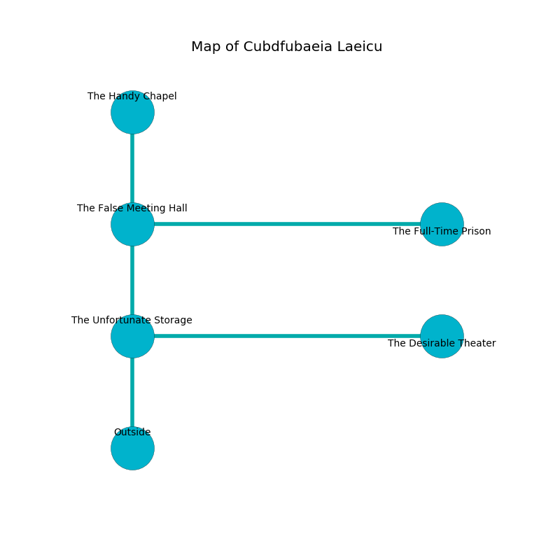

%Ruin Dogs

##Cubdfubaeia Laeicu
###Overview
Cubdfubaeia Laeicu is located in a ruined plain. Parts of Cubdfubaeia Laeicu are incredibly cold. A lunar eclipse is happening outside. It is occupied by Sahuagins. Britt Huggins The Truculent, an Ogre is here. The Sahuagins are the slaves of Britt Huggins The Truculent. He  is trying to recover [Coaid](#Coaid). 

###Artifact
####Coaid

Coaid has the form of a sharp spear. Fire bends near it. It is a medium black color. When thrown it destroys itself. 

###Locations

####the unfortunate storage
The concrete walls are bloodstained. The floor is smooth. The air tastes like grape here. 

* [Britt Huggins The Truculent](#Britt-Huggins-The-Truculent) is here.
* To the east a narrow passageway leads to [the desirable theater](#the-desirable-theater).
* To the north a windy cavern opens to [the false meeting hall](#the-false-meeting-hall).
* To the south is the entrance.

####the false meeting hall
White ferns are sprouting in cracks in the floor. The crystal walls are unsettled. The floor is flooded with seven inch deep cold water. There are a Winter Wolf, a Copper Dragon Wyrmling, and a Satyr here. 

There is an engraving on a stone written in common. 

> You are joyful
>
> yet never express
>
> hot, loud, varied
>
> but irrelevant
>
> whole, clear, lost
>
> experienced and surprised
>
> daily and fresh
>
> You are joyful
>

* There is a tree here.
* [Coaid](#Coaid) is here.
* To the east a dripping hallway opens to [the full-time prison](#the-full-time-prison).
* To the north a long threshold opens to [the handy chapel](#the-handy-chapel).
* To the south a windy cavern leads to [the unfortunate storage](#the-unfortunate-storage).

####the handy chapel
The metallic walls are covered in mold. There is a trap here. When activated, a magical sound detector will blast flames. There are a Giant Hyena, a Badger, an Ankheg, and a Tridrone here. The air tastes like solvent here. 

* To the south a long threshold leads to [the false meeting hall](#the-false-meeting-hall).

####the desirable theater
There is a trap here. When activated, a tripwire will fire an acid arrow. There are an Aarakocra, a Black Dragon Wyrmling, and a Giant Hyena here. The glass walls are ruined. 

* To the west a narrow passageway opens to [the unfortunate storage](#the-unfortunate-storage).

####the full-time prison
Green razorgrass is swaying in cracks in the floor. The floor is cluttered with bones. The air smells like shrimp here. 

* To the west a dripping hallway opens to [the false meeting hall](#the-false-meeting-hall).

