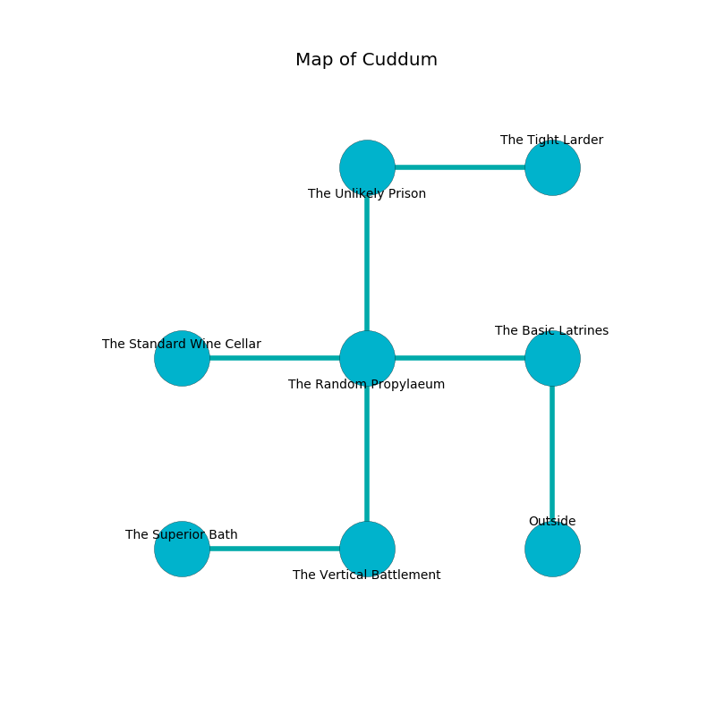

%Ruin Dogs

##Cuddum
###Overview
Cuddum is located in a volcanic tree. Parts of Cuddum are flooded. A blizzard is happening outside. It is occupied by Vampires. Georgie Keck The Tactless, a Hobgoblin Warlord is here. The Vampires are the minions of Georgie Keck The Tactless. She  is trying to hide [Gecdufwi](#Gecdufwi). 

###Artifact
####Gecdufwi

Gecdufwi looks like a hard amulet. It smells like lemon. When smelled it grants a wish. 

###Locations

####the basic latrines
Gray razorgrass is growing in cracks in the floor. The air smells like storax here. 

* There is a whistle here.
* To the west a small passageway opens to [the random propylaeum](#the-random-propylaeum).
* To the south is the entrance.

####the random propylaeum
There are a Centaur, a Black Pudding, a Noble, and a Giant Goat here. White lichens are growing from the ceiling. The floor is smooth. The air smells like autumn here. 

There is an engraving on a monolith written in Vampires Script. 

> O meak we
>
> eloquent, ambiguous, vicious
>
> dramatic, cold, free
>
> cruelty is ambitious
>

* To the west a twisted gap opens to [the standard wine cellar](#the-standard-wine-cellar).
* To the east a small passageway connects to [the basic latrines](#the-basic-latrines).
* To the north a dripping artery opens to [the unlikely prison](#the-unlikely-prison).
* To the south a flooded pathway connects to [the vertical battlement](#the-vertical-battlement).

####the vertical battlement
There are a Spider, a Swarm of Poisonous Snakes, a Magma Mephit, a Hell Hound, a Brown Bear, and a Minotaur Skeleton here. The wooden walls are caving in. Gray mushrooms are swaying from the ceiling. The floor is glossy. The air tastes like peach here. 

* To the west a long walkway connects to [the superior bath](#the-superior-bath).
* To the north a flooded pathway connects to [the random propylaeum](#the-random-propylaeum).

####the standard wine cellar
There are two Vampire Spawns here. The Vampires are meditating. 

* [Georgie Keck The Tactless](#Georgie-Keck-The-Tactless) is here.
* To the east a twisted gap connects to [the random propylaeum](#the-random-propylaeum).

####the superior bath
The obsidion walls are scratched. The floor is bloodstained. 

* To the east a long walkway connects to [the vertical battlement](#the-vertical-battlement).

####the unlikely prison
The air smells like red rose here. The glass walls are ruined. Yellow moss is sprouting from the walls. There is a trap here. When activated, a tripwire will ring a bell. There are a Winged Kobold, an Orc War Chief, and a Myconid Sovereign here. 

* There is an icon here.
* [Gecdufwi](#Gecdufwi) is here.
* To the east a hazy artery opens to [the tight larder](#the-tight-larder).
* To the south a dripping artery connects to [the random propylaeum](#the-random-propylaeum).

####the tight larder
The crystal walls are ruined. The floor is smooth. There are a Grell and a Spectator here. Red mushrooms are sprouting from the ceiling. 

* To the west a hazy artery connects to [the unlikely prison](#the-unlikely-prison).

