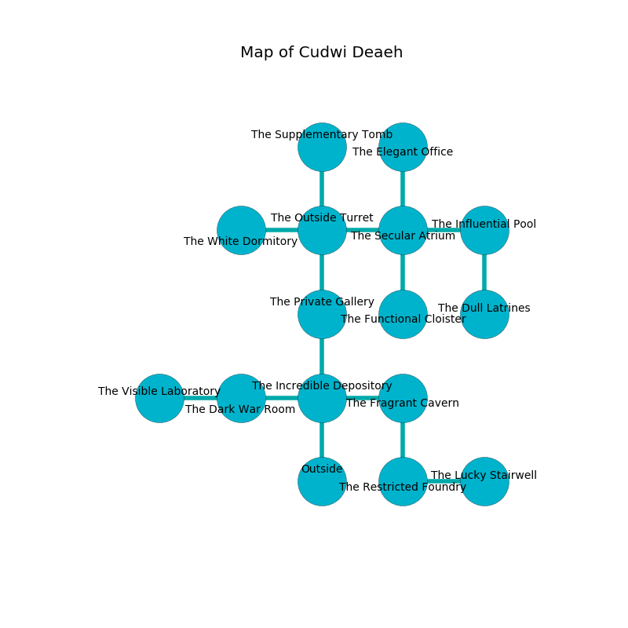

%Ruin Dogs

##Cudwi Deaeh
###Overview
Cudwi Deaeh is located in a spikey tree. Some rooms of Cudwi Deaeh are incredibly hot. A windstorm is happening outside. It is occupied by Sprites. Wilbur Ledoux The Bone-Idle, a Fire Giant is here. The Sprites are ruled by Wilbur Ledoux The Bone-Idle. He  is founding a new religion. 

###Artifact
####The Rich Cylinder

The Rich Cylinder has the form of a hard crystal. It smells like mustard. When thrown it levitates surrounding objects. 

###Locations

####the incredible depository
There are a Nightmare, a Fomorian, and a Knight here. The floor is cluttered with bones. The stone walls are covered in mold. 

There is an engraving on a tablet written in common. 

> Maybe try hiding.
>

* To the west a narrow path leads to [the dark war Room](#the-dark-war-Room).
* To the east a dripping passageway leads to [the fragrant cavern](#the-fragrant-cavern).
* To the north a small artery connects to [the private gallery](#the-private-gallery).
* To the south is the entrance.

####the private gallery
The floor is sticky. There are thirty six Sprites here. If the Sprites notice the Ruin Dogs, one of them will retreat and alert the others. 

* To the north a small corridor connects to [the outside turret](#the-outside-turret).
* To the south a small artery leads to [the incredible depository](#the-incredible-depository).

####the outside turret
Gray lichens are growing in a patch on the floor. The concrete walls are covered in mold. 

* To the west a torchlit path opens to [the white dormitory](#the-white-dormitory).
* To the east a windy walkway opens to [the secular atrium](#the-secular-atrium).
* To the north a long cavern leads to [the supplementary tomb](#the-supplementary-tomb).
* To the south a small corridor opens to [the private gallery](#the-private-gallery).

####the dark war Room
The stone walls are pristine. Yellow ferns are sprouting from the walls. There are thirty six Sprites here. The air tastes like rain here. One of the Sprites is working a mechanism that can engulf the room in a fiery blaze. 

* To the west a twisted hall leads to [the visible laboratory](#the-visible-laboratory).
* To the east a narrow path opens to [the incredible depository](#the-incredible-depository).

####the secular atrium
There are thirty six Sprites here. The obsidion walls are scratched. The air tastes like grease here. The Sprites are caring for babies. 

* To the west a windy walkway leads to [the outside turret](#the-outside-turret).
* To the east a small cavern leads to [the influential pool](#the-influential-pool).
* To the north a hazy cave connects to [the elegant office](#the-elegant-office).
* To the south a dark passageway leads to [the functional cloister](#the-functional-cloister).

####the influential pool
The floor is smooth. 

There is an engraving on a stone written in Sprites Script. 

> O dire soul
>
> enjoyable, dry, whole
>
> but obscure
>
> death is pure
>

* There is a pin here.
* To the west a small cavern connects to [the secular atrium](#the-secular-atrium).
* To the south a dripping path leads to [the dull latrines](#the-dull-latrines).

####the dull latrines
The crystal walls are pristine. There are a Giant Vulture, a Rust Monster, a Drow Mage, a Priest, and a Minotaur here. Gray lichens are decaying in cracks in the floor. 

* To the north a dripping path leads to [the influential pool](#the-influential-pool).

####the functional cloister
The floor is bloodstained. 

* To the north a dark passageway leads to [the secular atrium](#the-secular-atrium).

####the elegant office
The glass walls are caving in. 

* To the south a hazy cave opens to [the secular atrium](#the-secular-atrium).

####the white dormitory
There are thirty six Sprites here. Green razorgrass is growing from the walls. The floor is flooded with one inch deep hot water. One of the Sprites is on watch, the rest are sleeping. 

* To the east a torchlit path leads to [the outside turret](#the-outside-turret).

####the fragrant cavern
The air smells like lettuce here. The concrete walls are pristine. Yellow moss is sprouting in a patch on the floor. The floor is cluttered with broken glass. There are thirty six Sprites here. If the Sprites notice the Ruin Dogs, one of them will retreat and alert the others. 

* To the west a dripping passageway connects to [the incredible depository](#the-incredible-depository).
* To the south a hazy corridor opens to [the restricted foundry](#the-restricted-foundry).

####the supplementary tomb
The crystal walls are unsettled. There is a trap here. When activated, a magical sound detector will launch a ceiling pendulum. There are a Chasme, a Tribal Warrior, a Drow Mage, a Smoke Mephit, and a Jackalwere here. The floor is sticky. 

* [Wilbur Ledoux The Bone-Idle](#Wilbur-Ledoux-The-Bone-Idle) is here.
* To the south a long cavern connects to [the outside turret](#the-outside-turret).

####the restricted foundry
The air smells like oakmoss here. The floor is sticky. Red moss is growing from the walls. 

* [The Rich Cylinder](#The-Rich-Cylinder) is here.
* To the east a flooded path connects to [the lucky stairwell](#the-lucky-stairwell).
* To the north a hazy corridor connects to [the fragrant cavern](#the-fragrant-cavern).

####the visible laboratory
There are thirty six Sprites here. The air tastes like molasses here. The Sprites are meditating. 

There is an engraving on a tablet written in common. 

> I hid something in Cudwi Deaeh.
>
> Do not try giving up.
>

* There is a stick here.
* There is a basin here.
* To the east a twisted hall leads to [the dark war Room](#the-dark-war-Room).

####the lucky stairwell
The air smells like plum skin here. The mirrored walls are caving in. The floor is cluttered with shells. Red moss is swaying in broken urns. 

* To the west a flooded path opens to [the restricted foundry](#the-restricted-foundry).

