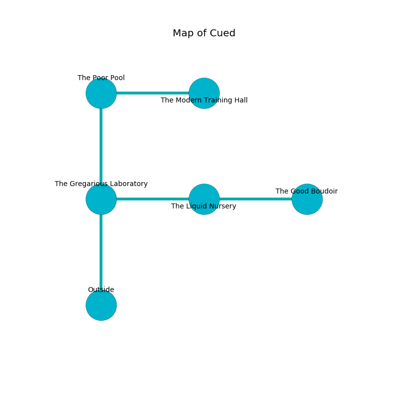

%Ruin Dogs

##Cued
###Overview
Cued is located under an alien rift. Some rooms of Cued are foggy. The ruin is flooding. It is occupied by Pixies. Lincoln Plante The Indecisive, a Frost Giant is here. The Pixies are battling Lincoln Plante The Indecisive. He  is founding a new religion. 

###Artifact
####Cufmaf

Cufmaf is a powerful artifact in the shape of a warm rock. It smells like white chocolate. When picked up it grants psychic powers. 

###Locations

####the gregarious laboratory
The floor is sticky. 

There is an engraving on the floor written in common. 

> I am lonely.
>
> I thought about hiding.
>

* To the east a long cavern opens to [the liquid nursery](#the-liquid-nursery).
* To the north a twisted threshold connects to [the poor pool](#the-poor-pool).
* To the south is the entrance.

####the liquid nursery
The air smells like papaya here. Red moss is decaying in a patch on the floor. 

There is an engraving on a stone written in Pixies Script. 

> A muscle is an ability
>
> influential and sudden
>
> you will be returned
>

* [Lincoln Plante The Indecisive](#Lincoln-Plante-The-Indecisive) is here.
* To the west a long cavern connects to [the gregarious laboratory](#the-gregarious-laboratory).
* To the east a narrow passageway connects to [the good boudoir](#the-good-boudoir).

####the poor pool
The glass walls are pristine. 

* [Cufmaf](#Cufmaf) is here.
* To the east a twisted cavern leads to [the modern training hall](#the-modern-training-hall).
* To the south a twisted threshold opens to [the gregarious laboratory](#the-gregarious-laboratory).

####the good boudoir
Green ferns are swaying from the ceiling. 

* To the west a narrow passageway leads to [the liquid nursery](#the-liquid-nursery).

####the modern training hall
The floor is sticky. The air smells like turmeric here. The crystal walls are covered in mold. There is a trap here. When activated, a tripwire will fire a net. 

There is an engraving on the floor written in common. 

> Dear me! pitiful fate
>
> it is never straight
>
> it is never shallow
>
> fate is late
>

* To the west a twisted cavern opens to [the poor pool](#the-poor-pool).

