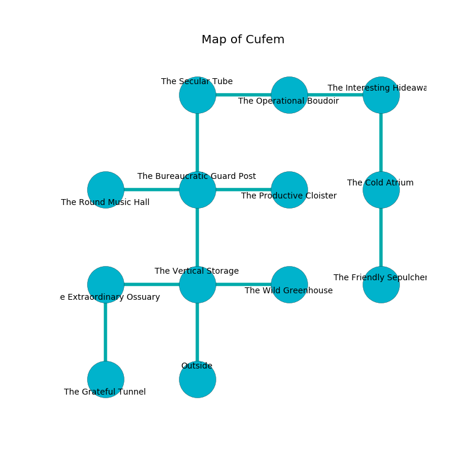

%Ruin Dogs

##Cufem
###Overview
Cufem is constructed on a poisoned mountain. Regions of it are corrupted. The ruin is burning. It is occupied by Satyrs. Garry Lake The Boring, a Veteran is here. The Satyrs have been charmed by Garry Lake The Boring. He  is founding a new religion. 

###Artifact
####Asaed Ghocdoedaeum

Asaed Ghocdoedaeum has the form of a transparent figurine. Psychic energy incinerates from it. When rubbed it becomes hot. 

###Locations

####the vertical storage
The air tastes like black tea here. Green moss is decaying in cracks in the floor. The crystal walls are scratched. There are a Cult Fanatic and a Poltergeist here. 

There is an engraving on the ceiling written in common. 

> Oh sad fate
>
> proper, legal, straight
>
> exact and great
>
> life is straight
>

* There is an orange here.
* To the west a flooded corridor opens to [the extraordinary ossuary](#the-extraordinary-ossuary).
* To the east a dark threshold connects to [the wild greenhouse](#the-wild-greenhouse).
* To the north a dark artery opens to [the bureaucratic guard post](#the-bureaucratic-guard-post).
* To the south is the entrance.

####the bureaucratic guard post
There are six Satyrs here. Green moss is decaying from the walls. The Satyrs are performing a ritual. If not interrupted, [Garry Lake](#Garry-Lake) will be magically alarmed. 

There is an engraving on the floor written in Satyrs Script. 

> A trap ahead.
>

* [Asaed Ghocdoedaeum](#Asaed-Ghocdoedaeum) is here.
* To the west a small cavern leads to [the round music hall](#the-round-music-hall).
* To the east a dripping cavern leads to [the productive cloister](#the-productive-cloister).
* To the north a hazy gap connects to [the secular tube](#the-secular-tube).
* To the south a dark artery opens to [the vertical storage](#the-vertical-storage).

####the extraordinary ossuary
Green razorgrass is swaying in a patch on the floor. The floor is glossy. 

* To the east a flooded corridor opens to [the vertical storage](#the-vertical-storage).
* To the south a dripping cavern leads to [the grateful tunnel](#the-grateful-tunnel).

####the secular tube
The air tastes like rye bread here. The metallic walls are bloodstained. The floor is sticky. 

There is an engraving on a stone written in Satyrs Script. 

> I am hiding in this place.
>

* To the east a dripping path connects to [the operational boudoir](#the-operational-boudoir).
* To the south a hazy gap connects to [the bureaucratic guard post](#the-bureaucratic-guard-post).

####the wild greenhouse
The air tastes like fennel here. 

* There is a lock here.
* To the west a dark threshold opens to [the vertical storage](#the-vertical-storage).

####the productive cloister
Yellow mushrooms are sprouting from the ceiling. The air tastes like linden flower here. The concrete walls are pristine. There is a trap here. When activated, a magical sound detector will make the walls close in. 

There is an engraving on a monolith written in Satyrs Script. 

> Run away.
>

* To the west a dripping cavern leads to [the bureaucratic guard post](#the-bureaucratic-guard-post).

####the operational boudoir
The concrete walls are pristine. 

* To the west a dripping path leads to [the secular tube](#the-secular-tube).
* To the east a small artery opens to [the interesting hideaway](#the-interesting-hideaway).

####the interesting hideaway
The floor is flooded with five inch deep scalding water. The stone walls are unsettled. The air tastes like rose here. 

There is an engraving on a monolith written in common. 

> I want to find [Asaed Ghocdoedaeum](#Asaed-Ghocdoedaeum).
>
> Dig here.
>

* To the west a small artery opens to [the operational boudoir](#the-operational-boudoir).
* To the south a dark walkway leads to [the cold atrium](#the-cold-atrium).

####the grateful tunnel
There are a Myconid Adult, a Druid, and a Scout here. The air smells like urine here. 

* To the north a dripping cavern connects to [the extraordinary ossuary](#the-extraordinary-ossuary).

####the cold atrium
Yellow moss is growing from the walls. The stone walls are pristine. The floor is cluttered with broken glass. 

* There is a casket here.
* [Garry Lake The Boring](#Garry-Lake-The-Boring) is here.
* To the north a dark walkway connects to [the interesting hideaway](#the-interesting-hideaway).
* To the south a dark corridor connects to [the friendly sepulcher](#the-friendly-sepulcher).

####the friendly sepulcher
There are a Mud Mephit, a Frog, a Kenku, a Giant Lizard, a Lemure, a Swarm of Quippers, a Giant Wolf Spider, and a Quadrone here. The mirrored walls are bloodstained. 

* To the north a dark corridor leads to [the cold atrium](#the-cold-atrium).

####the round music hall
The air smells like white rose here. The glass walls are pristine. 

* To the east a small cavern connects to [the bureaucratic guard post](#the-bureaucratic-guard-post).

