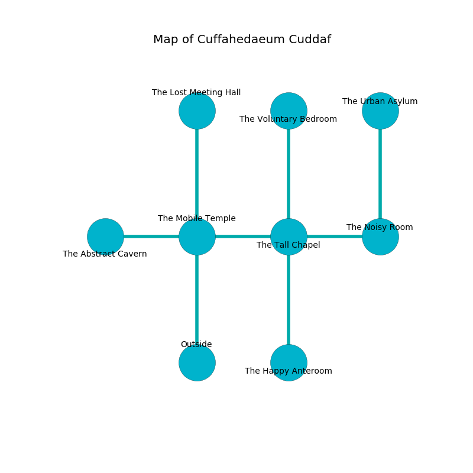

%Ruin Dogs

##Cuffahedaeum Cuddaf
###Overview
Cuffahedaeum Cuddaf is located in a flooded plain. Regions of Cuffahedaeum Cuddaf are foggy. A lunar eclipse is happening outside. It is occupied by Kuo-Toa. Chong Sadler The Cynical, a Berserker is here. The Kuo-Toa are the soldiers of Chong Sadler The Cynical. He  is founding a new religion. 

###Artifact
####The Deep Stem

The Deep Stem has the form of a wet spear. It smells like frankincense. When smelled it grants psychic powers. 

###Locations

####the mobile temple
The mirrored walls are bloodstained. The floor is glossy. There are three Kuo-Toa Whips here. The Kuo-Toa are performing a ritual. If not interrupted, the ruin dogs will be weakened. 

* To the west a torchlit hall leads to [the abstract cavern](#the-abstract-cavern).
* To the east a torchlit opening leads to [the tall chapel](#the-tall-chapel).
* To the north a dripping pathway opens to [the lost meeting hall](#the-lost-meeting-hall).
* To the south is the entrance.

####the tall chapel
There is a trap here. When activated, a magical rune will shoot a lightning bolt. The obsidion walls are scratched. The floor is sticky. Red mushrooms are sprouting in cracks in the floor. 

There is an engraving on a monolith written in Kuo-Toa Script. 

> I thought about leaving.
>

* There is a bee here.
* [The Deep Stem](#The-Deep-Stem) is here.
* To the west a torchlit opening connects to [the mobile temple](#the-mobile-temple).
* To the east a flooded hallway connects to [the noisy room](#the-noisy-room).
* To the north a long path connects to [the voluntary bedroom](#the-voluntary-bedroom).
* To the south a flooded pathway opens to [the happy anteroom](#the-happy-anteroom).

####the lost meeting hall
There are a Sprite, a Swarm of Rats, a Drow, two Poisonous Snakes, an Ice Mephit, a Giant Octopus, two Mastiffs, a Brown Bear,  here. White mushrooms are growing in a patch on the floor. 

* To the south a dripping pathway leads to [the mobile temple](#the-mobile-temple).

####the noisy room
Blue mushrooms are swaying from the walls. The floor is bloodstained. The crystal walls are scratched. The air tastes like fenugreek here. 

* There is a dog here.
* To the west a flooded hallway opens to [the tall chapel](#the-tall-chapel).
* To the north a twisted hallway leads to [the urban asylum](#the-urban-asylum).

####the urban asylum
The floor is cluttered with shells. There are a Kuo-Toa Whip, a Kuo-Toa Monitor, two Kuo-Toa, and  here. One of the Kuo-Toa is on watch, the rest are caring for babies. 

There is an engraving on the ceiling written in Kuo-Toa Script. 

> Oh everything is inhumane
>
> confident and vain
>
> varied and applied
>
> everything is outside
>

* To the south a twisted hallway connects to [the noisy room](#the-noisy-room).

####the abstract cavern
Gray moss is decaying from the walls. There are three Kuo-Toa Whips and three Kuo-Toa here. The floor is bloodstained. The Kuo-Toa are fighting amongst themselves. 

* To the east a torchlit hall leads to [the mobile temple](#the-mobile-temple).

####the happy anteroom
The floor is bloodstained. There is a Kuo-Toa Monitor here. Red ferns are decaying in cracks in the floor. The air tastes like dates here. The Kuo-Toa Monitor is willing to negotiate. 

* To the north a flooded pathway leads to [the tall chapel](#the-tall-chapel).

####the voluntary bedroom
There is a trap here. When activated, a tripwire will launch a javelin. Yellow razorgrass is decaying in a patch on the floor. 

* [Chong Sadler The Cynical](#Chong-Sadler-The-Cynical) is here.
* To the south a long path connects to [the tall chapel](#the-tall-chapel).

