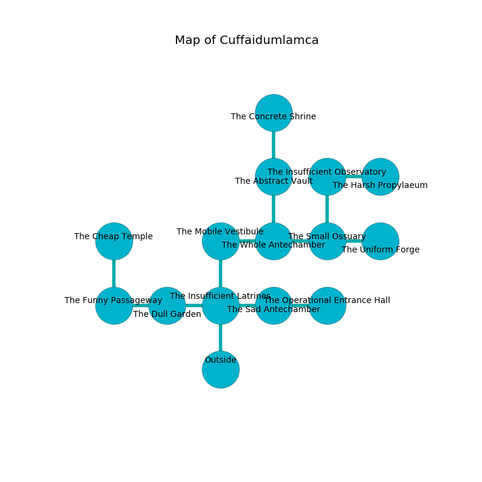

%Ruin Dogs

##Cuffaidumlamca
###Overview
Cuffaidumlamca is located under a flooded rift. Regions of it are unbearably cold. The ruin is larger on the inside than the outside. It is occupied by Githzerai. Kristine Cavazos The Impulsive, a Mind Flayer is here. The Githzerai worship Kristine Cavazos The Impulsive. She  is founding a new religion. 

###Artifact
####Cmefecdafaeidaec

Cmefecdafaeidaec is a powerful artifact in the shape of a transparent sphere. It is a pale purple color. When held it tunnels into the earth. 

###Locations

####the insufficient latrines
The air smells like beef here. There are four Githzerai Monks here. Gray moss is swaying in cracks in the floor. If the Githzerai notice the Ruin Dogs, one of them will retreat and alert [Kristine Cavazos](#Kristine-Cavazos). 

There is an engraving on the ceiling written in Githzerai Script. 

> I tried giving up.
>

* There is a board here.
* To the west a dripping threshold leads to [the dull garden](#the-dull-garden).
* To the east a twisted cave leads to [the sad antechamber](#the-sad-antechamber).
* To the north a windy artery leads to [the mobile vestibule](#the-mobile-vestibule).
* To the south is the entrance.

####the dull garden
Green moss is swaying in cracks in the floor. The air smells like toffee here. 

* To the west a dark artery opens to [the funny passageway](#the-funny-passageway).
* To the east a dripping threshold opens to [the insufficient latrines](#the-insufficient-latrines).

####the mobile vestibule
The floor is bloodstained. The air smells like guava here. 

* There is a cheese here.
* To the east a dark cave opens to [the whole antechamber](#the-whole-antechamber).
* To the south a windy artery connects to [the insufficient latrines](#the-insufficient-latrines).

####the sad antechamber
Green mushrooms are decaying from the ceiling. The brick walls are caving in. The air tastes like rhubarb here. The floor is flooded with four inch deep cold water. 

* To the west a twisted cave connects to [the insufficient latrines](#the-insufficient-latrines).
* To the east a windy corridor connects to [the operational entrance hall](#the-operational-entrance-hall).

####the operational entrance hall
The floor is glossy. 

* There is a parcel here.
* There is an imp here.
* To the west a windy corridor leads to [the sad antechamber](#the-sad-antechamber).

####the whole antechamber
There are four Githzerai Monks here. Yellow lichens are decaying in a patch on the floor. The Githzerai are performing a ritual. If not interrupted, a powerful monster will be summoned. 

* To the west a dark cave opens to [the mobile vestibule](#the-mobile-vestibule).
* To the east a small path leads to [the small ossuary](#the-small-ossuary).
* To the north a dripping hall connects to [the abstract vault](#the-abstract-vault).

####the small ossuary
Gray moss is sprouting in cracks in the floor. 

There is an engraving on a stone written in Githzerai Script. 

> O! sorry we
>
> it is never free
>
> wild, trivial, wet
>
> fate is free
>

* To the west a small path leads to [the whole antechamber](#the-whole-antechamber).
* To the east a torchlit path connects to [the uniform forge](#the-uniform-forge).
* To the north a narrow passageway leads to [the insufficient observatory](#the-insufficient-observatory).

####the uniform forge
The mirrored walls are scratched. Red lichens are decaying in broken urns. 

* To the west a torchlit path connects to [the small ossuary](#the-small-ossuary).

####the abstract vault
The obsidion walls are unsettled. 

* There is a cart here.
* To the north a dark gap connects to [the concrete shrine](#the-concrete-shrine).
* To the south a dripping hall leads to [the whole antechamber](#the-whole-antechamber).

####the concrete shrine
There are a Riding Horse, a Raven, a Crocodile, a Shrieker, a Homunculus, a Giant Bat, a Giant Hyena, a Basilisk, and a Gargoyle here. The air tastes like acerola here. White moss is swaying in a patch on the floor. The floor is smooth. 

There is an engraving on the wall written in common. 

> A trap ahead.
>

* [Kristine Cavazos The Impulsive](#Kristine-Cavazos-The-Impulsive) is here.
* To the south a dark gap leads to [the abstract vault](#the-abstract-vault).

####the insufficient observatory
The air tastes like urine here. There are a Slaad Tadpole, an Otyugh, a Hobgoblin Warlord, a Swarm of Quippers, and a Black Bear here. The metallic walls are caving in. 

* To the east a twisted pathway opens to [the harsh propylaeum](#the-harsh-propylaeum).
* To the south a narrow passageway connects to [the small ossuary](#the-small-ossuary).

####the funny passageway
White lichens are growing from the walls. The floor is smooth. 

* There is a rail here.
* [Cmefecdafaeidaec](#Cmefecdafaeidaec) is here.
* To the east a dark artery leads to [the dull garden](#the-dull-garden).
* To the north a dark hallway connects to [the cheap temple](#the-cheap-temple).

####the harsh propylaeum
Yellow moss is sprouting from the walls. The concrete walls are bloodstained. 

* There is a cup here.
* To the west a twisted pathway opens to [the insufficient observatory](#the-insufficient-observatory).

####the cheap temple
The floor is smooth. Gray lichens are decaying in cracks in the floor. 

* To the south a dark hallway connects to [the funny passageway](#the-funny-passageway).

