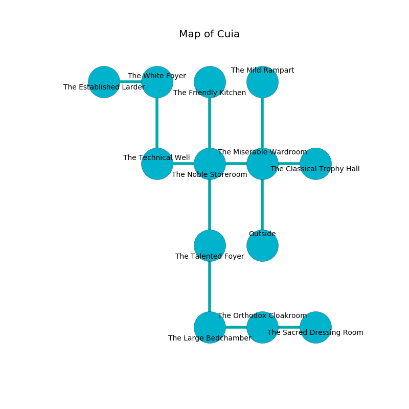

%Ruin Dogs

##Cuia
###Overview
Cuia is located under a haunted plain. Regions of Cuia are flooded. A massive storm is happening outside. It is occupied by Pixies. Kelvin Sandberg The Untrustworthy, a Frost Giant is here. The Pixies are the minions of Kelvin Sandberg The Untrustworthy. He  is trying to destroy [Fuia Lacc](#Fuia-Lacc). 

###Artifact
####Fuia Lacc

Fuia Lacc is a powerful artifact in the shape of an opaque gem. Gravity glows away from it. When smelled it emits dust. 

###Locations

####the miserable wardroom
The concrete walls are unsettled. The floor is bloodstained. There are thirty two Pixies here. The Pixies are berserk with rage. 

* To the west a torchlit hallway leads to [the noble storeroom](#the-noble-storeroom).
* To the east a hazy passageway leads to [the classical trophy hall](#the-classical-trophy-hall).
* To the north a windy artery opens to [the mild rampart](#the-mild-rampart).
* To the south is the entrance.

####the noble storeroom
The air smells like lilac here. The floor is flooded with nine inch deep cold water. 

* There is a bee here.
* To the west a long passageway leads to [the technical well](#the-technical-well).
* To the east a torchlit hallway opens to [the miserable wardroom](#the-miserable-wardroom).
* To the north a small cave opens to [the friendly kitchen](#the-friendly-kitchen).
* To the south a long pathway connects to [the talented foyer](#the-talented-foyer).

####the technical well
There are an Earth Elemental, a Killer Whale, and a Bat here. Green mushrooms are swaying in cracks in the floor. The floor is sticky. 

* [Kelvin Sandberg The Untrustworthy](#Kelvin-Sandberg-The-Untrustworthy) is here.
* To the east a long passageway opens to [the noble storeroom](#the-noble-storeroom).
* To the north a flooded artery connects to [the white foyer](#the-white-foyer).

####the talented foyer
Yellow razorgrass is decaying from the ceiling. 

There is an engraving on the ceiling written in Pixies Script. 

> [Fuia Lacc](#Fuia-Lacc)
>
> public, vague, molecular
>
> you are eaten
>

* To the north a long pathway connects to [the noble storeroom](#the-noble-storeroom).
* To the south a dark passageway opens to [the large bedchamber](#the-large-bedchamber).

####the mild rampart
The floor is cluttered with broken glass. The metallic walls are caving in. There is a trap here. When activated, a pressure plate will collapse a column. 

* To the south a windy artery leads to [the miserable wardroom](#the-miserable-wardroom).

####the large bedchamber
Green mushrooms are swaying from the walls. The brick walls are pristine. 

There is an engraving on a stone written in Pixies Script. 

> We are damned
>
> but written
>
> yet joint
>
> cheerful, temporary, marine
>
> molecular and practical
>
> yet eager
>
> but tall
>

* There is a baby here.
* To the east a windy cave leads to [the orthodox cloakroom](#the-orthodox-cloakroom).
* To the north a dark passageway opens to [the talented foyer](#the-talented-foyer).

####the friendly kitchen
The floor is flooded with nine inch deep hot water. The brick walls are unsettled. 

* To the south a small cave opens to [the noble storeroom](#the-noble-storeroom).

####the orthodox cloakroom
The concrete walls are caving in. The floor is bloodstained. 

There is an engraving on the wall written in common. 

> I am lost in Cuia.
>
> Maybe try running.
>

* To the west a windy cave leads to [the large bedchamber](#the-large-bedchamber).
* To the east a hazy path opens to [the sacred dressing room](#the-sacred-dressing-room).

####the classical trophy hall
The floor is glossy. Gray moss is sprouting from the ceiling. The glass walls are caving in. 

* There is a horse here.
* To the west a hazy passageway opens to [the miserable wardroom](#the-miserable-wardroom).

####the white foyer
The floor is cluttered with ashes. 

* [Fuia Lacc](#Fuia-Lacc) is here.
* To the west a long corridor opens to [the established larder](#the-established-larder).
* To the south a flooded artery opens to [the technical well](#the-technical-well).

####the sacred dressing room
The stone walls are unsettled. The floor is smooth. 

There is an engraving on the ceiling written in common. 

> I am cruel.
>

* To the west a hazy path opens to [the orthodox cloakroom](#the-orthodox-cloakroom).

####the established larder
Blue ferns are decaying in broken urns. The air tastes like cream here. 

* To the east a long corridor opens to [the white foyer](#the-white-foyer).

