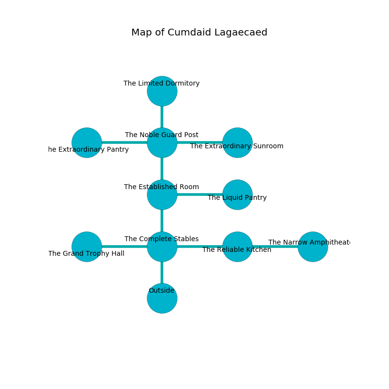

%Ruin Dogs

##Cumdaid Lagaecaed
###Overview
Cumdaid Lagaecaed is constructed on a broken plain. Regions of Cumdaid Lagaecaed are foggy. The ruin is burning. It is occupied by Dryads. Troy Clough The Detached, a Drow Mage is here. The Dryads are the soldiers of Troy Clough The Detached. She  is trying to exploit [Emiiaaf](#Emiiaaf). 

###Artifact
####Emiiaaf

Emiiaaf has the form of a warm cube. It smells like salt. When cradled it becomes a deadly projectile. 

###Locations

####the complete stables
There is a trap here. When activated, a tripwire will launch a poison needle. The air smells like brandy here. There are a Mud Mephit, a Raven, an Allosaurus, a Saber-Toothed Tiger, a Giant Crocodile, and a Green Dragon Wyrmling here. Yellow mushrooms are swaying in cracks in the floor. 

There is an engraving on the wall written in Dryads Script. 

> I am lovely.
>

* To the west a twisted threshold connects to [the grand trophy hall](#the-grand-trophy-hall).
* To the east a dripping artery opens to [the reliable kitchen](#the-reliable-kitchen).
* To the north a dripping threshold opens to [the established room](#the-established-room).
* To the south is the entrance.

####the established room
The wooden walls are pristine. The floor is flooded with three inch deep lukewarm water. 

* [Emiiaaf](#Emiiaaf) is here.
* To the east a dripping gap opens to [the liquid pantry](#the-liquid-pantry).
* To the north a torchlit corridor connects to [the noble guard post](#the-noble-guard-post).
* To the south a dripping threshold connects to [the complete stables](#the-complete-stables).

####the grand trophy hall
The obsidion walls are covered in mold. There are eight Dryads here. The air tastes like tomato leaf here. Green mushrooms are sprouting from the ceiling. One of the Dryads is on watch, the rest are meditating. 

* There is a triptych here.
* There is a net here.
* To the east a twisted threshold connects to [the complete stables](#the-complete-stables).

####the noble guard post
The air smells like vinegar here. Gray moss is sprouting in broken urns. The metallic walls are pristine. 

* To the west a flooded path connects to [the extraordinary pantry](#the-extraordinary-pantry).
* To the east a dripping threshold connects to [the extraordinary sunroom](#the-extraordinary-sunroom).
* To the north a dripping cavern leads to [the limited dormitory](#the-limited-dormitory).
* To the south a torchlit corridor opens to [the established room](#the-established-room).

####the limited dormitory
There is a trap here. When activated, a tripwire will fire an acid arrow. There are eight Dryads here. The Dryads are caring for babies. 

There is an engraving on the ceiling written in common. 

> O sorry we
>
> sudden, proper, steady
>
> solid, fastidious, free
>
> death is ready
>

* To the south a dripping cavern opens to [the noble guard post](#the-noble-guard-post).

####the reliable kitchen
The floor is sticky. 

* There is a nail here.
* [Troy Clough The Detached](#Troy-Clough-The-Detached) is here.
* To the west a dripping artery leads to [the complete stables](#the-complete-stables).
* To the east a flooded passageway connects to [the narrow amphitheater](#the-narrow-amphitheater).

####the extraordinary sunroom
The concrete walls are caving in. The floor is sticky. The air smells like storax here. 

* There is an orange here.
* To the west a dripping threshold connects to [the noble guard post](#the-noble-guard-post).

####the extraordinary pantry
There is a trap here. When activated, a magical sound detector will launch a blade. There are a Gorgon, a Swarm of Ravens, a Ghoul, an Assassin, and a Rat here. The floor is sticky. 

* There is an egg here.
* There is a flag here.
* To the east a flooded path leads to [the noble guard post](#the-noble-guard-post).

####the narrow amphitheater
The air smells like juniper here. The stone walls are covered in mold. 

* To the west a flooded passageway connects to [the reliable kitchen](#the-reliable-kitchen).

####the liquid pantry
Yellow moss is sprouting in broken urns. There are eight Dryads here. If the Dryads notice the Ruin Dogs, one of them will retreat and alert the others. 

* There is a hat here.
* To the west a dripping gap opens to [the established room](#the-established-room).

