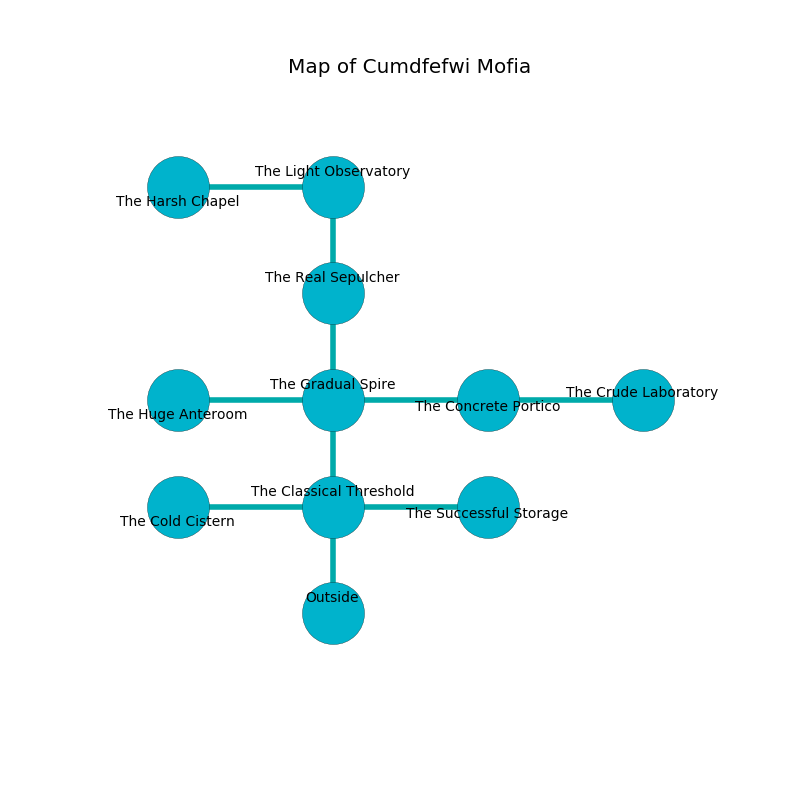

%Ruin Dogs

##Cumdfefwi Mofia
###Overview
Cumdfefwi Mofia is located under an obsidion city. Some rooms of Cumdfefwi Mofia are frozen. A massive flood is happening outside. It is occupied by Ogres. Riva Feeney The Unpredictable, a Barbed Devil is here. The Ogres are the soldiers of Riva Feeney The Unpredictable. She  is founding a new religion. 

###Artifact
####The Expensive Risk

The Expensive Risk is a powerful artifact in the shape of a glassy blade. It smells like nasturtium. It is a pale brown color. When smelled it becomes lost. 

###Locations

####the classical threshold
The stone walls are covered in mold. 

* There is a church here.
* To the west a windy threshold opens to [the cold cistern](#the-cold-cistern).
* To the east a narrow path opens to [the successful storage](#the-successful-storage).
* To the north a hazy cavern connects to [the gradual spire](#the-gradual-spire).
* To the south is the entrance.

####the gradual spire
The concrete walls are bloodstained. 

There is an engraving on the floor written in common. 

> Maybe try running.
>

* [The Expensive Risk](#The-Expensive-Risk) is here.
* To the west a torchlit opening leads to [the huge anteroom](#the-huge-anteroom).
* To the east a long walkway leads to [the concrete portico](#the-concrete-portico).
* To the north a flooded opening connects to [the real sepulcher](#the-real-sepulcher).
* To the south a hazy cavern connects to [the classical threshold](#the-classical-threshold).

####the cold cistern
There are three Half-Ogres and an Ogre here. The mirrored walls are caving in. The air tastes like rose tea here. The Ogres are willing to negotiate. 

* To the east a windy threshold opens to [the classical threshold](#the-classical-threshold).

####the successful storage
The air smells like toffee here. There is a trap here. When activated, a pressure plate will collapse a column. There are two Half-Ogres and two Ogres here. If the Ogres notice the Ruin Dogs, one of them will retreat and alert the others. 

* To the west a narrow path opens to [the classical threshold](#the-classical-threshold).

####the real sepulcher
There are a Bugbear Chief and a Succubus here. Green mushrooms are decaying in a patch on the floor. 

There is an engraving on the wall written in common. 

> I am sneaky.
>

* To the north a narrow walkway leads to [the light observatory](#the-light-observatory).
* To the south a flooded opening leads to [the gradual spire](#the-gradual-spire).

####the concrete portico

* To the west a long walkway connects to [the gradual spire](#the-gradual-spire).
* To the east a hazy gap opens to [the crude laboratory](#the-crude-laboratory).

####the light observatory
There is a trap here. When activated, a magical rune will fire an acid arrow. The mirrored walls are ruined. The floor is glossy. 

* There is an orange here.
* There is a knife here.
* There is a table here.
* There is a cat here.
* To the west a small passageway opens to [the harsh chapel](#the-harsh-chapel).
* To the south a narrow walkway leads to [the real sepulcher](#the-real-sepulcher).

####the crude laboratory
The crystal walls are ruined. The floor is sticky. There are a Grell, a Crawling Claw, a Tridrone, a Satyr, a Needle Blight, and a Polar Bear here. White lichens are growing from the walls. 

* To the west a hazy gap connects to [the concrete portico](#the-concrete-portico).

####the harsh chapel
There is a trap here. When activated, a tripwire will launch a poison needle. The floor is sticky. There are a Giant Constrictor Snake, a Lemure, a Barlgura, a Giant Wasp, and a Poisonous Snake here. The air smells like cherry here. Green moss is growing in broken urns. 

There is an engraving on the wall written in common. 

> I found [The Expensive Risk](#The-Expensive-Risk).
>
> Try jumping.
>

* [Riva Feeney The Unpredictable](#Riva-Feeney-The-Unpredictable) is here.
* To the east a small passageway connects to [the light observatory](#the-light-observatory).

####the huge anteroom
The brick walls are caving in. There are a Troglodyte, an Intellect Devourer, a Green Hag, and a Berserker here. The air tastes like rain here. 

* To the east a torchlit opening connects to [the gradual spire](#the-gradual-spire).

