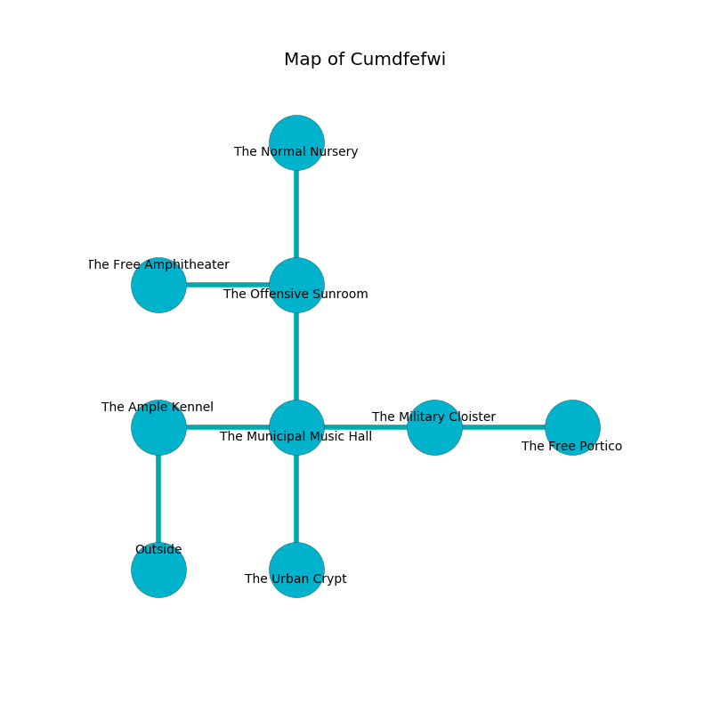

%Ruin Dogs

##Cumdfefwi
###Overview
Cumdfefwi is located under a broken tree. Some areas of Cumdfefwi are flooded. A solar eclipse is happening outside. It is occupied by Satyrs. Denver Redman The Moody, a Quaggoth Thonot is here. The Satyrs are the soldiers of Denver Redman The Moody. He  is trying to exploit [Iaaemdaf](#Iaaemdaf). 

###Artifact
####Iaaemdaf

Iaaemdaf looks like a transparent figurine. It is a dark orange color. It smells like zedoary. When gazed upon it burns the mind. 

###Locations

####the ample kennel
White lichens are sprouting from the walls. The air tastes like sassafrass here. 

* There is a shirt here.
* To the east a long hall leads to [the municipal music hall](#the-municipal-music-hall).
* To the south is the entrance.

####the municipal music hall
There is a trap here. When activated, a tripwire will launch a ceiling pendulum. The floor is sticky. The air tastes like liver here. The mirrored walls are bloodstained. Yellow ferns are sprouting in broken urns. There are a Reef Shark, a Grell, a Duodrone, a Githzerai Monk, and a Pixie here. 

There is an engraving on a monolith written in common. 

> Oh weak soul
>
> aggressive, acceptable, bare
>
> written, philosophical, whole
>
> the world is aware
>

* There is a collar here.
* To the west a long hall opens to [the ample kennel](#the-ample-kennel).
* To the east a long threshold opens to [the military cloister](#the-military-cloister).
* To the north a narrow walkway opens to [the offensive sunroom](#the-offensive-sunroom).
* To the south a windy hallway connects to [the urban crypt](#the-urban-crypt).

####the military cloister
The floor is flooded with two inch deep hot water. White razorgrass is decaying in broken urns. There are eight Satyrs here. If the Satyrs notice the Ruin Dogs, one of them will retreat and alert the others. 

* There is a board here.
* To the west a long threshold opens to [the municipal music hall](#the-municipal-music-hall).
* To the east a twisted pathway leads to [the free portico](#the-free-portico).

####the offensive sunroom
There are an Incubus and an Animated Armor here. White razorgrass is decaying in a patch on the floor. The floor is flooded with nine inch deep hot water. 

* [Iaaemdaf](#Iaaemdaf) is here.
* To the west a flooded gap opens to [the free amphitheater](#the-free-amphitheater).
* To the north a twisted hallway connects to [the normal nursery](#the-normal-nursery).
* To the south a narrow walkway connects to [the municipal music hall](#the-municipal-music-hall).

####the free portico
The stone walls are caving in. The air tastes like fudge here. The floor is bloodstained. 

There is an engraving on the ceiling written in common. 

> We are envious
>
> yet childish
>
> yet reckless
>
> considerable and peaceful
>
> We are envious
>

* To the west a twisted pathway opens to [the military cloister](#the-military-cloister).

####the urban crypt
The concrete walls are bloodstained. 

There is an engraving on a stone written in common. 

> I am looting this place.
>
> A trap ahead.
>

* To the north a windy hallway connects to [the municipal music hall](#the-municipal-music-hall).

####the free amphitheater
There are eight Satyrs here. The floor is flooded with seven inch deep scalding water. The Satyrs are berserk with rage. 

* To the east a flooded gap leads to [the offensive sunroom](#the-offensive-sunroom).

####the normal nursery
The brick walls are covered in mold. 

* [Denver Redman The Moody](#Denver-Redman-The-Moody) is here.
* To the south a twisted hallway connects to [the offensive sunroom](#the-offensive-sunroom).

