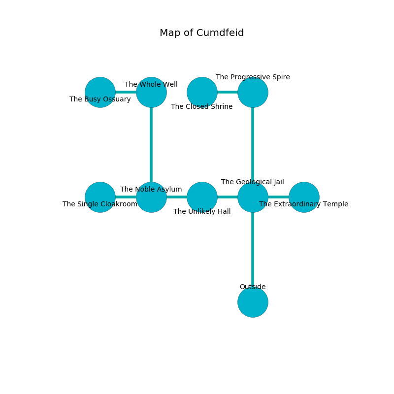

%Ruin Dogs

##Cumdfeid
###Overview
Cumdfeid is located under a volcanic plain. Some areas of Cumdfeid are inaccessible. A solar eclipse is happening outside. It is occupied by Kobolds. Eloy Clem The Patronizing, a Drow Priestess of Lolth is here. The Kobolds have been charmed by Eloy Clem The Patronizing. He  is founding a new religion. 

###Artifact
####Fahesedaeum

Fahesedaeum is a powerful artifact in the shape of a broken sphere. It smells like sweat. When held it dissappears. 

###Locations

####the geological jail
The floor is bloodstained. There are twenty two Winged Kobolds and twelve Kobolds here. The Kobolds are feasting. 

* There is a brush here.
* [Fahesedaeum](#Fahesedaeum) is here.
* To the west a hazy opening leads to [the unlikely hall](#the-unlikely-hall).
* To the east a twisted cave connects to [the extraordinary temple](#the-extraordinary-temple).
* To the north a long pathway opens to [the progressive spire](#the-progressive-spire).
* To the south is the entrance.

####the progressive spire
Yellow mushrooms are sprouting from the ceiling. There are an Eagle, a Drow Elite Warrior, a Bandit, a Specter, a Giant fire beetle, and a Twig Blight here. The crystal walls are ruined. 

* To the west a torchlit threshold leads to [the closed shrine](#the-closed-shrine).
* To the south a long pathway opens to [the geological jail](#the-geological-jail).

####the unlikely hall
The air smells like coconut here. The floor is bloodstained. 

* To the west a windy passageway opens to [the noble asylum](#the-noble-asylum).
* To the east a hazy opening connects to [the geological jail](#the-geological-jail).

####the noble asylum

There is an engraving on the floor written in common. 

> I am lost in Cumdfeid.
>
> I thought about jumping.
>

* [Eloy Clem The Patronizing](#Eloy-Clem-The-Patronizing) is here.
* To the west a dark cave leads to [the single cloakroom](#the-single-cloakroom).
* To the east a windy passageway leads to [the unlikely hall](#the-unlikely-hall).
* To the north a torchlit gap leads to [the whole well](#the-whole-well).

####the single cloakroom
There are sixteen Winged Kobolds and twenty five Kobolds here. The concrete walls are unsettled. There is a trap here. When activated, a magical sound detector will launch a hail of needles. The air tastes like corn here. The Kobolds are willing to fight to the death. 

* To the east a dark cave opens to [the noble asylum](#the-noble-asylum).

####the whole well
There are a Red Dragon Wyrmling, a Flumph, a Swarm of Quippers, a Druid, two Worgs, and  here. 

* To the west a flooded hallway leads to [the busy ossuary](#the-busy-ossuary).
* To the south a torchlit gap leads to [the noble asylum](#the-noble-asylum).

####the closed shrine
The floor is smooth. The air tastes like lily of the valley here. The crystal walls are covered in mold. 

* To the east a torchlit threshold leads to [the progressive spire](#the-progressive-spire).

####the busy ossuary
The floor is cluttered with ashes. The air smells like nut here. White lichens are swaying in a patch on the floor. There are a Guard, a Manticore, a Blue Slaad, and a Myconid Adult here. The wooden walls are ruined. 

* To the east a flooded hallway connects to [the whole well](#the-whole-well).

####the extraordinary temple

* To the west a twisted cave connects to [the geological jail](#the-geological-jail).

