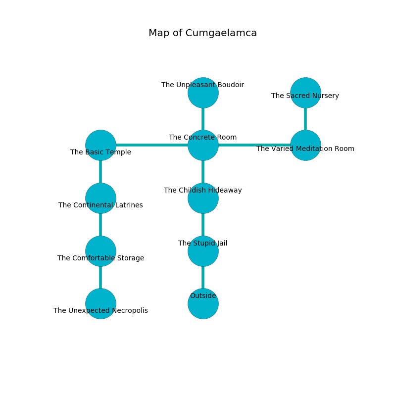

%Ruin Dogs

##Cumgaelamca
###Overview
Cumgaelamca is constructed on a haunted mountain. Some areas of Cumgaelamca are unbearably hot. A lunar eclipse is happening outside. It is occupied by Thri-Kreens. Kizzie Burt The Nasty, a Spined Devil is here. The Thri-Kreens have been charmed by Kizzie Burt The Nasty. She  is founding a new religion. 

###Artifact
####Cmeouaemaeid Imeluia

Cmeouaemaeid Imeluia is a powerful artifact in the shape of a soft gem. Water flows near it. When eaten it curses all nearby. 

###Locations

####the stupid jail
The floor is smooth. The air smells like starch here. There are three Thri-Kreens here. The Thri-Kreens are performing a ritual. If not interrupted, [Kizzie Burt](#Kizzie-Burt) will be magically alarmed. 

* To the north a dark hallway connects to [the childish hideaway](#the-childish-hideaway).
* To the south is the entrance.

####the childish hideaway
The floor is glossy. The glass walls are covered in mold. There are a Kuo-Toa Whip, a Dryad, an Eagle, a Boar, a Giant Bat, and a Gray Ooze here. 

There is an engraving on the ceiling written in common. 

> Oh my! meak you
>
> but proud
>
> competent, cruel, true
>
> cruelty is loud
>

* To the north a twisted threshold opens to [the concrete room](#the-concrete-room).
* To the south a dark hallway connects to [the stupid jail](#the-stupid-jail).

####the concrete room
Green razorgrass is sprouting from the walls. 

There is an engraving on a tablet written in common. 

> Oh cruel god
>
> it is always odd
>
> stupid and independent
>
> fate is dependent
>

* There is a trophy here.
* To the west a small walkway connects to [the basic temple](#the-basic-temple).
* To the east a windy walkway leads to [the varied meditation room](#the-varied-meditation-room).
* To the north a long path opens to [the unpleasant boudoir](#the-unpleasant-boudoir).
* To the south a twisted threshold opens to [the childish hideaway](#the-childish-hideaway).

####the varied meditation room
The obsidion walls are bloodstained. The air tastes like wasabi here. 

* [Kizzie Burt The Nasty](#Kizzie-Burt-The-Nasty) is here.
* To the west a windy walkway leads to [the concrete room](#the-concrete-room).
* To the north a narrow path leads to [the sacred nursery](#the-sacred-nursery).

####the sacred nursery
Gray moss is decaying from the ceiling. 

* There is a horse here.
* To the south a narrow path leads to [the varied meditation room](#the-varied-meditation-room).

####the basic temple
The air tastes like radish here. 

* To the east a small walkway connects to [the concrete room](#the-concrete-room).
* To the south a twisted path leads to [the continental latrines](#the-continental-latrines).

####the continental latrines
There is a Mummy here. There is a trap here. When activated, a pressure plate will flood the room with water. 

There is an engraving on the wall written in common. 

> Dear me! my fate is sadistic
>
> it is always concrete
>
> always characteristic
>
> the world is complete
>

* To the north a twisted path connects to [the basic temple](#the-basic-temple).
* To the south a dripping cavern leads to [the comfortable storage](#the-comfortable-storage).

####the comfortable storage
The air tastes like muguet here. There is a trap here. When activated, a magical rune will make the ceiling slowly lower. 

There is an engraving on a monolith written in Thri-Kreens Script. 

> Dear me! our fate is sadistic
>
> joint and artistic
>
> but never small
>
> life is characteristic
>

* [Cmeouaemaeid Imeluia](#Cmeouaemaeid-Imeluia) is here.
* To the north a dripping cavern connects to [the continental latrines](#the-continental-latrines).
* To the south a small hallway connects to [the unexpected necropolis](#the-unexpected-necropolis).

####the unpleasant boudoir
Yellow razorgrass is swaying in cracks in the floor. 

There is an engraving on the ceiling written in Thri-Kreens Script. 

> O! terrible we
>
> ever free
>
> legal, fastidious, literary
>
> sadness is free
>

* There is a jewel here.
* To the south a long path leads to [the concrete room](#the-concrete-room).

####the unexpected necropolis
There are a Blue Dragon Wyrmling and a Vine Blight here. 

* To the north a small hallway opens to [the comfortable storage](#the-comfortable-storage).

