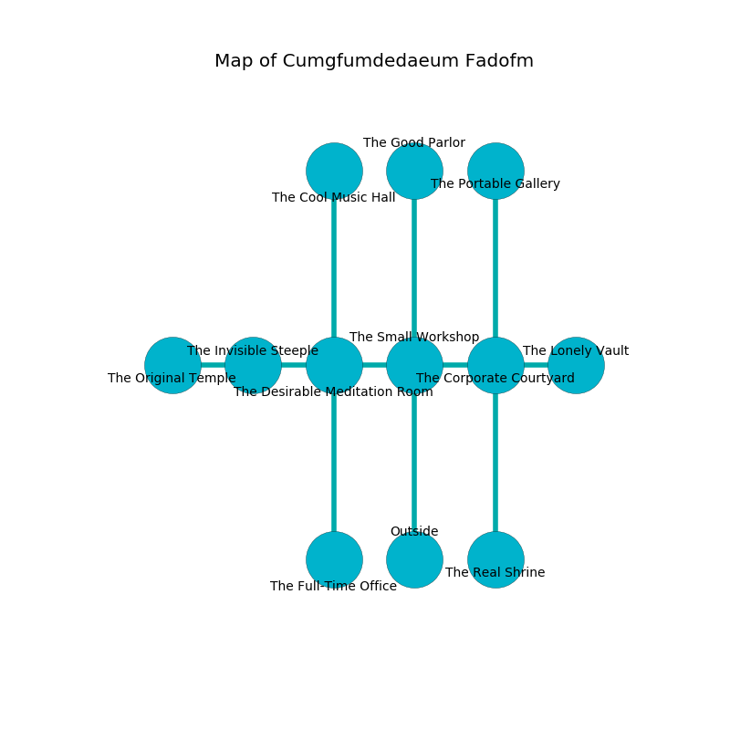

%Ruin Dogs

##Cumgfumdedaeum Fadofm
###Overview
Cumgfumdedaeum Fadofm is located on a cursed mountain. Some areas of Cumgfumdedaeum Fadofm are foggy. A blizzard is happening outside. It is occupied by Drow. Peggy Bair The Silly, a Frost Giant is here. The Drow have been charmed by Peggy Bair The Silly. She  is trying to discover [Uodhaema Asaeha](#Uodhaema-Asaeha). 

###Artifact
####Uodhaema Asaeha

Uodhaema Asaeha looks like a broken amulet. It smells like cypress. When touched it turns surrounding objects to ashes. 

###Locations

####the small workshop
The stone walls are unsettled. The air tastes like dry	durian here. The floor is flooded with eight inch deep cold water. There are a Wight, a Black Pudding, a Flumph, and an Old Faerie Dragon here. Red razorgrass is swaying from the walls. 

* To the west a dripping path opens to [the desirable meditation room](#the-desirable-meditation-room).
* To the east a dripping artery leads to [the corporate courtyard](#the-corporate-courtyard).
* To the north a torchlit opening opens to [the good parlor](#the-good-parlor).
* To the south is the entrance.

####the corporate courtyard
There are a Cyclops and a Silver Dragon Wyrmling here. 

There is an engraving on a stone written in Drow Script. 

> Maybe try fighting.
>

* To the west a dripping artery connects to [the small workshop](#the-small-workshop).
* To the east a torchlit passageway leads to [the lonely vault](#the-lonely-vault).
* To the north a dripping opening opens to [the portable gallery](#the-portable-gallery).
* To the south a narrow hall opens to [the real shrine](#the-real-shrine).

####the desirable meditation room
The air smells like red rose here. The brick walls are ruined. The floor is glossy. 

* There is a key here.
* To the west a dripping hallway leads to [the invisible steeple](#the-invisible-steeple).
* To the east a dripping path connects to [the small workshop](#the-small-workshop).
* To the north a hazy pathway opens to [the cool music hall](#the-cool-music-hall).
* To the south a flooded hall opens to [the full-time office](#the-full-time-office).

####the cool music hall
The air tastes like chicken coup here. The obsidion walls are unsettled. The floor is smooth. Blue moss is growing from the walls. There is a Drow Mage here. The Drow Mage is crazy with bloodlust. 

There is an engraving on a monolith written in Drow Script. 

> Dear me! dire fate
>
> yet never artificial
>
> late, noisy, late
>
> the world is official
>

* To the south a hazy pathway connects to [the desirable meditation room](#the-desirable-meditation-room).

####the good parlor
Green razorgrass is decaying from the ceiling. The concrete walls are pristine. 

* To the south a torchlit opening opens to [the small workshop](#the-small-workshop).

####the portable gallery
There are two Drow Elite Warriors here. The floor is sticky. The stone walls are unsettled. The Drow are crazy with bloodlust. 

* To the south a dripping opening leads to [the corporate courtyard](#the-corporate-courtyard).

####the full-time office
Green lichens are sprouting in broken urns. 

* To the north a flooded hall leads to [the desirable meditation room](#the-desirable-meditation-room).

####the invisible steeple
The concrete walls are scratched. There are a Sahuagin, a Drow Elite Warrior, a Werebear, a Hippogriff, and a Dretch here. The air smells like cantaloupe here. 

* There is a salamander here.
* There is a knot here.
* [Uodhaema Asaeha](#Uodhaema-Asaeha) is here.
* To the west a dripping pathway connects to [the original temple](#the-original-temple).
* To the east a dripping hallway connects to [the desirable meditation room](#the-desirable-meditation-room).

####the lonely vault
The floor is bloodstained. 

* There is a cat here.
* There is a pin here.
* [Peggy Bair The Silly](#Peggy-Bair-The-Silly) is here.
* To the west a torchlit passageway leads to [the corporate courtyard](#the-corporate-courtyard).

####the real shrine
The mirrored walls are pristine. There are two Drow Elite Warriors here. If the Drow notice the Ruin Dogs, one of them will retreat and alert the others. 

* To the north a narrow hall connects to [the corporate courtyard](#the-corporate-courtyard).

####the original temple
The air tastes like sage here. Gray moss is decaying from the ceiling. The floor is sticky. 

There is an engraving on the floor written in common. 

> Oh dire soul
>
> hilarious and archaeological
>
> but whole
>
> everything is geological
>

* To the east a dripping pathway leads to [the invisible steeple](#the-invisible-steeple).

