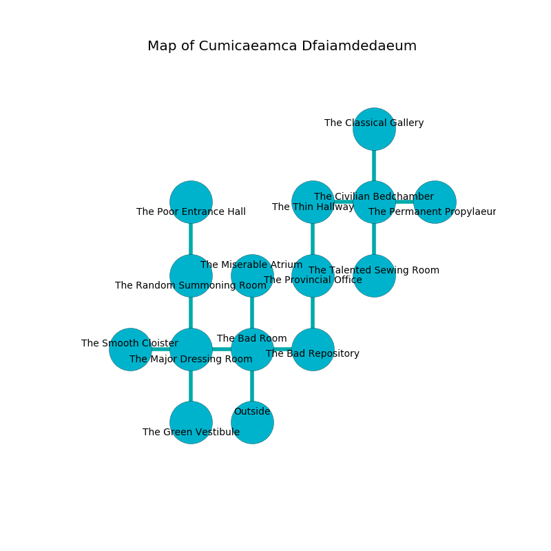

%Ruin Dogs

##Cumicaeamca Dfaiamdedaeum
###Overview
Cumicaeamca Dfaiamdedaeum is located on a cursed rift. Some areas of it are flooded. A windstorm is happening outside. It is occupied by Goblins. Marcos Lockwood The Overemotional, a Harpy is here. The Goblins are the slaves of Marcos Lockwood The Overemotional. He  is founding a new religion. 

###Artifact
####The Awkward Exhibition

The Awkward Exhibition is a powerful artifact in the shape of a soft rock. Cacophony incinerates around it. When touched it emits dust. 

###Locations

####the bad room
The brick walls are unsettled. The floor is sticky. There are four Goblins and two Hobgoblins here. The Goblins are performing a ritual. If not interrupted, the ruin dogs will be weakened. 

* To the west a torchlit opening opens to [the major dressing room](#the-major-dressing-room).
* To the east a hazy corridor leads to [the bad repository](#the-bad-repository).
* To the north a dripping pathway connects to [the miserable atrium](#the-miserable-atrium).
* To the south is the entrance.

####the bad repository
The floor is sticky. There is a Will-O’-Wisp here. Red lichens are swaying in a patch on the floor. 

* To the west a hazy corridor connects to [the bad room](#the-bad-room).
* To the north a windy path leads to [the provincial office](#the-provincial-office).

####the provincial office
There are a Riding Horse, a Smoke Mephit, and a White Dragon Wyrmling here. The concrete walls are ruined. The air smells like grass here. 

* To the north a long artery leads to [the thin hallway](#the-thin-hallway).
* To the south a windy path leads to [the bad repository](#the-bad-repository).

####the major dressing room
There are a Carrion Crawler, a Giant Centipede, a Spider, a Jackalwere, and a Panther here. 

* There is a cake here.
* [The Awkward Exhibition](#The-Awkward-Exhibition) is here.
* To the west a small hallway opens to [the smooth cloister](#the-smooth-cloister).
* To the east a torchlit opening leads to [the bad room](#the-bad-room).
* To the north a hazy cave leads to [the random summoning room](#the-random-summoning-room).
* To the south a dark path leads to [the green vestibule](#the-green-vestibule).

####the miserable atrium
Red moss is swaying from the ceiling. The floor is sticky. There is a Myconid Sovereign here. The concrete walls are unsettled. There is a trap here. When activated, a magical sound detector will extend a spring loaded spear. 

There is an engraving on a stone written in common. 

> You are maddened
>
> professional, smart, powerful
>
> We are damned
>
> welcome, black, valuable
>
> All of us are frozen
>
> competitive and spontaneous
>
> yet never rural
>
> concrete, faithful, incongruous
>
> A shelf is a title
>
> but industrial
>
> bold, talented, independent
>
> [The Awkward Exhibition](#The-Awkward-Exhibition)
>
> terminal and socialist
>
> always offensive
>
> ever environmental
>

* To the south a dripping pathway leads to [the bad room](#the-bad-room).

####the random summoning room
There are six Goblins and a Hobgoblin here. One of the Goblins is pointing a ballista at the entrance. 

* To the north a narrow cave opens to [the poor entrance hall](#the-poor-entrance-hall).
* To the south a hazy cave connects to [the major dressing room](#the-major-dressing-room).

####the thin hallway
There are a Giant Octopus, a Giant Owl, an Owl, a Giant Centipede, a Gray Ooze, a Needle Blight, a Kobold, and a Constrictor Snake here. The air tastes like anise here. Green mushrooms are decaying in cracks in the floor. 

* To the east a torchlit walkway connects to [the civilian bedchamber](#the-civilian-bedchamber).
* To the south a long artery opens to [the provincial office](#the-provincial-office).

####the poor entrance hall
There are a Sprite, a Swarm of Rats, a Merfolk, a Magmin, an Ice Mephit, and a Giant Sea Horse here. White lichens are swaying in cracks in the floor. 

There is an engraving on the wall written in Goblins Script. 

> All of us are envious
>
> ever random
>
> geological, just, raw
>
> appropriate, distant, harsh
>
> liberal and organic
>
> painful and experienced
>
> [The Awkward Exhibition](#The-Awkward-Exhibition)
>
> but curious
>
> [The Awkward Exhibition](#The-Awkward-Exhibition)
>
> medieval, modest, temporary
>
> you shall be loved
>

* To the south a narrow cave connects to [the random summoning room](#the-random-summoning-room).

####the civilian bedchamber

* To the west a torchlit walkway connects to [the thin hallway](#the-thin-hallway).
* To the east a twisted cave connects to [the permanent propylaeum](#the-permanent-propylaeum).
* To the north a small cave opens to [the classical gallery](#the-classical-gallery).
* To the south a windy pathway opens to [the talented sewing room](#the-talented-sewing-room).

####the smooth cloister
The air smells like thyme here. The floor is sticky. 

* To the east a small hallway opens to [the major dressing room](#the-major-dressing-room).

####the talented sewing room
Blue mushrooms are growing in a patch on the floor. There is a trap here. When activated, a pressure plate will close a portcullis. The floor is flooded with nine inch deep lukewarm water. 

* To the north a windy pathway leads to [the civilian bedchamber](#the-civilian-bedchamber).

####the permanent propylaeum
White ferns are swaying in a patch on the floor. There is a trap here. When activated, a magical proximity detector will launch a poison dart. The air tastes like red currant here. 

* There is a breastplate here.
* To the west a twisted cave leads to [the civilian bedchamber](#the-civilian-bedchamber).

####the classical gallery
Gray lichens are growing in a patch on the floor. The floor is cluttered with debris. The air tastes like whiskey here. The crystal walls are pristine. There are three Goblins and three Hobgoblins here. One of the Goblins is pointing a ballista at the entrance. 

* [Marcos Lockwood The Overemotional](#Marcos-Lockwood-The-Overemotional) is here.
* To the south a small cave opens to [the civilian bedchamber](#the-civilian-bedchamber).

####the green vestibule
There is a trap here. When activated, a pressure plate will launch a fireball. The mirrored walls are pristine. The air tastes like petitgrain here. There are two Goblins and three Hobgoblins here. One of the Goblins is pointing a ballista at the entrance. 

There is an engraving on a tablet written in common. 

> I tried leaving.
>

* To the north a dark path opens to [the major dressing room](#the-major-dressing-room).

