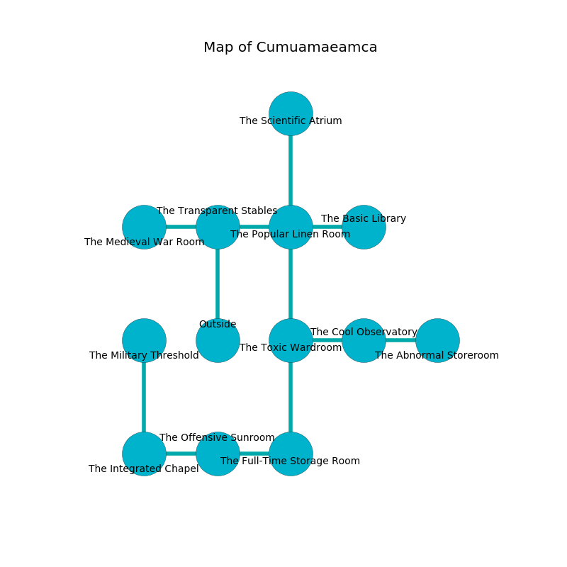

%Ruin Dogs

##Cumuamaeamca
###Overview
Cumuamaeamca is located on an obsidion city. Parts of it are corrupted. The ruin is coming to life. It is occupied by Dryads. Merrie Neil The Untrustworthy, a Veteran is here. The Dryads are battling Merrie Neil The Untrustworthy. She  is founding a new religion. 

###Artifact
####Cuofeha

Cuofeha is a powerful artifact in the shape of a smooth figurine. Power slides away from it. When gazed upon it sings the hymn of the damned. 

###Locations

####the transparent stables
The air tastes like cornmint here. Green moss is swaying in broken urns. There are four Dryads here. The Dryads are berserk with rage. 

* To the west a hazy walkway leads to [the medieval war Room](#the-medieval-war-Room).
* To the east a small cavern leads to [the popular linen room](#the-popular-linen-room).
* To the south is the entrance.

####the popular linen room
The metallic walls are bloodstained. The floor is smooth. 

* To the west a small cavern connects to [the transparent stables](#the-transparent-stables).
* To the east a dripping cavern leads to [the basic library](#the-basic-library).
* To the north a long corridor connects to [the scientific atrium](#the-scientific-atrium).
* To the south a twisted hallway leads to [the toxic wardroom](#the-toxic-wardroom).

####the toxic wardroom
The glass walls are caving in. Green lichens are growing in cracks in the floor. The floor is smooth. 

* To the east a torchlit corridor leads to [the cool observatory](#the-cool-observatory).
* To the north a twisted hallway opens to [the popular linen room](#the-popular-linen-room).
* To the south a torchlit pathway opens to [the full-time storage room](#the-full-time-storage-room).

####the full-time storage room
The floor is cluttered with shells. The wooden walls are caving in. White lichens are swaying in cracks in the floor. The air smells like eggs here. 

* To the west a narrow corridor opens to [the offensive sunroom](#the-offensive-sunroom).
* To the north a torchlit pathway opens to [the toxic wardroom](#the-toxic-wardroom).

####the scientific atrium
The floor is glossy. Blue razorgrass is sprouting in a patch on the floor. There are four Dryads here. One of the Dryads is on watch, the rest are drunk. 

* To the south a long corridor connects to [the popular linen room](#the-popular-linen-room).

####the offensive sunroom
The air tastes like narcissus here. There are a Drow, an Ochre Jelly, and an Orog here. 

* To the west a twisted passageway leads to [the integrated chapel](#the-integrated-chapel).
* To the east a narrow corridor leads to [the full-time storage room](#the-full-time-storage-room).

####the basic library
White ferns are swaying in a patch on the floor. The floor is glossy. The air smells like potato chip here. There are four Dryads here. The Dryads are defending this room from intruders. 

* To the west a dripping cavern connects to [the popular linen room](#the-popular-linen-room).

####the cool observatory
There are four Dryads here. The floor is cluttered with broken glass. The air smells like red rose here. One of the Dryads is working a mechanism that can engulf the room in a fiery blaze. 

* [Merrie Neil The Untrustworthy](#Merrie-Neil-The-Untrustworthy) is here.
* To the west a torchlit corridor connects to [the toxic wardroom](#the-toxic-wardroom).
* To the east a narrow cavern leads to [the abnormal storeroom](#the-abnormal-storeroom).

####the medieval war Room
The brick walls are ruined. Red moss is growing from the walls. The air tastes like flowers here. 

* To the east a hazy walkway opens to [the transparent stables](#the-transparent-stables).

####the integrated chapel
The concrete walls are scratched. The floor is flooded with eight inch deep lukewarm water. 

There is an engraving on the floor written in common. 

> I am cruel.
>

* There is a cake here.
* [Cuofeha](#Cuofeha) is here.
* To the east a twisted passageway connects to [the offensive sunroom](#the-offensive-sunroom).
* To the north a hazy cave leads to [the military threshold](#the-military-threshold).

####the abnormal storeroom
The stone walls are caving in. The floor is smooth. The air tastes like hawthorn here. 

* To the west a narrow cavern connects to [the cool observatory](#the-cool-observatory).

####the military threshold
The floor is smooth. The brick walls are scratched. There is a trap here. When activated, a tripwire will launch an arrow. 

* To the south a hazy cave leads to [the integrated chapel](#the-integrated-chapel).

