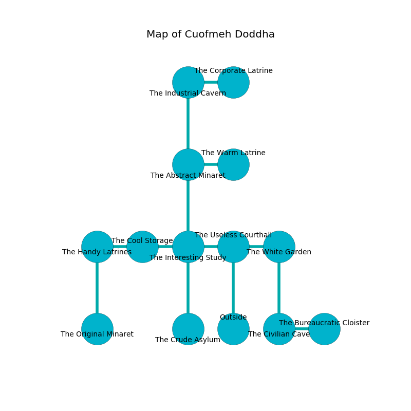

%Ruin Dogs

##Cuofmeh Doddha
###Overview
Cuofmeh Doddha is located under a crystal rift. Some areas of Cuofmeh Doddha are incredibly hot. The ruin is larger on the inside than the outside. It is occupied by Vampires. Keenan Mclaurin The Impolite, a Mage is here. The Vampires have been charmed by Keenan Mclaurin The Impolite. He  is trying to understand [Cuhhacdaeum](#Cuhhacdaeum). 

###Artifact
####Cuhhacdaeum

Cuhhacdaeum is a powerful artifact in the shape of a sharp rock. Gravity slides towards it. It smells like phenolic. When smelled it emits dust. 

###Locations

####the useless courthall
There are a Drow, a Badger, a Mummy, a Dretch, a Plesiosaurus, and a Berserker here. The air smells like melon rind here. The concrete walls are pristine. 

There is an engraving on the ceiling written in common. 

> I could not try running.
>

* To the west a long corridor connects to [the interesting study](#the-interesting-study).
* To the east a hazy opening leads to [the white garden](#the-white-garden).
* To the south is the entrance.

####the interesting study
The floor is sticky. 

* To the west a dripping passageway connects to [the cool storage](#the-cool-storage).
* To the east a long corridor opens to [the useless courthall](#the-useless-courthall).
* To the north a flooded walkway connects to [the abstract minaret](#the-abstract-minaret).
* To the south a long walkway connects to [the crude asylum](#the-crude-asylum).

####the abstract minaret
Green mushrooms are swaying in a patch on the floor. There are a Manticore and a Flesh Golem here. The floor is flooded with two inch deep hot water. 

* There is a nail here.
* To the east a small path leads to [the warm latrine](#the-warm-latrine).
* To the north a dripping hall connects to [the industrial cavern](#the-industrial-cavern).
* To the south a flooded walkway connects to [the interesting study](#the-interesting-study).

####the warm latrine
The floor is cluttered with broken glass. Green lichens are swaying from the walls. There are two Vampire Spawns here. If the Vampires notice the Ruin Dogs, one of them will retreat and alert the others. 

* To the west a small path opens to [the abstract minaret](#the-abstract-minaret).

####the cool storage
Green mushrooms are swaying in a patch on the floor. There are two Vampire Spawns here. The brick walls are pristine. One of the Vampires is working a mechanism that can engulf the room in a fiery blaze. 

* To the west a twisted cave connects to [the handy latrines](#the-handy-latrines).
* To the east a dripping passageway connects to [the interesting study](#the-interesting-study).

####the industrial cavern
The air tastes like tequila here. The floor is cluttered with ashes. 

There is an engraving on the floor written in Vampires Script. 

> Leave at once.
>

* To the east a windy gap leads to [the corporate latrine](#the-corporate-latrine).
* To the south a dripping hall connects to [the abstract minaret](#the-abstract-minaret).

####the corporate latrine
The brick walls are covered in mold. 

* To the west a windy gap opens to [the industrial cavern](#the-industrial-cavern).

####the crude asylum
The air tastes like spearmint here. There are a Red Slaad, a Blood Hawk, a Kuo-Toa, and a Lamia here. 

* To the north a long walkway opens to [the interesting study](#the-interesting-study).

####the white garden
Red razorgrass is growing in cracks in the floor. There are two Vampire Spawns here. The air smells like ozone here. The Vampires are performing a ritual. If not interrupted, the Vampires will become more powerful. 

* There is a rod here.
* To the west a hazy opening leads to [the useless courthall](#the-useless-courthall).
* To the south a dripping opening connects to [the civilian cave](#the-civilian-cave).

####the civilian cave
The air smells like gravy here. Blue mushrooms are decaying from the walls. 

There is an engraving on the ceiling written in Vampires Script. 

> I am lost in Cuofmeh Doddha.
>
> Go away.
>

* [Cuhhacdaeum](#Cuhhacdaeum) is here.
* To the east a dark opening leads to [the bureaucratic cloister](#the-bureaucratic-cloister).
* To the north a dripping opening leads to [the white garden](#the-white-garden).

####the handy latrines
There is a trap here. When activated, a magical proximity detector will close a portcullis. 

* There is a berry here.
* To the east a twisted cave opens to [the cool storage](#the-cool-storage).
* To the south a small cave connects to [the original minaret](#the-original-minaret).

####the original minaret
Yellow moss is decaying in a patch on the floor. The wooden walls are ruined. The air smells like boysenberry here. 

There is an engraving on a monolith written in common. 

> [Cuhhacdaeum](#Cuhhacdaeum)
>
> content and full-time
>
> invisible and heavy
>

* [Keenan Mclaurin The Impolite](#Keenan-Mclaurin-The-Impolite) is here.
* To the north a small cave opens to [the handy latrines](#the-handy-latrines).

####the bureaucratic cloister
White moss is growing in broken urns. The floor is smooth. The air smells like anise here. 

There is an engraving on the ceiling written in Vampires Script. 

> A table is an art
>
> geological and cute
>
> A table is an art
>

* To the west a dark opening connects to [the civilian cave](#the-civilian-cave).

