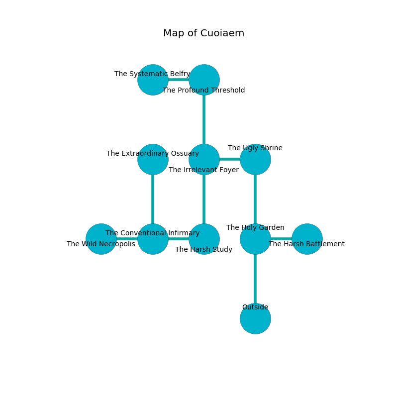

%Ruin Dogs

##Cuoiaem
###Overview
Cuoiaem is located in a poisoned mountain. Some rooms of Cuoiaem are flooded. The ruin is coming to life. It is occupied by Demons. Landon Hurt The Impolite, a Knight is here. The Demons worship Landon Hurt The Impolite. He  is trying to research [The Friendly Nose](#The-Friendly-Nose). 

###Artifact
####The Friendly Nose

The Friendly Nose has the form of a glassy orb. When touched it illuminates its surroundings. 

###Locations

####the holy garden
The air tastes like nut skin here. Gray razorgrass is sprouting in cracks in the floor. There is a Spined Devil here. If the Spined Devil notice the Ruin Dogs, one of them will retreat and alert the others. 

There is an engraving on the ceiling written in Demons Script. 

> Try digging.
>

* To the east a long hall connects to [the harsh battlement](#the-harsh-battlement).
* To the north a hazy threshold opens to [the ugly shrine](#the-ugly-shrine).
* To the south is the entrance.

####the harsh battlement
There is a trap here. When activated, a tripwire will collapse a column. The air smells like styrene here. 

* To the west a long hall opens to [the holy garden](#the-holy-garden).

####the ugly shrine
The floor is glossy. Blue lichens are swaying in a patch on the floor. There is a Spined Devil here. The Spined Devil is crazy with bloodlust. 

* To the west a hazy pathway opens to [the irrelevant foyer](#the-irrelevant-foyer).
* To the south a hazy threshold opens to [the holy garden](#the-holy-garden).

####the irrelevant foyer
The floor is flooded with two inch deep cold water. Red moss is decaying from the walls. 

* There is a sock here.
* To the east a hazy pathway opens to [the ugly shrine](#the-ugly-shrine).
* To the north a twisted walkway opens to [the profound threshold](#the-profound-threshold).
* To the south a small cavern opens to [the harsh study](#the-harsh-study).

####the harsh study
White razorgrass is growing from the ceiling. There are a Badger, a Dust Mephit, a Boar, a Swarm of Insects, a Quipper, a Poisonous Snake, a Hawk, and a Griffon here. The brick walls are pristine. 

* There is a trousers here.
* [Landon Hurt The Impolite](#Landon-Hurt-The-Impolite) is here.
* To the west a flooded corridor opens to [the conventional infirmary](#the-conventional-infirmary).
* To the north a small cavern connects to [the irrelevant foyer](#the-irrelevant-foyer).

####the profound threshold
There are two Imp here. The floor is flooded with seven inch deep cool water. The Demons are performing a ritual. If not interrupted, the Demons will become more powerful. 

* There is a pot here.
* There is a brake here.
* To the west a long artery leads to [the systematic belfry](#the-systematic-belfry).
* To the south a twisted walkway leads to [the irrelevant foyer](#the-irrelevant-foyer).

####the conventional infirmary
The air smells like deertongue here. Gray ferns are sprouting in broken urns. The glass walls are scratched. 

There is an engraving on the floor written in Demons Script. 

> Dear me! pitiful you
>
> asleep, equal, nice
>
> but never new
>
> cruelty is obese
>

* [The Friendly Nose](#The-Friendly-Nose) is here.
* To the west a long gap connects to [the wild necropolis](#the-wild-necropolis).
* To the east a flooded corridor connects to [the harsh study](#the-harsh-study).
* To the north a flooded pathway opens to [the extraordinary ossuary](#the-extraordinary-ossuary).

####the extraordinary ossuary
There are a Silver Dragon Wyrmling and a Giant Spider here. The concrete walls are bloodstained. 

There is an engraving on a monolith written in Demons Script. 

> We are cursed
>
> yet never environmental
>
> We are cursed
>

* To the south a flooded pathway connects to [the conventional infirmary](#the-conventional-infirmary).

####the systematic belfry
The mirrored walls are scratched. Green ferns are growing in broken urns. 

* To the east a long artery leads to [the profound threshold](#the-profound-threshold).

####the wild necropolis
The air smells like tagette here. White lichens are decaying in a patch on the floor. The crystal walls are caving in. 

* There is a cheese here.
* To the east a long gap connects to [the conventional infirmary](#the-conventional-infirmary).

