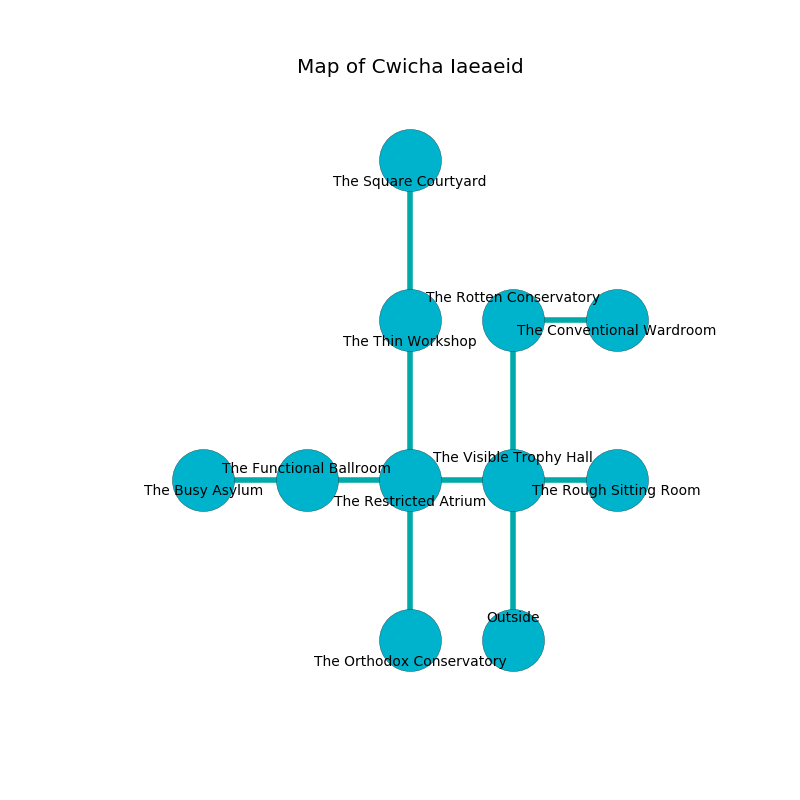

%Ruin Dogs

##Cwicha Iaeaeid
###Overview
Cwicha Iaeaeid is located under a crystal tree. Some areas of it are somewhat cold. The ruin is larger on the inside than the outside. It is occupied by Humans. Kermit Pena The Secretive, a Yuan-Ti Pureblood is here. The Humans are the soldiers of Kermit Pena The Secretive. He  is trying to use [Iduum Dheaemdaegg](#Iduum-Dheaemdaegg). 

###Artifact
####Iduum Dheaemdaegg

Iduum Dheaemdaegg has the form of a broken orb. It is a sickly gray color. Light bends towards it. When worshipped it grants psychic powers. 

###Locations

####the visible trophy hall
The wooden walls are caving in. Gray razorgrass is decaying from the ceiling. The air tastes like grape here. 

There is an engraving on a monolith written in Humans Script. 

> Oh terrible we
>
> mental and restricted
>
> it is never free
>
> sadness is addicted
>

* There is a cheese here.
* There is a chainmail here.
* To the west a long opening opens to [the restricted atrium](#the-restricted-atrium).
* To the east a narrow walkway opens to [the rough sitting Room](#the-rough-sitting-Room).
* To the north a long corridor opens to [the rotten conservatory](#the-rotten-conservatory).
* To the south is the entrance.

####the restricted atrium
The floor is glossy. There are a Thug, a Tribal Warrior, a Cultist, and a Berserker here. Red ferns are growing from the ceiling. The Humans are willing to negotiate. 

* To the west a windy path connects to [the functional ballroom](#the-functional-ballroom).
* To the east a long opening opens to [the visible trophy hall](#the-visible-trophy-hall).
* To the north a dripping cave opens to [the thin workshop](#the-thin-workshop).
* To the south a long corridor leads to [the orthodox conservatory](#the-orthodox-conservatory).

####the functional ballroom
There is a Nothic here. The mirrored walls are covered in mold. Green razorgrass is growing from the walls. There is a trap here. When activated, a magical rune will launch a rolling boulder. The floor is flooded with five inch deep cool water. The air tastes like lychee here. 

* [Iduum Dheaemdaegg](#Iduum-Dheaemdaegg) is here.
* To the west a dark hallway connects to [the busy asylum](#the-busy-asylum).
* To the east a windy path connects to [the restricted atrium](#the-restricted-atrium).

####the orthodox conservatory
There are a Tiger and an Animated Armor here. The air tastes like orange here. 

* [Kermit Pena The Secretive](#Kermit-Pena-The-Secretive) is here.
* To the north a long corridor leads to [the restricted atrium](#the-restricted-atrium).

####the thin workshop
The mirrored walls are scratched. The air smells like green bean here. 

* To the north a hazy passageway opens to [the square courtyard](#the-square-courtyard).
* To the south a dripping cave connects to [the restricted atrium](#the-restricted-atrium).

####the rotten conservatory
The floor is bloodstained. Blue razorgrass is decaying from the walls. There is a Merrow here. 

* To the east a dark threshold opens to [the conventional wardroom](#the-conventional-wardroom).
* To the south a long corridor connects to [the visible trophy hall](#the-visible-trophy-hall).

####the rough sitting Room
There is a Cult Fanatic here. The Cult Fanatic is willing to fight to the death. 

There is an engraving on a stone written in common. 

> I tried swimming.
>

* To the west a narrow walkway opens to [the visible trophy hall](#the-visible-trophy-hall).

####the square courtyard
The air smells like rubber here. The floor is glossy. 

There is an engraving on a stone written in Humans Script. 

> Hide here.
>

* To the south a hazy passageway leads to [the thin workshop](#the-thin-workshop).

####the conventional wardroom
The obsidion walls are bloodstained. There are a Tribal Warrior, three Commoners, an Acolyte, two Guards, a Berserker, a Cultist,  here. The Humans are berserk with rage. 

* There is a casket here.
* To the west a dark threshold leads to [the rotten conservatory](#the-rotten-conservatory).

####the busy asylum
The air tastes like liver here. The floor is bloodstained. 

There is an engraving on a stone written in Humans Script. 

> Maybe try swimming.
>

* To the east a dark hallway connects to [the functional ballroom](#the-functional-ballroom).

