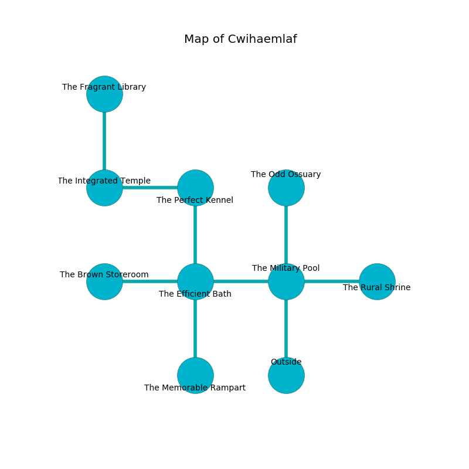

%Ruin Dogs

##Cwihaemlaf
###Overview
Cwihaemlaf is located under a haunted tree. Regions of Cwihaemlaf are frozen. A massive storm is happening outside. It is occupied by Sprites. Chantell Barkley The Conservative, a Cambion is here. The Sprites have been charmed by Chantell Barkley The Conservative. She  is trying to steal [The Irrelevant Life](#The-Irrelevant-Life). 

###Artifact
####The Irrelevant Life

The Irrelevant Life looks like a transparent cube. Cacophony pours towards it. When held it projects energy. 

###Locations

####the military pool
The floor is flooded with nine inch deep cold water. Gray moss is swaying in a patch on the floor. 

There is an engraving on the ceiling written in Sprites Script. 

> They are love
>
> statistical and optional
>
> All of us are maddened
>
> always mechanical
>
> sophisticated, inevitable, different
>
> [The Irrelevant Life](#The-Irrelevant-Life)
>
> permanent and portable
>
> but empty
>
> but revolutionary
>
> They are love
>

* There is a spade here.
* To the west a torchlit walkway leads to [the efficient bath](#the-efficient-bath).
* To the east a small gap opens to [the rural shrine](#the-rural-shrine).
* To the north a windy path leads to [the odd ossuary](#the-odd-ossuary).
* To the south is the entrance.

####the efficient bath
There are twenty Sprites here. The floor is sticky. Blue lichens are swaying in broken urns. The Sprites are crazy with bloodlust. 

* There is a spring here.
* There is a cheese here.
* To the west a torchlit hall connects to [the brown storeroom](#the-brown-storeroom).
* To the east a torchlit walkway connects to [the military pool](#the-military-pool).
* To the north a small walkway leads to [the perfect kennel](#the-perfect-kennel).
* To the south a narrow corridor leads to [the memorable rampart](#the-memorable-rampart).

####the brown storeroom
The mirrored walls are bloodstained. There are a Giant Toad and a Lizard King here. Gray ferns are sprouting in broken urns. The air tastes like praline here. The floor is cluttered with broken glass. 

There is an engraving on a stone written in Sprites Script. 

> [The Irrelevant Life](#The-Irrelevant-Life)
>
> unexpected, rotten, reasonable
>
> always implicit
>
> [The Irrelevant Life](#The-Irrelevant-Life)
>

* To the east a torchlit hall opens to [the efficient bath](#the-efficient-bath).

####the perfect kennel
The air smells like neroli here. Red lichens are sprouting from the ceiling. The glass walls are caving in. 

* [Chantell Barkley The Conservative](#Chantell-Barkley-The-Conservative) is here.
* To the west a small threshold connects to [the integrated temple](#the-integrated-temple).
* To the south a small walkway leads to [the efficient bath](#the-efficient-bath).

####the odd ossuary
The crystal walls are scratched. 

There is an engraving on the ceiling written in Sprites Script. 

> I am fleeing this place.
>

* There is an orb here.
* To the south a windy path connects to [the military pool](#the-military-pool).

####the memorable rampart
The floor is cluttered with bones. Red ferns are decaying from the walls. The wooden walls are ruined. 

* To the north a narrow corridor leads to [the efficient bath](#the-efficient-bath).

####the integrated temple
The floor is smooth. The brick walls are unsettled. Red ferns are growing from the ceiling. 

* [The Irrelevant Life](#The-Irrelevant-Life) is here.
* To the east a small threshold opens to [the perfect kennel](#the-perfect-kennel).
* To the north a dark hall connects to [the fragrant library](#the-fragrant-library).

####the rural shrine
The metallic walls are unsettled. Blue lichens are decaying from the ceiling. 

* To the west a small gap connects to [the military pool](#the-military-pool).

####the fragrant library

* There is a card here.
* To the south a dark hall connects to [the integrated temple](#the-integrated-temple).

