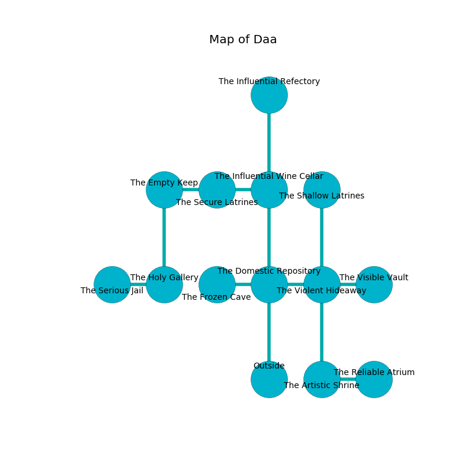

%Ruin Dogs

##Daa
###Overview
Daa is located in an alien city. Some rooms of Daa are flooded. A solar eclipse is happening outside. It is occupied by Orc. Mohammed Doss The Touchy, a Sahuagin Baron is here. The Orc are the soldiers of Mohammed Doss The Touchy. He  is trying to find [The Liquid Delay](#The-Liquid-Delay). 

###Artifact
####The Liquid Delay

The Liquid Delay looks like a mushy blade. It smells like capers. It is a light blue color. When worshipped it repels insects. 

###Locations

####the domestic repository
Green ferns are growing in cracks in the floor. There are ten Orcs here. The air smells like pear skin here. The floor is sticky. The Orc are performing a ritual. If not interrupted, the Orc will become more powerful. 

* [Mohammed Doss The Touchy](#Mohammed-Doss-The-Touchy) is here.
* To the west a small path connects to [the frozen cave](#the-frozen-cave).
* To the east a hazy cave leads to [the violent hideaway](#the-violent-hideaway).
* To the north a hazy artery opens to [the influential wine cellar](#the-influential-wine-cellar).
* To the south is the entrance.

####the influential wine cellar
The air smells like myrrh here. 

* There is a salamander here.
* There is a plate here.
* To the west a long walkway opens to [the secure latrines](#the-secure-latrines).
* To the north a small pathway opens to [the influential refectory](#the-influential-refectory).
* To the south a hazy artery opens to [the domestic repository](#the-domestic-repository).

####the violent hideaway

There is an engraving on the wall written in Orc Script. 

> [The Liquid Delay](#The-Liquid-Delay)
>
> proportional and cold
>
> [The Liquid Delay](#The-Liquid-Delay)
>
> yet huge
>
> A nut is a red
>
> imperial, dynamic, nice
>
> pure, close, exact
>
> [The Liquid Delay](#The-Liquid-Delay)
>

* To the west a hazy cave leads to [the domestic repository](#the-domestic-repository).
* To the east a hazy cave connects to [the visible vault](#the-visible-vault).
* To the north a dark corridor leads to [the shallow latrines](#the-shallow-latrines).
* To the south a windy passageway connects to [the artistic shrine](#the-artistic-shrine).

####the shallow latrines
White ferns are decaying from the walls. 

* There is a spoon here.
* To the south a dark corridor leads to [the violent hideaway](#the-violent-hideaway).

####the secure latrines
Blue mushrooms are growing in a patch on the floor. The concrete walls are covered in mold. 

* To the west a torchlit threshold leads to [the empty keep](#the-empty-keep).
* To the east a long walkway leads to [the influential wine cellar](#the-influential-wine-cellar).

####the artistic shrine
Red lichens are decaying from the ceiling. There are ten Orcs here. The Orc are performing a ritual. If not interrupted, [Mohammed Doss](#Mohammed-Doss) will be magically alarmed. 

There is an engraving on the wall written in common. 

> I am lost in Daa.
>

* To the east a torchlit cavern leads to [the reliable atrium](#the-reliable-atrium).
* To the north a windy passageway opens to [the violent hideaway](#the-violent-hideaway).

####the influential refectory
The air tastes like ambergris here. There are ten Orcs here. The concrete walls are bloodstained. One of the Orc is pointing a ballista at the entrance. 

There is an engraving on a stone written in Orc Script. 

> O! the world is poor
>
> limited, unexpected, pure
>
> productive, loose, cute
>
> sadness is acute
>

* To the south a small pathway connects to [the influential wine cellar](#the-influential-wine-cellar).

####the frozen cave
There are ten Orcs here. If the Orc notice the Ruin Dogs, one of them will retreat and alert [Mohammed Doss](#Mohammed-Doss). 

There is an engraving on a monolith written in common. 

> I was injured in this place.
>

* To the east a small path connects to [the domestic repository](#the-domestic-repository).

####the empty keep
The metallic walls are unsettled. The floor is bloodstained. 

* To the east a torchlit threshold leads to [the secure latrines](#the-secure-latrines).
* To the south a twisted opening opens to [the holy gallery](#the-holy-gallery).

####the visible vault
There is a trap here. When activated, a magical proximity detector will ring a bell. The floor is cluttered with broken glass. There are ten Orcs here. Blue ferns are decaying in a patch on the floor. The air tastes like smoked sausage here. The metallic walls are bloodstained. If the Orc notice the Ruin Dogs, one of them will retreat and alert [Mohammed Doss](#Mohammed-Doss). 

There is an engraving on a stone written in common. 

> Run away.
>

* There is a bottle here.
* To the west a hazy cave opens to [the violent hideaway](#the-violent-hideaway).

####the holy gallery
The floor is glossy. The metallic walls are scratched. The air smells like incense here. 

* [The Liquid Delay](#The-Liquid-Delay) is here.
* To the west a hazy corridor opens to [the serious jail](#the-serious-jail).
* To the north a twisted opening connects to [the empty keep](#the-empty-keep).

####the reliable atrium
The floor is glossy. There are a Red Slaad, a Swarm of Insects, a Draft Horse, and a Flying Snake here. There is a trap here. When activated, a tripwire will launch a hail of needles. 

* To the west a torchlit cavern leads to [the artistic shrine](#the-artistic-shrine).

####the serious jail
The floor is smooth. There are a Werewolf and a Silver Dragon Wyrmling here. The glass walls are caving in. 

There is an engraving on the floor written in Orc Script. 

> I am old.
>

* There is an imp here.
* To the east a hazy corridor connects to [the holy gallery](#the-holy-gallery).

