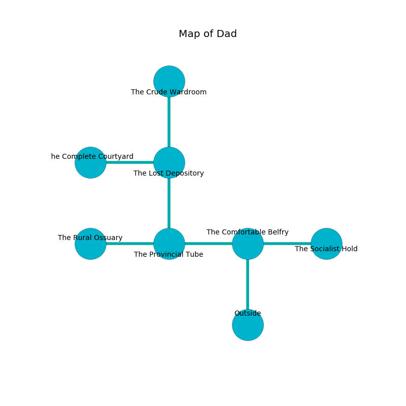

%Ruin Dogs

##Dad
###Overview
Dad is located under a volcanic city. Some rooms of it are cursed. A solar eclipse is happening outside. It is occupied by Orc. Virgil Ricketts The Bone-Idle, a Yuan-Ti Malison is here. The Orc are the minions of Virgil Ricketts The Bone-Idle. He  is founding a new religion. 

###Artifact
####Lachefedaeum Hfemlgedmaf

Lachefedaeum Hfemlgedmaf looks like a soft monument. It is a bright purple color. It smells like peppermint. When worshipped it shows an image of the future. 

###Locations

####the comfortable belfry
There are six Orcs here. Red mushrooms are growing in broken urns. The floor is sticky. The mirrored walls are covered in mold. The Orc are meditating. 

* [Virgil Ricketts The Bone-Idle](#Virgil-Ricketts-The-Bone-Idle) is here.
* To the west a small pathway opens to [the provincial tube](#the-provincial-tube).
* To the east a small artery leads to [the socialist hold](#the-socialist-hold).
* To the south is the entrance.

####the provincial tube
The air smells like valerian root here. There are a Pentadrone, a Kenku, a Giant Crab, an Owl, a Black Bear, and a Satyr here. 

* There is a goat here.
* [Lachefedaeum Hfemlgedmaf](#Lachefedaeum-Hfemlgedmaf) is here.
* To the west a narrow opening leads to [the rural ossuary](#the-rural-ossuary).
* To the east a small pathway leads to [the comfortable belfry](#the-comfortable-belfry).
* To the north a torchlit pathway opens to [the lost depository](#the-lost-depository).

####the socialist hold
The concrete walls are bloodstained. The air smells like lemon here. There are an Azer, a Githzerai Monk, and an Owl here. 

There is an engraving on a monolith written in Orc Script. 

> [Lachefedaeum Hfemlgedmaf](#Lachefedaeum-Hfemlgedmaf)
>
> nuclear, modern, industrial
>
> temporary and vertical
>
> you shall be consumed
>

* To the west a small artery leads to [the comfortable belfry](#the-comfortable-belfry).

####the lost depository
The floor is glossy. 

* To the west a flooded passageway connects to [the complete courtyard](#the-complete-courtyard).
* To the north a torchlit walkway leads to [the crude wardroom](#the-crude-wardroom).
* To the south a torchlit pathway connects to [the provincial tube](#the-provincial-tube).

####the complete courtyard
There is a Gold Dragon Wyrmling here. The air smells like lily here. 

* To the east a flooded passageway connects to [the lost depository](#the-lost-depository).

####the crude wardroom
The concrete walls are bloodstained. White moss is growing in cracks in the floor. The air tastes like marjoram here. 

* To the south a torchlit walkway opens to [the lost depository](#the-lost-depository).

####the rural ossuary
The floor is sticky. The air tastes like root beer here. The metallic walls are pristine. Green lichens are sprouting from the walls. There is a Green Hag here. 

* To the east a narrow opening leads to [the provincial tube](#the-provincial-tube).

