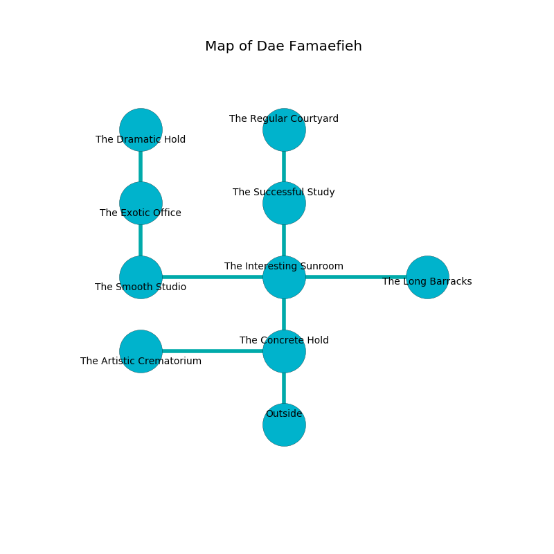

%Ruin Dogs

##Dae Famaefieh
###Overview
Dae Famaefieh is constructed on an obsidion rift. Regions of it are cursed. The ruin is burning. It is occupied by Humans. Jame Frantz The Truculent, a Cyclops is here. The Humans are battling Jame Frantz The Truculent. He  is trying to destroy [Iaeda](#Iaeda). 

###Artifact
####Iaeda

Iaeda is a powerful artifact in the shape of a warm orb. It is a shifting purple color. It smells like brandy. When thrown it flies into the air. 

###Locations

####the concrete hold
The brick walls are ruined. There are a Mage and a Priest here. Green moss is swaying in cracks in the floor. There is a trap here. When activated, a magical rune will launch a swinging block. The Humans are willing to negotiate. 

* To the west a narrow artery opens to [the artistic crematorium](#the-artistic-crematorium).
* To the north a windy walkway opens to [the interesting sunroom](#the-interesting-sunroom).
* To the south is the entrance.

####the artistic crematorium
White mushrooms are swaying in cracks in the floor. The brick walls are unsettled. 

* To the east a narrow artery leads to [the concrete hold](#the-concrete-hold).

####the interesting sunroom
The wooden walls are ruined. There are a Magma Mephit, a Chasme, and a Mummy here. 

* [Iaeda](#Iaeda) is here.
* [Jame Frantz The Truculent](#Jame-Frantz-The-Truculent) is here.
* To the west a twisted path leads to [the smooth studio](#the-smooth-studio).
* To the east a narrow passageway opens to [the long barracks](#the-long-barracks).
* To the north a hazy walkway opens to [the successful study](#the-successful-study).
* To the south a windy walkway connects to [the concrete hold](#the-concrete-hold).

####the successful study

* To the north a small gap opens to [the regular courtyard](#the-regular-courtyard).
* To the south a hazy walkway connects to [the interesting sunroom](#the-interesting-sunroom).

####the smooth studio
The brick walls are scratched. 

There is an engraving on the ceiling written in common. 

> Poor me! my fate is poor
>
> absent and obscure
>
> it is always normal
>
> cruelty is pure
>

* To the east a twisted path connects to [the interesting sunroom](#the-interesting-sunroom).
* To the north a torchlit pathway leads to [the exotic office](#the-exotic-office).

####the exotic office
The metallic walls are bloodstained. The air smells like raisin here. Red razorgrass is decaying in a patch on the floor. There are a Gladiator, a Mage, and a Commoner here. One of the Humans is pointing a ballista at the entrance. 

* There is a chest here.
* To the north a twisted threshold opens to [the dramatic hold](#the-dramatic-hold).
* To the south a torchlit pathway connects to [the smooth studio](#the-smooth-studio).

####the regular courtyard
There is a trap here. When activated, a tripwire will open a large pit in the floor. The air tastes like seafood here. 

* To the south a small gap leads to [the successful study](#the-successful-study).

####the dramatic hold
There are a Guard, a Mage, and a Druid here. The air smells like absinthe here. The metallic walls are bloodstained. White razorgrass is sprouting in cracks in the floor. One of the Humans is working a mechanism that can launch acid at the Ruin Dogs. 

There is an engraving on a tablet written in common. 

> I am afraid.
>

* To the south a twisted threshold opens to [the exotic office](#the-exotic-office).

####the long barracks

* To the west a narrow passageway leads to [the interesting sunroom](#the-interesting-sunroom).

