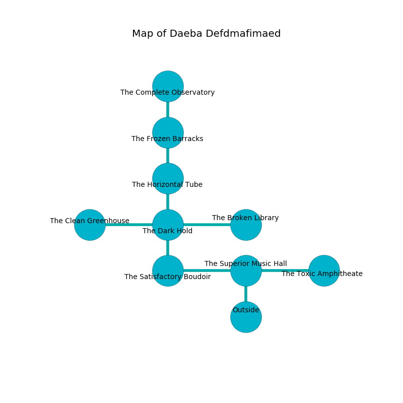

%Ruin Dogs

##Daeba Defdmafimaed
###Overview
Daeba Defdmafimaed is located on a volcanic tree. Regions of it are corrupted. A solar eclipse is happening outside. It is occupied by Kuo-Toa. Magdalen Tuggle The Conservative, a Stone Giant is here. The Kuo-Toa are battling Magdalen Tuggle The Conservative. She  is trying to recover [Cfegd Iugdiaefa](#Cfegd-Iugdiaefa). 

###Artifact
####Cfegd Iugdiaefa

Cfegd Iugdiaefa looks like a sharp monument. Fire pours away from it. It is a dark red color. When cradled it makes its owner invisible. 

###Locations

####the superior music hall
The floor is smooth. The air tastes like lobster here. There are a Plesiosaurus and a Tyrannosaurus Rex here. 

* To the west a twisted cavern leads to [the satisfactory boudoir](#the-satisfactory-boudoir).
* To the east a long gap opens to [the toxic amphitheater](#the-toxic-amphitheater).
* To the south is the entrance.

####the satisfactory boudoir
White ferns are sprouting in broken urns. There are a Kuo-Toa Whip, a Kuo-Toa Monitor, and a Kuo-Toa Archpriest here. The crystal walls are covered in mold. The Kuo-Toa are fighting amongst themselves. 

* To the east a twisted cavern connects to [the superior music hall](#the-superior-music-hall).
* To the north a flooded hallway leads to [the dark hold](#the-dark-hold).

####the toxic amphitheater
White moss is sprouting from the ceiling. The air tastes like alfalfa here. The obsidion walls are bloodstained. The floor is bloodstained. 

* To the west a long gap connects to [the superior music hall](#the-superior-music-hall).

####the dark hold
The concrete walls are scratched. Green mushrooms are swaying in cracks in the floor. 

* [Cfegd Iugdiaefa](#Cfegd-Iugdiaefa) is here.
* To the west a long cave opens to [the clean greenhouse](#the-clean-greenhouse).
* To the east a dark threshold opens to [the broken library](#the-broken-library).
* To the north a twisted hallway connects to [the horizontal tube](#the-horizontal-tube).
* To the south a flooded hallway leads to [the satisfactory boudoir](#the-satisfactory-boudoir).

####the broken library
The air smells like nasturtium here. The floor is glossy. Gray ferns are swaying in a patch on the floor. There are a Sprite, a Shadow Demon, a Githzerai Monk, and a Chimera here. 

* To the west a dark threshold opens to [the dark hold](#the-dark-hold).

####the horizontal tube
The floor is smooth. Blue mushrooms are sprouting in cracks in the floor. The air smells like pear here. 

* There is a sword here.
* There is a bone here.
* There is a plow here.
* To the north a small hall opens to [the frozen barracks](#the-frozen-barracks).
* To the south a twisted hallway connects to [the dark hold](#the-dark-hold).

####the frozen barracks
The floor is flooded with seven inch deep scalding water. 

* To the north a hazy walkway opens to [the complete observatory](#the-complete-observatory).
* To the south a small hall opens to [the horizontal tube](#the-horizontal-tube).

####the complete observatory
The air smells like rubber here. The floor is glossy. There are a Wereboar and a Cambion here. There is a trap here. When activated, a magical proximity detector will blast flames. The concrete walls are scratched. 

* [Magdalen Tuggle The Conservative](#Magdalen-Tuggle-The-Conservative) is here.
* To the south a hazy walkway opens to [the frozen barracks](#the-frozen-barracks).

####the clean greenhouse
The air tastes like hyssop here. There are a Yeti, a Monodrone, a Duergar, a Drow Elite Warrior, a Violet Fungus, and a Griffon here. The floor is flooded with seven inch deep cool water. Red lichens are sprouting in cracks in the floor. 

* To the east a long cave leads to [the dark hold](#the-dark-hold).

