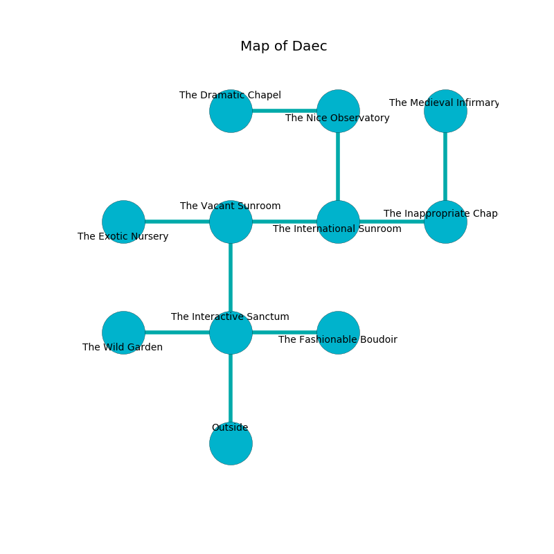

%Ruin Dogs

##Daec
###Overview
Daec is located under a cursed rift. Regions of it are somewhat hot. A solar eclipse is happening outside. It is occupied by Lizardfolk. Robin Woo The Nasty, a Centaur is here. The Lizardfolk are ruled by Robin Woo The Nasty. He  is founding a new religion. 

###Artifact
####Deaem Cula

Deaem Cula has the form of a sharp blade. Magic pours around it. It smells like rose. When smelled it projects energy. 

###Locations

####the interactive sanctum
Red ferns are swaying in cracks in the floor. The brick walls are bloodstained. 

* To the west a windy artery opens to [the wild garden](#the-wild-garden).
* To the east a dark hallway connects to [the fashionable boudoir](#the-fashionable-boudoir).
* To the north a dark cave leads to [the vacant sunroom](#the-vacant-sunroom).
* To the south is the entrance.

####the vacant sunroom
The obsidion walls are unsettled. 

There is an engraving on the ceiling written in Lizardfolk Script. 

> Poor me! sorry you
>
> yet never due
>
> it is always scientific
>
> everything is true
>

* There is a feather here.
* To the west a small cavern connects to [the exotic nursery](#the-exotic-nursery).
* To the east a dripping opening connects to [the international sunroom](#the-international-sunroom).
* To the south a dark cave leads to [the interactive sanctum](#the-interactive-sanctum).

####the international sunroom

* There is a nail here.
* To the west a dripping opening opens to [the vacant sunroom](#the-vacant-sunroom).
* To the east a hazy artery leads to [the inappropriate chapel](#the-inappropriate-chapel).
* To the north a hazy opening connects to [the nice observatory](#the-nice-observatory).

####the wild garden
The floor is glossy. 

* To the east a windy artery leads to [the interactive sanctum](#the-interactive-sanctum).

####the fashionable boudoir
The metallic walls are pristine. There are four Lizardfolk here. The Lizardfolk are willing to negotiate. 

There is an engraving on the ceiling written in Lizardfolk Script. 

> A hand is a message
>
> but never ambiguous
>
> accessible, limited, positive
>
> yet colourful
>
> A hand is a message
>

* [Robin Woo The Nasty](#Robin-Woo-The-Nasty) is here.
* To the west a dark hallway connects to [the interactive sanctum](#the-interactive-sanctum).

####the nice observatory
The air smells like curry here. Red ferns are swaying in cracks in the floor. 

* To the west a dark cave leads to [the dramatic chapel](#the-dramatic-chapel).
* To the south a hazy opening connects to [the international sunroom](#the-international-sunroom).

####the exotic nursery
The air smells like white rose here. White lichens are sprouting in a patch on the floor. 

There is an engraving on the floor written in Lizardfolk Script. 

> O! the world is woe
>
> chronic and bad
>
> always low
>
> everything is sad
>

* There is a brick here.
* To the east a small cavern leads to [the vacant sunroom](#the-vacant-sunroom).

####the inappropriate chapel
Green ferns are growing in broken urns. The air smells like barley here. 

* There is an eye here.
* There is a chain here.
* [Deaem Cula](#Deaem-Cula) is here.
* To the west a hazy artery leads to [the international sunroom](#the-international-sunroom).
* To the north a torchlit walkway leads to [the medieval infirmary](#the-medieval-infirmary).

####the dramatic chapel
There is a Myconid Sovereign here. The stone walls are covered in mold. The air smells like seaweed here. 

There is an engraving on a tablet written in common. 

> Oh sad we
>
> latest, attractive, moral
>
> it is never free
>
> hope is oral
>

* To the east a dark cave opens to [the nice observatory](#the-nice-observatory).

####the medieval infirmary
The stone walls are covered in mold. There are a Sprite, a Goblin, a Minotaur Skeleton, and an Imp here. The floor is flooded with eight inch deep lukewarm water. 

* To the south a torchlit walkway opens to [the inappropriate chapel](#the-inappropriate-chapel).

