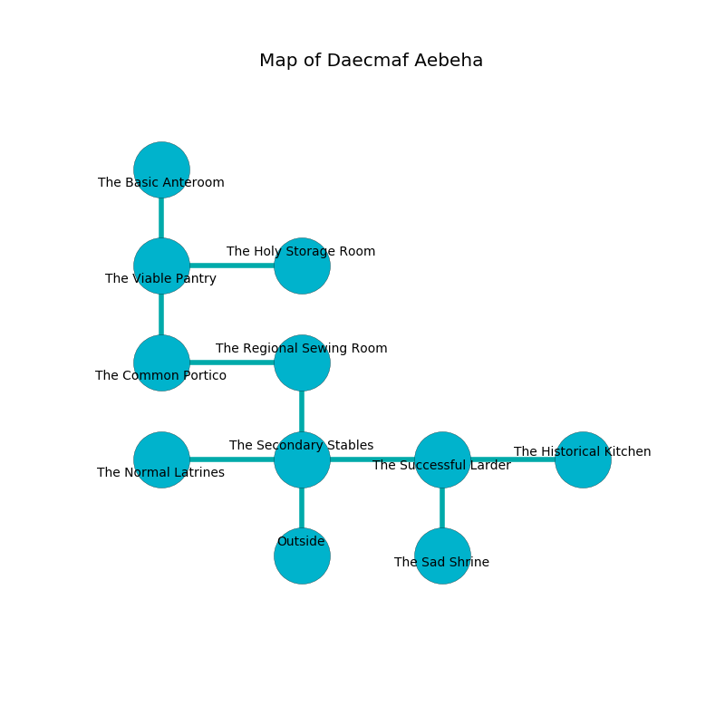

%Ruin Dogs

##Daecmaf Aebeha
###Overview
Daecmaf Aebeha is located on an alien tree. Some rooms of it are somewhat hot. The ruin is burning. It is occupied by Kuo-Toa. Kyle Rigsby The Fussy, a Mage is here. The Kuo-Toa worship Kyle Rigsby The Fussy. He  is trying to steal [Godofa Ehobaemaeob](#Godofa-Ehobaemaeob). 

###Artifact
####Godofa Ehobaemaeob

Godofa Ehobaemaeob is a powerful artifact in the shape of a warm monument. It smells like frying. When thrown it grants a wish. 

###Locations

####the secondary stables
The floor is bloodstained. The air smells like agarwood here. The mirrored walls are pristine. Yellow razorgrass is sprouting in cracks in the floor. There is a trap here. When activated, a magical rune will shoot a lightning bolt. There are a Fire Snake, a Pegasus, an Allosaurus, a Giant Crab, and a Berserker here. 

* [Kyle Rigsby The Fussy](#Kyle-Rigsby-The-Fussy) is here.
* To the west a dark opening leads to [the normal latrines](#the-normal-latrines).
* To the east a long passageway leads to [the successful larder](#the-successful-larder).
* To the north a twisted pathway connects to [the regional sewing room](#the-regional-sewing-room).
* To the south is the entrance.

####the regional sewing room
The floor is bloodstained. Blue razorgrass is sprouting in a patch on the floor. There are a Swarm of Insects, a Vampire Spawn, a Camel, and a Chimera here. The metallic walls are ruined. 

There is an engraving on a stone written in common. 

> I thought about cowering.
>

* There is a dress here.
* To the west a long gap opens to [the common portico](#the-common-portico).
* To the south a twisted pathway leads to [the secondary stables](#the-secondary-stables).

####the successful larder
There are a Kuo-Toa Whip, a Mummy, and a Werebear here. The floor is sticky. Gray lichens are swaying in broken urns. 

* There is a wall here.
* To the west a long passageway opens to [the secondary stables](#the-secondary-stables).
* To the east a dark threshold leads to [the historical kitchen](#the-historical-kitchen).
* To the south a long passageway leads to [the sad shrine](#the-sad-shrine).

####the sad shrine
White moss is swaying in a patch on the floor. There are a Drow Elite Warrior and a Killer Whale here. The floor is sticky. 

* To the north a long passageway opens to [the successful larder](#the-successful-larder).

####the common portico
The air tastes like red rose here. The crystal walls are pristine. 

* To the east a long gap connects to [the regional sewing room](#the-regional-sewing-room).
* To the north a dark passageway leads to [the viable pantry](#the-viable-pantry).

####the viable pantry
There is a trap here. When activated, a magical rune will launch a fusillade of darts. The stone walls are ruined. 

* There is a berry here.
* There is a cow here.
* There is a net here.
* There is a net here.
* [Godofa Ehobaemaeob](#Godofa-Ehobaemaeob) is here.
* To the east a narrow passageway connects to [the holy storage room](#the-holy-storage-room).
* To the north a torchlit cave opens to [the basic anteroom](#the-basic-anteroom).
* To the south a dark passageway connects to [the common portico](#the-common-portico).

####the historical kitchen
The concrete walls are unsettled. Gray lichens are swaying from the walls. The air tastes like vanilla here. The floor is cluttered with debris. 

There is an engraving on a stone written in Kuo-Toa Script. 

> I am afraid.
>
> I could not try giving up.
>

* There is a nut here.
* There is a berry here.
* To the west a dark threshold leads to [the successful larder](#the-successful-larder).

####the normal latrines
The metallic walls are unsettled. The floor is glossy. There are a Kuo-Toa Monitor, a Kuo-Toa Whip, a Kuo-Toa Archpriest, two Kuo-Toa, and  here. The Kuo-Toa are willing to negotiate. 

There is an engraving on the wall written in Kuo-Toa Script. 

> Do not try giving up.
>

* To the east a dark opening leads to [the secondary stables](#the-secondary-stables).

####the basic anteroom
The glass walls are covered in mold. The floor is bloodstained. Red mushrooms are decaying in a patch on the floor. There are a Quaggoth, a Monodrone, a Giant Shark, and an Animated Armor here. 

There is an engraving on the wall written in common. 

> Try fighting.
>

* To the south a torchlit cave connects to [the viable pantry](#the-viable-pantry).

####the holy storage room
The floor is sticky. 

* To the west a narrow passageway leads to [the viable pantry](#the-viable-pantry).

