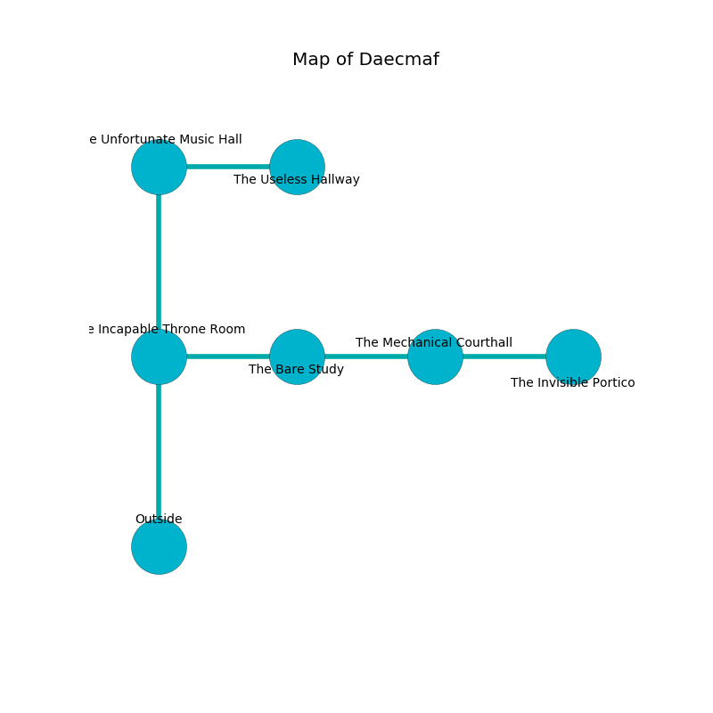

%Ruin Dogs

##Daecmaf
###Overview
Daecmaf is located in a giant rift. Regions of Daecmaf are corrupted. The ruin is burning. It is occupied by Myconids. Troy Clevenger The Greedy, a Vampire Spawn is here. The Myconids worship Troy Clevenger The Greedy. She  is founding a new religion. 

###Artifact
####The Primary Summer

The Primary Summer looks like a hard orb. It is a light purple color. When touched it ignites its surrroundings. 

###Locations

####the incapable throne room
The floor is flooded with six inch deep cold water. 

* There is a horse here.
* To the east a long hall connects to [the bare study](#the-bare-study).
* To the north a twisted pathway leads to [the unfortunate music hall](#the-unfortunate-music-hall).
* To the south is the entrance.

####the unfortunate music hall
There are a Doppelganger, a Phase Spider, and an Old Faerie Dragon here. 

There is an engraving on the floor written in common. 

> A bag is a venture
>
> green and deadly
>

* [Troy Clevenger The Greedy](#Troy-Clevenger-The-Greedy) is here.
* To the east a small cave opens to [the useless hallway](#the-useless-hallway).
* To the south a twisted pathway leads to [the incapable throne room](#the-incapable-throne-room).

####the bare study
The floor is bloodstained. The wooden walls are ruined. 

* To the west a long hall leads to [the incapable throne room](#the-incapable-throne-room).
* To the east a twisted hall connects to [the mechanical courthall](#the-mechanical-courthall).

####the mechanical courthall
There are a Hill Giant and a Chimera here. The floor is flooded with eight inch deep scalding water. The air tastes like soup here. 

There is an engraving on a tablet written in common. 

> Run away.
>

* There is a chest here.
* [The Primary Summer](#The-Primary-Summer) is here.
* To the west a twisted hall leads to [the bare study](#the-bare-study).
* To the east a twisted artery leads to [the invisible portico](#the-invisible-portico).

####the useless hallway
Red lichens are decaying from the walls. The air smells like brown sugar here. 

* To the west a small cave connects to [the unfortunate music hall](#the-unfortunate-music-hall).

####the invisible portico
The air tastes like corn here. The floor is glossy. 

There is an engraving on the ceiling written in common. 

> Dig here.
>

* To the west a twisted artery opens to [the mechanical courthall](#the-mechanical-courthall).

