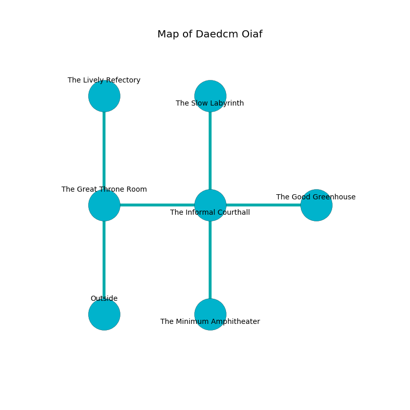

%Ruin Dogs

##Daedcm Oiaf
###Overview
Daedcm Oiaf is located on a cursed plain. Regions of Daedcm Oiaf are incredibly cold. The ruin is flooding. It is occupied by Lizardfolk. Garland Nolen The Nervous, a Bulette is here. The Lizardfolk are the soldiers of Garland Nolen The Nervous. He  is founding a new religion. 

###Artifact
####Uaaem Fahaeum

Uaaem Fahaeum is a powerful artifact in the shape of a wet cube. It is a shifting red color. It smells like lime. When carried it aids memory. 

###Locations

####the great throne room
The metallic walls are covered in mold. 

* [Garland Nolen The Nervous](#Garland-Nolen-The-Nervous) is here.
* To the east a dark hallway opens to [the informal courthall](#the-informal-courthall).
* To the north a torchlit cavern opens to [the lively refectory](#the-lively-refectory).
* To the south is the entrance.

####the lively refectory
The crystal walls are scratched. 

* To the south a torchlit cavern opens to [the great throne room](#the-great-throne-room).

####the informal courthall
There are two Lizardfolk Shamans and two Lizardfolk here. Yellow ferns are growing from the walls. The floor is flooded with eight inch deep cold water. The Lizardfolk are willing to negotiate. 

* [Uaaem Fahaeum](#Uaaem-Fahaeum) is here.
* To the west a dark hallway leads to [the great throne room](#the-great-throne-room).
* To the east a flooded threshold opens to [the good greenhouse](#the-good-greenhouse).
* To the north a twisted walkway connects to [the slow labyrinth](#the-slow-labyrinth).
* To the south a torchlit path leads to [the minimum amphitheater](#the-minimum-amphitheater).

####the slow labyrinth
The floor is glossy. The air tastes like cassia here. 

There is an engraving on the ceiling written in common. 

> I tried swimming.
>

* To the south a twisted walkway opens to [the informal courthall](#the-informal-courthall).

####the good greenhouse
There are three Lizardfolk Shamans here. The mirrored walls are pristine. The air smells like raisin here. Green lichens are swaying in broken urns. One of the Lizardfolk is on watch, the rest are fighting amongst themselves. 

There is an engraving on the floor written in Lizardfolk Script. 

> Oh my! meak god
>
> elegant and odd
>
> dark, vulnerable, round
>
> sadness is sound
>

* To the west a flooded threshold connects to [the informal courthall](#the-informal-courthall).

####the minimum amphitheater
The air smells like lavender here. The wooden walls are ruined. There is a Shambling Mound here. 

* To the north a torchlit path connects to [the informal courthall](#the-informal-courthall).

